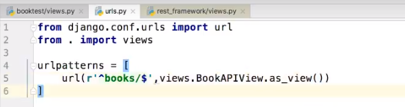

# **Rest Framework**：

[toc]


## RESTful规范   


----

## 一级视图 APIView

1. 继承django的view 
2. 提供了自己的request对象
3. 提供了自己的response 对象
4. 提供了认证,权限,限流等功能
	1. **authentication_classes** 列表或元祖，身份认证类
	2. **permissoin_classes** 列表或元祖，权限检查类
	3. **throttle_classes** 列表或元祖，流量控制类


```python
from django.views import View
from rest_framework.views import APIView
from rest_framework.response import Response
from rest_framework.request import Request
from rest_framework import status # 状态码

from rest_framework import authtoken, permissions


```

#### 列表视图  ( 查询所有, 创建单个)

#### 详情视图  (查询单个, 修改单个, 删除单个)


### APIViews 之 request





##### request.data

`request.data` 返回解析之后的请求体数据。类似于Django中标准的`request.POST`和 `request.FILES`属性，但提供如下特性：

- 包含了解析之后的文件和非文件数据
- 包含了对POST、PUT、PATCH请求方式解析后的数据
- 利用了REST framework的parsers解析器，不仅支持表单类型数据，也支持JSON数据


当调用dispath 方法的时候， `request = self.initialize_request(request, *args, **kwargs)` ,request 就已经被初始化过了

```python
return Request(
    request,
    parsers=self.get_parsers(),
    authenticators=self.get_authenticators(),
    negotiator=self.get_content_negotiator(),
    parser_context=parser_context
)
```


##### request.query_params

`request.query_params`与Django标准的`request.GET`相同，只是更换了更正确的名称而已。


### APIViews 之 response

```
rest_framework.response.Response
from rest_framework import status
```

REST framework提供了一个响应类`Response`，使用该类构造响应对象时，响应的具体数据内容会被转换（render渲染）成符合前端需求的类型。

##### 构造方式

```python
Response(data, status=None, template_name=None, headers=None, content_type=None)
```

`data`数据不要是render处理之后的数据，只需传递python的内建类型数据即可，REST framework会使用`renderer`渲染器处理`data`。

`data`不能是复杂结构的数据，如Django的模型类对象，对于这样的数据我们可以使用`Serializer`序列化器序列化处理后（转为了Python字典类型）再传递给`data`参数。

参数说明:

- `data`: 为响应准备的序列化处理后的数据；
- `status`: 状态码，默认200；
- `template_name`: 模板名称，如果使用`HTMLRenderer` 时需指明；
- `headers`: 用于存放响应头信息的字典；
- `content_type`: 响应数据的Content-Type，通常此参数无需传递，REST framework会根据前端所需类型数据来设置该参数。


#### APIView列表视图

get

获取所有

创建单个


#### APIView详情视图 (带id)

post

获取单个

修改单个

删除单个

**views.py**

```python
class BookAPIView(APIView):
    def get(self, request):
        books = models.Bookinfo.objects.all()
        serializer = serializers.BookModelSerializer(instance=books, many=True)

        return Response(serializer.data)

    def post(self, request):
        book = request.data
        serializer = serializers.BookModelSerializer(data=book)
        serializer.is_valid(raise_exception=True):
        serializer.save()
        return Response(serializer.validated_data, status=status.HTTP_201_CREATED)


class BookDetailAPIView(APIView):
    def get(self, request, book_id):
        book = models.Bookinfo.objects.filter(id=book_id).first()
        serializer = serializers.BookModelSerializer(instance=book)
        return Response(serializer.data, status=status.HTTP_200_OK)

    def put(self, request, book_id, ):
        book = models.Bookinfo.objects.filter(id=book_id).first()
        serializer = serializers.BookModelSerializer(instance=book, data=request.data)
        serializer.is_valid(raise_exception=True)
        serializer.save()
        return Response(serializer.data, status=status.HTTP_201_CREATED)

    def delete(self, request, book_id):
        models.Bookinfo.objects.filter(pk=book_id).delete()
        return Response(status=status.HTTP_200_OK)
```


**serializer.py**

```python
from rest_framework import serializers
from booktest import models


class BookModelSerializer(serializers.ModelSerializer):
    # mobile = serializers.CharField(max_length=11, min_length=11, label='手机号', write_only=True)

    class Meta:
        model = models.Bookinfo
        fields = "__all__"
```

**urls.py**

```python
urlpatterns = [
    re_path("^books/$", views.BookAPIView.as_view()),
    re_path("^books/(?P<book_id>\d+)/$", views.BookDetailAPIView.as_view())
]
```


## 二级视图 GenericAPIView

```
rest_framework.generics.GenericAPIView
```

两个特点

1. 继承自`APIVIew`，提供了通用的行为和方法。

2. 通常使用时，可搭配一个或多个Mixin扩展类

### 1. 提供常见的属性和行为（方法）

#### 行为(方法):

```python
# 获取 queryset 的数据集
self.get_queryset()

# 获取 serializer_class序列化对象
self.get_serializer()  self.get_serializer_class()

# 根据 lookup_field 获取单个对象
self.get_object()

```

#### 属性:

```python
# 通过的数据集
queryset = models.Bookinfo.objects.all() 

# 通用的序列化器
serializer_class = serializers.BookModelSerializer

# 源码默认是pk , 可以手动修改为id, 字段必须是数据库中要查询的字段
lookup_field = pk 

# url 中正则匹配的名字,可以自己指定修改,view中也要全部使用这个值,
lookup_url_kwarg = "book_id"

""" 两者区别
lookup_url_kwarg 是匹配URL中正则表达式的名称取出值, 默认是None 

lookup_field  要查询的字段名称, 所以只能是 pk 或者 id
两者都可以写 可以不写, 不写就用默认的 lookup_field = 'pk'

"""

```


**views.py**

```python
# 列表视图
class BookGenericAPIView(GenericAPIView):
    # 提供了公共的属性
    queryset = models.Bookinfo.objects.all()
    serializer_class = serializers.BookModelSerializer

    def get(self, request):
        # books = self.queryset  # 等同与下面的
        books = self.get_queryset()

        # serializer = serializers.BookModelSerializer(instance=books, many=True)
        # serializer = self.serializer_class(instance=books, many=True)
        # serializer = self.get_serializer_class()(instance=books, many=True)
        serializer = self.get_serializer(instance=books, many=True)

        return Response(serializer.data)

    def post(self, request):
        book = request.data
        # serializer = serializers.BookModelSerializer(data=book)
        serializer = self.get_serializer(data=book)
        serializer.is_valid(raise_exception=True)
        serializer.save()
        return Response(serializer.validated_data, status=status.HTTP_201_CREATED)

# 详情视图
class BookDetailGenericAPIView(GenericAPIView):
    # 通用的属性
    queryset = models.Bookinfo.objects.all()
    serializer_class = serializers.BookModelSerializer
    # lookup_field = "pk" 默认
    # lookup_url_kwarg = None 默认
    lookup_url_kwarg = "book_id"

    def get(self, request, book_id):
        # book = models.Bookinfo.objects.filter(id=book_id).first()
        book = self.get_object()  # 根据book_id到queryset中取出书籍对象

        serializer = self.get_serializer(instance=book)
        return Response(serializer.data, status=status.HTTP_200_OK)

    def put(self, request, book_id):
        # book = models.Bookinfo.objects.filter(id=book_id).first()
        book = self.get_object()

        serializer = self.get_serializer(instance=book, data=request.data)
        serializer.is_valid(raise_exception=True)
        serializer.save()
        return Response(serializer.data, status=status.HTTP_201_CREATED)

    def delete(self, request, book_id):
        # models.Bookinfo.objects.filter(pk=book_id).delete()
        self.get_object().delete()

        return Response(status=status.HTTP_204_NO_CONTENT)

```


**urls.py**

```python
urlpatterns = [
    re_path("^gen_books/$", views.BookGenericAPIView.as_view()),
    re_path("^gen_books/(?P<book_id>\d+)/$", views.BookDetailGenericAPIView.as_view()),
]
```


#### get_object() 方法

```python
lookup_url_kwarg = self.lookup_url_kwarg or self.lookup_field
```

通过`self.lookup_field`或者 `lookup_url_kwarg` 和通过正则取出url中 `lookup_url_kwarg`的值构建成字典

然后数据库通过字典的解包查询数据, get_object_or_404() 

返回对象

**若详情访问的模型类对象不存在，会返回404。**

**该方法会默认使用APIView提供的check_object_permissions方法检查当前对象是否有权限被访问。**


#### self.kwargs[lookup_url_kwarg]


lookup_url_kwarg 是匹配URL中正则表达式的名称取出值

lookup_field  要查询的字段名称, 所以只能是 pk 或者 id


### 2. 和一个或者多个mixin类配合使用

`rest_framework.mixins`

#### 特点

 	1. 可以提供基本的视图行为(列表, 详情视图)的操作
 	2. 配合二级视图 GenericAPIView 使用

#### 五个扩展类

#### 1). ListModelMixin   list  查询所有对象

列表视图扩展类，提供`list(request, *args, **kwargs)`方法快速实现列表视图，返回200状态码。

该Mixin的list方法会对数据进行过滤和分页。


源代码：

```python
class ListModelMixin(object):
    """
    List a queryset.
    """
    def list(self, request, *args, **kwargs):
        # 过滤
        queryset = self.filter_queryset(self.get_queryset())
        # 分页
        page = self.paginate_queryset(queryset)
        if page is not None:
            serializer = self.get_serializer(page, many=True)
            return self.get_paginated_response(serializer.data)
        # 序列化
        serializer = self.get_serializer(queryset, many=True)
        return Response(serializer.data)
```

举例：

```python
from rest_framework.mixins import ListModelMixin

class BookListView(ListModelMixin, GenericAPIView):
    queryset = BookInfo.objects.all()
    serializer_class = BookInfoSerializer

    def get(self, request):
        return self.list(request)
```


#### 2). CreateModelMixin create 创建单个对象

创建视图扩展类，提供`create(request, *args, **kwargs)`方法快速实现创建资源的视图，成功返回201状态码。

如果序列化器对前端发送的数据验证失败，返回400错误。

源代码：

```python
class CreateModelMixin(object):
    """
    Create a model instance.
    """
    def create(self, request, *args, **kwargs):
        # 获取序列化器
        serializer = self.get_serializer(data=request.data)
        # 验证
        serializer.is_valid(raise_exception=True)
        # 保存
        self.perform_create(serializer)
        headers = self.get_success_headers(serializer.data)
        return Response(serializer.data, status=status.HTTP_201_CREATED, headers=headers)

    def perform_create(self, serializer):
        serializer.save()

    def get_success_headers(self, data):
        try:
            return {'Location': str(data[api_settings.URL_FIELD_NAME])}
        except (TypeError, KeyError):
            return {}
```


#### 3） RetrieveModelMixin  retrieve  获取单个对象

详情视图扩展类，提供`retrieve(request, *args, **kwargs)`方法，可以快速实现返回一个存在的数据对象。

如果存在，返回200， 否则返回404。

源代码：

```python
class RetrieveModelMixin(object):
    """
    Retrieve a model instance.
    """
    def retrieve(self, request, *args, **kwargs):
        # 获取对象，会检查对象的权限
        instance = self.get_object()
        # 序列化
        serializer = self.get_serializer(instance)
        return Response(serializer.data)
```

举例：

```python
class BookDetailView(RetrieveModelMixin, GenericAPIView):
    queryset = BookInfo.objects.all()
    serializer_class = BookInfoSerializer

    def get(self, request, pk):
        return self.retrieve(request)
```


#### 4）UpdateModelMixin  update  更新单个对象

更新视图扩展类，提供`update(request, *args, **kwargs)`方法，可以快速实现更新一个存在的数据对象。

同时也提供`partial_update(request, *args, **kwargs)`方法，可以实现局部更新。

成功返回200，序列化器校验数据失败时，返回400错误。

```python
class UpdateModelMixin(object):
    """
    Update a model instance.
    """
    def update(self, request, *args, **kwargs):
        partial = kwargs.pop('partial', False)
        instance = self.get_object()
        serializer = self.get_serializer(instance, data=request.data, partial=partial)
        serializer.is_valid(raise_exception=True)
        self.perform_update(serializer)

        if getattr(instance, '_prefetched_objects_cache', None):
            # If 'prefetch_related' has been applied to a queryset, we need to
            # forcibly invalidate the prefetch cache on the instance.
            instance._prefetched_objects_cache = {}

        return Response(serializer.data)

    def perform_update(self, serializer):
        serializer.save()

    def partial_update(self, request, *args, **kwargs):
        kwargs['partial'] = True
        return self.update(request, *args, **kwargs)
```


#### 5）DestroyModelMixin destroy  删除单个对象

删除视图扩展类，提供`destroy(request, *args, **kwargs)`方法，可以快速实现删除一个存在的数据对象。

成功返回204，不存在返回404。

源代码：

```python
class DestroyModelMixin(object):
    """
    Destroy a model instance.
    """
    def destroy(self, request, *args, **kwargs):
        instance = self.get_object()
        self.perform_destroy(instance)
        return Response(status=status.HTTP_204_NO_CONTENT)

    def perform_destroy(self, instance):
        instance.delete()
```


例子:

**views.py**

```python
from rest_framework.generics import GenericAPIView
from rest_framework.mixins import ListModelMixin, CreateModelMixin, RetrieveModelMixin, UpdateModelMixin,DestroyModelMixin
from booktest import serializers
from booktest import models


class BookGenericMixinAPIView(GenericAPIView, ListModelMixin, CreateModelMixin):
    # 提供了公共的属性
    queryset = models.Bookinfo.objects.all()
    serializer_class = serializers.BookModelSerializer

    def get(self, request):
        return self.list(request)

    def post(self, request):
        return self.create(request)


class BookDetailGenericMixinAPIView(GenericAPIView, RetrieveModelMixin, UpdateModelMixin,DestroyModelMixin):
    # 通用的属性
    queryset = models.Bookinfo.objects.all()
    serializer_class = serializers.BookModelSerializer
    # lookup_field = "pk"
    # lookup_url_kwarg = None
    lookup_url_kwarg = "book_id"

    def get(self, request, book_id):
        return self.retrieve(request)

    def put(self, request, book_id):
        return self.update(request)

    def delete(self, request, book_id):
        return self.destroy(request)
```


**urls.py**

```python
urlpatterns = [
	...
    re_path("^gen_mixin_books/$", views.BookGenericMixinAPIView.as_view()),
    re_path("^gen_mixin_book/(?P<book_id>\d+)/$", views.BookDetailGenericMixinAPIView.as_view()),

]
```


## 三级视图 generics 组合起来使用

`rest_framework.generics`

特点:

​	如果没有大量的自定义的行为, 就可以使用通用视图(三级视图)


| 类名称 | 父类 | 提供方法 | 作用 |
| :----- | ---- | -------- | ---- |
| CreateAPIView       | GenericAPIView、CreateModelMixin | 提供 post 方法 | 创建单个对象 |
| ListAPIView | GenericAPIView、ListModelMixin | 提供 get 方法 | 查询所有数据 |
| RetireveAPIView | GenericAPIView、RetrieveModelMixin | 提供 get 方法 | 获取单个对象 |
| DestoryAPIView | GenericAPIView、DestoryModelMixin | 提供 delete 方法 | 删除单个对象 |
| UpdateAPIView | GenericAPIView、UpdateModelMixin | 提供 put (全部更新) 和 patch(局部字段更新) 方法 | 更新单个对象 |
| RetrieveUpdateAPIView | GenericAPIView、RetrieveModelMixin、UpdateModelMixin | 提供 get、put、patch方法                        | |
| RetrieveUpdateDestoryAPIView | GenericAPIView、RetrieveModelMixin、UpdateModelMixin、DestoryModelMixin | 提供 get、put、patch、delete方法 | |


**urls.py**

```python
urlpatterns = [
	...
    re_path("^gen_third_books/$", views.BookThirdView.as_view()),
    re_path("^gen_third_book/(?P<pk>\d+)/$", views.BookDetailThirdView.as_view()),

]
```


**views.py**

```python
from rest_framework.generics import ListAPIView, CreateAPIView
class BookThirdView(ListAPIView, CreateAPIView):
    # 提供了公共的属性
    queryset = models.Bookinfo.objects.all()
    serializer_class = serializers.BookModelSerializer


from rest_framework.generics import RetrieveAPIView, UpdateAPIView, DestroyAPIView
class BookDetailThirdView(RetrieveAPIView, UpdateAPIView, DestroyAPIView):
    # 通用的属性
    queryset = models.Bookinfo.objects.all()
    serializer_class = serializers.BookModelSerializer
```


## 视图集 viewsets

### 特点

1. 使用视图集ViewSet，可以将一系列逻辑相关的动作放到一个类中：

- list() 提供一组数据
- retrieve() 提供单个数据
- create() 创建数据
- update() 保存数据
- destory() 删除数据
- 

2. ViewSet视图集类不再实现get()、post()等方法，而是实现动作 **action** 如 list() 、create() 等。

3. 可以将标准的请求方式(get,post,put,delete), 和mixin的方法做映射


### 常用视图集父类

| 类名称                     | 父类                                             | 作用                                                         |
| -------------------------- | ------------------------------------------------ | ------------------------------------------------------------ |
| ViewSet                    | ViewSet ViewSetMixin                             | 与APIView基本类似，提供了身份认证、权限校验、流量管理(permission_classes,authentication_classes等 ). 在ViewSet中，没有提供任何动作action方法，需要我们自己实现action方法.                      可以做路由映射(ViewSetMixin提供的) |
| GenericViewSet             | GenericAPIVIew ViewSetMixin                      | 可以做路由映射, 可以使用三个属性, 三个方法                   |
| ModelViewSet *重点         | GenericAPIVIew 五个mixin类                       | 所有的增删改查, 可以使用三个属性, 三个方法                   |
| ReadOnlyModelViewSet *重点 | GenericAPIVIew ListModelMixin RetrieveModelMixin | 获取单个,所有  可以使用三个属性,三个方法                     |
|                            |                                                  |                                                              |


#### ViewSet 实现获取单个和所有

最基本的写法 没有三属性, 三方法

```python
# 视图集 viewsets
from django.shortcuts import get_object_or_404
from booktest.serializers import BookModelSerializer
from rest_framework import viewsets
class BookViewSet(viewsets.ViewSet):

    def list(self,request):
        queryset = models.Bookinfo.objects.all()
        serializer = BookModelSerializer(instance=queryset, many=True)
        return Response(serializer.data)

    def retrieve(self, request, pk=None):
        queryset = models.Bookinfo.objects.all()
        book = get_object_or_404(queryset, pk=pk)
        serializer = BookModelSerializer(instance=book)
        return Response(serializer.data)
```

urls.py

```python
urlpatterns = [
	....
    re_path("^viewset/$", views.BookViewSet.as_view({'get': 'list',})),
    re_path("^viewset/(?P<pk>\d+)/$", views.BookViewSet.as_view({'get': 'retrieve',})),

]
```


#### ReadOnlyModelViewSet 实现获取单个和所有

views.py

```python
# ReadOnlyModelViewSet
from booktest.serializers import BookModelSerializer
from rest_framework import viewsets
class BookReadOnlyModelViewSet(viewsets.ReadOnlyModelViewSet):
    queryset = models.Bookinfo.objects.all()
    serializer_class = BookModelSerializer
    
```

urls.py

```python
urlpatterns = [
	...
    re_path("^readonly_viewset/$", views.BookReadOnlyModelViewSet.as_view({'get': 'list',})),
    re_path("^readonly_viewset/(?P<pk>\d+)/$", views.BookReadOnlyModelViewSet.as_view({'get': 'retrieve',})),
]
```


#### ModelViewSet 实现列表视图详情视图


views.py

```python
# ModelViewSet
from booktest.serializers import BookModelSerializer
from rest_framework import viewsets
class BookModelViewSet(viewsets.ModelViewSet):
    queryset = models.Bookinfo.objects.all()
    serializer_class = BookModelSerializer
```

urls.py

```python
urlpatterns = [
   	...
    re_path("^Model_viewset/$", views.BookModelViewSet.as_view({'get': 'list', 'post':'create'})),
    re_path("^Model_viewset/(?P<pk>\d+)/$", views.BookModelViewSet.as_view({'get': 'retrieve', 'put':'update','delete':'destroy' })),

]
```


视图集只在使用as_view()方法的时候，才会将**action**动作与具体请求方式对应上。如：

```python
class BookInfoViewSet(viewsets.ViewSet):

    def list(self, request):
        ...

    def retrieve(self, request, pk=None):
        ...
```

在设置路由时，将请求的方式和mixin的请求方式做对应

```python
urlpatterns = [
    url(r'^books/$', BookInfoViewSet.as_view({'get':'list'}),
    url(r'^books/(?P<pk>\d+)/$', BookInfoViewSet.as_view({'get': 'retrieve'})
]
```

在视图集中，我们可以通过action对象属性来获取当前请求视图集时的action动作是哪个。

例如：

```python
def get_serializer_class(self):
    if self.action == 'create':
        return OrderCommitSerializer
    else:
        return OrderDataSerializer
    
    
```


### 视图集 自定义函数 和 partial=True


**views.py**

```python
# ModelViewSet
from booktest.serializers import BookModelSerializer
from rest_framework import viewsets
class BookModelViewSet(viewsets.ModelViewSet):
    queryset = models.Bookinfo.objects.all()
    serializer_class = BookModelSerializer

    # 获取阅读量大于20的书籍
    def read_book(self,request):
        books = models.Bookinfo.objects.filter(read__gt = 20)
        serializer = self.get_serializer(instance=books, many=True)
        return Response(serializer.data)
    
    
        # 修改部分字段 partial=True
    def update_book_read(self, request, pk):
        book = self.get_object()
        data = request.data

        serializer = self.get_serializer(instance=book, data=data, partial=True)
        serializer.is_valid(raise_exception=True)
        serializer.save()
        return Response(serializer.data, status=status.HTTP_201_CREATED)
```

**urls.py**

```python
urlpatterns = [
	...
    re_path("^Model_read_viewset/$", views.BookActionViewSet.as_view({'get': 'read_book', })),
    
    re_path("^Model_read_viewset/(?P<pk>\d+)/$", views.BookActionViewSet.as_view({'put': 'update_book_read', })),
]
```


##  路由 route 

==只能给视图集生成路由==

REST framework提供了两个router

- **SimpleRouter**
- **DefaultRouter**

DefaultRouter与SimpleRouter的区别是，DefaultRouter会多附带一个默认的API根视图，返回一个包含所有列表视图的超链接响应数据。


注意点:

 	1. 使用DRF可以自动根据前端需要的类型, 返回对应格式类型
 	2. 请求的时候在请求头中标记 Accept即可


### DefaultRoute 生成路由格式

特点:

​	共有三对路由视图

 	1. 列表路由
 	2. 详情路由
 	3. 根路由

register(prefix, viewset, base_name)

- prefix 该视图集的路由前缀
- viewset 视图集
- base_name 路由名称的前缀


```python
from rest_framework.routers import SimpleRouter, DefaultRouter
# 1.创建路由对象
route = DefaultRouter()

# 2.注册视图集
route.register('books', views.BookActionViewSet, basename="book")
urlpatterns += route.urls


添加路由数据

可以有两种方式：

urlpatterns = [
    ...
]
urlpatterns += router.urls
或

urlpatterns = [
    ...
    url(r'^', include(router.urls))
]

# 3.输出结果
print(urlpatterns)

"""
[
<URLPattern '^books/$' [name='-list']>, 
<URLPattern '^books\.(?P<format>[a-z0-9]+)/?$' [name='-list']>, 

<URLPattern '^books/(?P<pk>[^/.]+)/$' [name='-detail']>, 
<URLPattern '^books/(?P<pk>[^/.]+)\.(?P<format>[a-z0-9]+)/?$' [name='-detail']>, 

<URLPattern '^$' [name='api-root']>, 
<URLPattern '^\.(?P<format>[a-z0-9]+)/?$' [name='api-root']>
]
"""
```


### SimpleRouter 生成的路由格式

特点:

 	1. 列表路由
 	2. 详情视图

register(prefix, viewset, base_name)

- prefix 该视图集的路由前缀
- viewset 视图集
- base_name 路由名称的前缀


```python
from rest_framework.routers import SimpleRouter, DefaultRouter
# 1.创建路由对象
route = SimpleRouter()

# 2.注册视图集
route.register('books', views.BookActionViewSet, basename="book")


urlpatterns += route.urls

# 3.输出结果
print(urlpatterns)

"""
[
<URLPattern '^books/$' [name='book-list']>, 
<URLPattern '^books/(?P<pk>[^/.]+)/$' [name='book-detail']>
]
"""
```


## action 装饰器

`rest_framework.decorators.action`

以action装饰器装饰的方法名会作为action动作名，与list、retrieve等同。

action装饰器可以接收两个参数：

- **methods**: 该action支持的请求方式，列表传递

- detail

	: 表示是action中要处理的是否是视图资源的对象（即是否通过url路径获取主键）

	- True 表示使用通过URL获取的主键对应的数据对象
	- False 表示不使用URL获取主键

views.py

```python
from booktest.serializers import BookModelSerializer
from rest_framework import viewsets
from rest_framework.decorators import action


class BookActionViewSet(viewsets.ModelViewSet):
    queryset = models.Bookinfo.objects.all()
    serializer_class = BookModelSerializer

    @action(methods=["GET"], detail=False)
    # 生成路由规则 前缀/方法名
    # <URLPattern '^books/read_book/$' [name='book-read-book']>,
    def read_book(self, request):
        books = models.Bookinfo.objects.filter(read__gt=20)
        serializer = self.get_serializer(instance=books, many=True)
        return Response(serializer.data)

    @action(methods=["PUT"], detail=True)
    # 前缀/{pk}/方法名
    # <URLPattern '^books/(?P<pk>[^/.]+)/update_book_read/$' [name='book-update-book-read']>]
    def update_book_read(self, request, pk):
        book = self.get_object()
        data = request.data

        serializer = self.get_serializer(instance=book, data=data, partial=True)
        serializer.is_valid(raise_exception=True)
        serializer.save()
        return Response(serializer.data, status=status.HTTP_201_CREATED)
```


urls.py

```python
from rest_framework.routers import SimpleRouter, DefaultRouter
# 1.创建路由对象
route = SimpleRouter()

# 2.注册视图集
route.register('books', views.BookActionViewSet, basename="book")
urlpatterns += route.urls
```


----

## 序列化组件  serializers

``` python

from rest_framework import serializers
from rest_framework.serializers import ModelSerializer

from rest_framework import exceptions
        raise exceptions.ValidationError('看你不顺眼')
    
from django.forms.models import model_to_dict (query_set对象)
from rest_framework.response import Response

from django.views import View


实例 instance
数据 data

```


### 作用

- 反序列化: 将json转成模型类的对象
- 序列化   : 将模型累的对象,转成json
- 作用
  - 反序列化 (校验,入库)
  - 序列化返回

### 序列化组件源码分析

```python
序列化组件，先调用__new__方法，如果many=True，生成ListSerializer对象，如果为False，生成Serializer对象
序列化对象.data方法--调用父类data方法---调用对象自己的to_representation（自定义的序列化类无此方法，去父类找）
Aerializer类里有to_representation方法，for循环执行attribute = field.get_attribute(instance)
再去Field类里去找get_attribute方法，self.source_attrs就是被切分的source，然后执行get_attribute方法，source_attrs
当参数传过去，判断是方法就加括号执行，是属性就把值取出来


ModelSerialize -> Serialize -> baseSerialize
```

### 定义规则:

1. 定义类, 继承自serializer
2. 和模型类, 字段名字一样
3. 和模型类, 字段类型一样
4. 和模型类, 字段选项一样

### 序列化

**serializers.py**

``` python
from rest_framework import serializers
from booktest import models


# 书籍序列化器
class BookInfoSerializer(serializers.Serializer):
    id = serializers.IntegerField(label="id", read_only=True)
    title = serializers.CharField(max_length=20, label="名称")
    pub_date = serializers.DateField(label="发布日期")
    read = serializers.IntegerField(default=0, label="阅读量")
    comment = serializers.IntegerField(default=0, label="评论量")
    is_delete = serializers.BooleanField(default=False, label="逻辑删除")


# 英雄序列化器
class HeroInfoSerializer(serializers.Serializer):
    GENDER_CHOICES = (
        (0, "male"),
        (0, "female"),
    )
    id = serializers.IntegerField(label="ID", read_only=True)
    name = serializers.CharField(label="名字", max_length=20)
    gender = serializers.ChoiceField(choices=GENDER_CHOICES, label="性别", required=False)
    comment = serializers.CharField(label="描述信息", max_length=200, required=False, allow_null=True)
    # 1. 关联的书籍外键, 主键   (设置read_only=True 或者 设置queryset) 返回的外键的id
    # book = serializers.PrimaryKeyRelatedField(read_only=True)
    # book = serializers.PrimaryKeyRelatedField(queryset=models.Bookinfo.objects.all())

    # 2.关联的书籍, 使用模型类__str__方法返回
    #book = serializers.StringRelatedField(read_only=True)

    # 3.关联的书籍, 使用书籍的序列化器,可以取出所以书籍的详细信息
    book = BookInfoSerializer()
    
    
    
    
 # 写几个序列化几个

```

字段选项

```
label="id" 字段说明
read_only=True
```

#### 序列化单个对象

**views.py**

``` python
from booktest.serializers import BookInfoSerializer
from booktest import models

# 序列化单个文件
#1. 获取书籍对象
book = models.Bookinfo.objects.get(id=1)

# 2.创建序列化器, instance, 表示要序列化的对象
serializer = BookInfoSerializer(instance=book)

# 3.转换数据
print(serializer.data)


```

注意点:

 1. BookInfoSerializer(instance=book) 

    instance=book 表示要将book进行序列化

	2. serializer.data 取到序列化的结果


#### 序列化列表数据

**views.py**

```python
from booktest.serializers import BookInfoSerializer
from booktest import models
# 序列化多个对象
#1. 获取书籍对象
book = models.Bookinfo.objects.all()

# 2.创建序列化器, instance 表示要序列化的对象, many=True 标识要序列化多个对象
serializer = BookInfoSerializer(instance=book,many=True)

# 3.转换数据
print(serializer.data)

# 返回orderdict
# [{}]
```

注意:

​	BookInfoSerializer(instance=book,many=True) many=True


#### 序列化关联外键

**serializers.py**

``` python
# 英雄序列化器
class HeroInfoSerializer(serializers.Serializer):
    GENDER_CHOICES = (
        (0, "male"),
        (0, "female"),
    )
    id = serializers.IntegerField(label="ID", read_only=True)
    name = serializers.CharField(label="名字", max_length=20)
    gender = serializers.ChoiceField(choices=GENDER_CHOICES, label="性别", required=False)
    comment = serializers.CharField(label="描述信息", max_length=200, required=False, allow_null=True)
    
    
    # 1. 关联的书籍外键, 主键   (设置read_only=True 或者 设置queryset) 返回的外键的id
    # book = serializers.PrimaryKeyRelatedField(read_only=True)
    # book = serializers.PrimaryKeyRelatedField(queryset=models.Bookinfo.objects.all())

    # 2.关联的书籍, 使用模型类__str__方法返回
    #book = serializers.StringRelatedField(read_only=True)

    # 3.关联的书籍, 使用书籍的序列化器,可以取出所以书籍的详细信息
    book = BookInfoSerializer()
```


**views.py**

```python
from booktest.serializers import BookInfoSerializer, HeroInfoSerializer
from booktest import models
# 序列化多个对象
hero = models.HeroInfo.objects.all()

# 2.创建序列化器, instance 表示要序列化的对象, many=True 标识要序列化多个对象
serializer = HeroInfoSerializer(instance=hero,many=True)

# 3.转换数据
print(serializer.data)
```


#### 书籍序列化器,反向查找关联many字段

**serializers.py**

``` python
# 书籍序列化器
class BookInfoSerializer(serializers.Serializer):
    id = serializers.IntegerField(label="id", read_only=True)
    title = serializers.CharField(max_length=20, label="名称")
    pub_date = serializers.DateField(label="发布日期")
    read = serializers.IntegerField(default=0, label="阅读量")
    comment = serializers.IntegerField(default=0, label="评论量")
    is_delete = serializers.BooleanField(default=False, label="逻辑删除")

    # 1. 反向查找英雄主键,many=True, 序列化多方,需要加上,只显示id
    # hero_set = serializers.PrimaryKeyRelatedField(read_only=True,many=True)

    # 2. 显示反向模型的__str__
    hero_set = serializers.StringRelatedField(read_only=True, many=True)

```


### 反序列化

校验

1. 字段类型的校验
2. 字段选项的校验
3. 单字段 (方法)校验
4. 多字段(方法)校验

使用序列化器进行反序列化时，需要对数据进行验证后，才能获取验证成功的数据或保存成模型类对象。

在获取反序列化的数据前，必须调用**is_valid()**方法进行验证，验证成功返回True，否则返回False。

验证失败，可以通过序列化器对象的**errors**属性获取错误信息，返回字典，包含了字段和字段的错误。如果是非字段错误，可以通过修改REST framework配置中的**NON_FIELD_ERRORS_KEY**来控制错误字典中的键名。

验证成功，可以通过序列化器对象的**validated_data**属性获取数据。

在定义序列化器时，指明每个字段的序列化类型和选项参数，本身就是一种验证行为。

如我们前面定义过的BookInfoSerializer

```python
class BookInfoSerializer(serializers.Serializer):
    """图书数据序列化器"""
    id = serializers.IntegerField(label='ID', read_only=True)
    btitle = serializers.CharField(label='名称', max_length=20)
    bpub_date = serializers.DateField(label='发布日期', required=False)
    bread = serializers.IntegerField(label='阅读量', required=False)
    bcomment = serializers.IntegerField(label='评论量', required=False)
    image = serializers.ImageField(label='图片', required=False)
```

通过构造序列化器对象，并将要反序列化的数据传递给data构造参数，进而进行验证

```python
from booktest.serializers import BookInfoSerializer
data = {'bpub_date': 123}
serializer = BookInfoSerializer(data=data)
serializer.is_valid()  # 返回False
serializer.errors
# {'btitle': [ErrorDetail(string='This field is required.', code='required')], 'bpub_date': [ErrorDetail(string='Date has wrong format. Use one of these formats instead: YYYY[-MM[-DD]].', code='invalid')]}
serializer.validated_data  # {}

data = {'btitle': 'python'}
serializer = BookInfoSerializer(data=data)
serializer.is_valid()  # True
serializer.errors  # {}
serializer.validated_data  #  OrderedDict([('btitle', 'python')])
```

is_valid()方法还可以在验证失败时抛出异常serializers.ValidationError，可以通过传递**raise_exception=True**参数开启，REST framework接收到此异常，会向前端返回HTTP 400 Bad Request响应。

```python
# Return a 400 response if the data was invalid.
serializer.is_valid(raise_exception=True)
```

```
# 校验不通过, 直接报错 ,前端直接显示400
```


#### 反序列化 数据类型的校验

``` python


```

#### 反序列化 数据选项的校验

max_length required 等之类的

read_only 只是序列化, 不进行反序列化

required 默认是True 必须要传递, 除非设置了default / false / read_only


#### 反序列化 - 单个字段校验 `validate_<field_name>`

格式:

​	 **def validate_字段名字(self, value):  pass**


``` python
class BookInfoSerializer(serializers.Serializer):
    """图书数据序列化器"""
    ...

    def validate_btitle(self, value):
        if 'django' not in value.lower():
            raise serializers.ValidationError("图书不是关于Django的")
        return value
```


```python
from booktest.serializers import BookInfoSerializer
data = {'btitle': 'python'}
serializer = BookInfoSerializer(data=data)
serializer.is_valid()  # False   
serializer.errors
#  {'btitle': [ErrorDetail(string='图书不是关于Django的', code='invalid')]}
```

#### 多个字段校验 validate

在序列化器中需要同时对多个字段进行比较验证时，可以定义validate方法来验证，如

```python
class BookInfoSerializer(serializers.Serializer):
    """图书数据序列化器"""
    ...

    def validate(self, attrs):
        bread = attrs['bread']
        bcomment = attrs['bcomment']
        if bread < bcomment:
            raise serializers.ValidationError('阅读量小于评论量')
        return attrs
```

测试

```python
from booktest.serializers import BookInfoSerializer
data = {'btitle': 'about django', 'bread': 10, 'bcomment': 20}
s = BookInfoSerializer(data=data)
s.is_valid()  # False
s.errors
#  {'non_field_errors': [ErrorDetail(string='阅读量小于评论量', code='invalid')]}
```


#### 自定义校验/补充校验 validators (了解)

在字段中添加validators选项参数，也可以补充验证行为，如

```python
# 自定义校验方法  
def about_django(value):
    if 'django' not in value.lower():
        raise serializers.ValidationError("图书不是关于Django的")
	return value
	
    
class BookInfoSerializer(serializers.Serializer):
    """图书数据序列化器"""
    id = serializers.IntegerField(label='ID', read_only=True)
    btitle = serializers.CharField(label='名称', max_length=20, validators=[about_django])
    bpub_date = serializers.DateField(label='发布日期', required=False)
    bread = serializers.IntegerField(label='阅读量', required=False)
    bcomment = serializers.IntegerField(label='评论量', required=False)
    image = serializers.ImageField(label='图片', required=False)
```

测试：

```python
from booktest.serializers import BookInfoSerializer
data = {'btitle': 'python'}
serializer = BookInfoSerializer(data=data)
serializer.is_valid()  # False   
serializer.errors
#  {'btitle': [ErrorDetail(string='图书不是关于Django的', code='invalid')]}
```

----

#### 数据验证成功入库 保存 validated_data

如果在验证成功后，想要基于validated_data完成数据对象的创建，可以通过实现create()和update()两个方法来实现。

##### create() update()

```python
class BookInfoSerializer(serializers.Serializer):
    """图书数据序列化器"""
    ...

    def create(self, validated_data):
        """新建"""
        return BookInfo(**validated_data)

    def update(self, instance, validated_data):
        """更新，instance为要更新的对象实例"""
        instance.btitle = validated_data.get('btitle', instance.btitle)
        instance.bpub_date = validated_data.get('bpub_date', instance.bpub_date)
        instance.bread = validated_data.get('bread', instance.bread)
        instance.bcomment = validated_data.get('bcomment', instance.bcomment)
        return instance
```

如果需要在返回数据对象的时候，也将数据保存到数据库中，则可以进行如下修改

```python
class BookInfoSerializer(serializers.Serializer):
    """图书数据序列化器"""
    ...

    def create(self, validated_data):
        """新建"""
        return BookInfo.objects.create(**validated_data)

    def update(self, instance, validated_data):
        """更新，instance为要更新的对象实例 validated_data 校验成功的数据"""
        instance.btitle = validated_data.get('btitle', instance.btitle)
        instance.bpub_date = validated_data.get('bpub_date', instance.bpub_date)
        instance.bread = validated_data.get('bread', instance.bread)
        instance.bcomment = validated_data.get('bcomment', instance.bcomment)
        
        instance.save()
        
        return instance
```


实现了上述两个方法后，在反序列化数据的时候，就可以通过save()方法返回一个数据对象实例了

```python
serializer.save()
```

如果创建序列化器对象的时候，没有传递instance实例，则调用save()方法的时候，create()被调用，相反，如果传递了instance实例，则调用save()方法的时候，update()被调用。

```python
from db.serializers import BookInfoSerializer
data = {'btitle': '封神演义'}
serializer = BookInfoSerializer(data=data)
serializer.is_valid()  # True
serializer.save()  # <BookInfo: 封神演义>

from db.models import BookInfo
book = BookInfo.objects.get(id=2)
data = {'btitle': '倚天剑'}
serializer = BookInfoSerializer(instance=book, data=data)
serializer.is_valid()  # True

serializer.save()  # <BookInfo: 倚天剑>
book.btitle  # '倚天剑'
```

#### 说明：

1） 在对序列化器进行save()保存时，可以额外传递数据，这些数据可以在create()和update()中的validated_data参数获取到

```python
serializer.save(owner=request.user)
```


----

```python
class BookViewSet(APIView):

    def get(self,request,*args,**kwargs):
        book_list=Book.objects.all()
        # 序列化方式1:
        # from django.forms.models import model_to_dict
        # import json
        # data=[]
        # for obj in book_list:
        #     data.append(model_to_dict(obj))
        # print(data)
        # return HttpResponse("ok")

        # 序列化方式2:
        # data=serializers.serialize("json",book_list)
        # return HttpResponse(data)

        # 序列化方式3:
        bs=BookSerializers(book_list,many=True)     #many=True代表有多条数据，如果只有一条数据，many=False
        return Response(bs.data)
　　　　 # 序列化方式4: 
　　    # ret=models.Book.objects.all().values('nid','title')
　　　　 # dd=list(ret)
        # return HttpResponse(json.dumps(dd))
```

注意：

source 如果是字段，会显示字段，如果是方法，会执行方法，不用加括号（authors=serializers.CharField(source='authors.all')）

如在模型中定义一个方法，直接可以在在source指定执行

```python
class UserInfo(models.Model):
    user_type_choices = (
        (1,'普通用户'),
        (2,'VIP'),
        (3,'SVIP'),
    )
    user_type = models.IntegerField(choices=user_type_choices)

    username = models.CharField(max_length=32,unique=True)
    password = models.CharField(max_length=64)


#视图
ret=models.UserInfo.objects.filter(pk=1).first()
aa=ret.get_user_type_display()

#serializer
xx=serializers.CharField(source='get_user_type_display')
```

----


### 序列化组件  ModelSerializer

ModelSerializer与常规的Serializer相同，但提供了：

- 基于模型类自动生成一系列字段或者自定义字段

	自定义字段不一定是要存入数据库的 可以是做某些验证 

	比如验证码或者token之类的

- 基于模型类自动为Serializer生成validators，比如unique_together

- 包含默认的create()和update()的实现 

	(父类Serialize实现了这两个方法)

```python
class BookInfoSerializer(serializers.ModelSerializer):
    """图书数据序列化器"""
    mobile = serializers.CharField(max_length=11, min_length=11,label='手机号',default="",write_only=True) # 自定义字段
	# write_only=True 只写,只有反序列化才能用到, 只是举例参数,不一定用到
    class Meta:
        model = BookInfo
        fields = '__all__'
        # fields = ('id', 'hname', 'hgender', 'hcomment', 'hbook')
        # read_only_fields = ('id', 'bread', 'bcomment')
        extra_kwargs = {
            'bread': {'min_value': 0, 'required': True},
            'bcomment': {'min_value': 0, 'required': True},
        }
        
```

- model 指明参照哪个模型类
- fields 指明为模型类的哪些字段生成 (源码1063行)
- 使用**exclude**可以明确排除掉哪些字段 
- **read_only_fields**指明只读字段，即仅用于序列化输出的字段
- 使用**extra_kwargs**参数为ModelSerializer添加或修改原有的选项参数 (源码1322行)
- depth  #深度控制，


```python
>>> from booktest.serializers import BookInfoSerializer
>>> serializer = BookInfoSerializer()
>>> serializer
```


```python
class BookSerializers(serializers.ModelSerializer):
    class Meta:
        model = models.Book
        # fields = "__all__"
        fields=['nid','title','authors','publish']
        # exclude=('nid',)   #不能跟fields同时用
        # depth = 1    #深度控制，写 几 往里拿几层，层数越多，响应越慢，官方建议0--10之间，个人建议最多3层
    publish=serializers.SerializerMethodField()
    def get_publish(self,obj):
        return obj.publish.name
    authors=serializers.SerializerMethodField()
    def get_authors(self,obj):
        ret=obj.authors.all()
        ss=AuthorSerializer(ret,many=True)
        return ss.data
```


### write_only

反序列化的时候用到, 例如密码类的, 创建好后不需要给用户在返回密码查看


### read_only =

序列化的时候用到, 例如id. 不需要用户传递过来, 可以给返回回去查看


----

## 认证组件 Authentication

官网链接: <https://www.django-rest-framework.org/api-guide/authentication/>

优先查看局部认证

全局配置, 在settings.py中设置

```python
REST_FRAMEWORK = {
    'DEFAULT_AUTHENTICATION_CLASSES': (
        'rest_framework.authentication.BasicAuthentication',   # 基本认证 HTTP的认证 常用于测试
        'rest_framework.authentication.SessionAuthentication',  # session认证
    )
}
```


局部配置 views.py

视图中通过设置authentication_classess属性来设置

```python
from rest_framework.authentication import SessionAuthentication, BasicAuthentication
from rest_framework.views import APIView

class ExampleView(APIView):
    
    authentication_classes = (SessionAuthentication, BasicAuthentication)
    ...
```

认证失败会有两种可能的返回值：

- 401 Unauthorized 未认证
- 403 Permission Denied 权限被禁止


## 权限组件 Permissions

权限控制可以限制用户对于视图的访问和对于具体数据对象的访问。

- 在执行视图的dispatch()方法前，会先进行视图访问权限的判断
- 在通过get_object()获取具体对象时，会进行对象访问权限的判断
- 

优先查看局部权限

全局 settings.py

```python
REST_FRAMEWORK = {
    'DEFAULT_PERMISSION_CLASSES': (
        'rest_framework.permissions.IsAuthenticated', # 普通用户
        'rest_framework.permissions.AllowAny',        # 所有用户
        'rest_framework.permissions.IsAdminUser ',	  # 管理员
        'rest_framework.permissions.IsAuthenticatedOrReadOnly  ', # 认证的用户可以完全操作，否则只能get读取
    )
}
```


局部权限 views.py

```python
from rest_framework.permissions import IsAuthenticated
from rest_framework.permissions import AllowAny
from rest_framework.views import APIView

class ExampleView(APIView):
    permission_classes = (IsAuthenticated,)
    或者
    permission_classes = [AllowAny]
    ...
```


## 频率组件 限流 Throtting

官网链接 <https://www.django-rest-framework.org/api-guide/throttling/>

<>

对接口访问的频次进行限制

1） AnonRateThrottle

限制所有匿名未认证用户，使用IP区分用户。

使用`DEFAULT_THROTTLE_RATES['anon']` 来设置频次

2）UserRateThrottle

限制认证用户，使用User id 来区分。

使用`DEFAULT_THROTTLE_RATES['user']` 来设置频次

3）ScopedRateThrottle

限制用户对于每个视图的访问频次，使用ip或user id。


全局限流配置 settings.py

可以在配置文件中，使用`DEFAULT_THROTTLE_CLASSES` 和 `DEFAULT_THROTTLE_RATES`进行全局配置，

```python
REST_FRAMEWORK = {
    'DEFAULT_THROTTLE_CLASSES': (
        'rest_framework.throttling.AnonRateThrottle', # 匿名用户
        'rest_framework.throttling.UserRateThrottle'  # 认证用户
    ),
    'DEFAULT_THROTTLE_RATES': {
        'anon': '100/day',
        'user': '1000/day'
    }
}
```

`DEFAULT_THROTTLE_RATES` 可以使用 `second`, `minute`, `hour` 或`day`来指明周期。


局部 views.py

也可以在具体视图中通过throttle_classess属性来配置，如

```python
from rest_framework.throttling import AnonRateThrottle, UserRateThrottle
from rest_framework.views import APIView

class ExampleView(APIView):
    throttle_classes = (UserRateThrottle,) # 认证用户
    ...
```


### 可选限流 throttling.ScopedRateThrottl

```
'rest_framework.throttling.ScopedRateThrottle',
```

可以定义可选限流, 用在不同的类视图中


全局定义

settings.py

```python
REST_FRAMEWORK = {
    'DEFAULT_THROTTLE_CLASSES': (
        # 'rest_framework.throttling.AnonRateThrottle', # 匿名用户
        # 'rest_framework.throttling.UserRateThrottle'  # 认证用户
        'rest_framework.throttling.ScopedRateThrottle',
    ),
    'DEFAULT_THROTTLE_RATES': {
        'downloads': '3/minute',
        'upload': '5/minute'
    }
}
```


局部使用

```python
class Test1(APIView):
    throttle_scope = "downloads"
    ...
```


### 自己写规则 SimpleRateThrottle

https://www.cnblogs.com/liuqingzheng/articles/9766408.html


----


## 分页器 Pagination

REST framework提供了分页的支持。

全局配置

```python
REST_FRAMEWORK = {
    'DEFAULT_PAGINATION_CLASS':  'rest_framework.pagination.PageNumberPagination',
    'PAGE_SIZE': 100  # 每页数目
}
```


局部配置

```python
class BookDetailView(RetrieveAPIView):
    queryset = BookInfo.objects.all()
    serializer_class = BookInfoSerializer
    pagination_class = PageNumberPagination
```


**注意：如果在视图内关闭分页功能，只需在视图内设置**

```python
pagination_class = None
```


### 可选分页器

#### 1. **PageNumberPagination**

（查看第n页，每页显示n条）

前端访问网址形式：

```http
两种访问方式
GET  http://api.example.org/books/?page=4
GET  http://api.example.org/books/?page=4&size=44 
# 每页100条, 要第四页
```

也可通过自定义Pagination类，来为视图添加不同分页行为。在视图中通过`pagination_class`属性来指明。

可以在子类中定义的属性：

- page_size 每页数目
- page_query_param 前端发送的页数关键字名，默认为"page"
- page_size_query_param 前端发送的每页数目关键字名，默认为None
- max_page_size 前端最多能设置的每页数量


```python
from rest_framework.pagination import PageNumberPagination

class StandardPageNumberPagination(PageNumberPagination):
    page_size = 3
    page_query_param = 'page'  # 默认是page
    page_size_query_param = 'size' # 定制传参
    max_page_size = 100 # 最大一页的数据
    
    

class BookListView(ListAPIView):
    queryset = BookInfo.objects.all().order_by('id')
    serializer_class = BookInfoSerializer
    pagination_class = StandardPageNumberPagination

# 127.0.0.1/books/?page=1&page_size=2
```


#### 2. LimitOffsetPagination

（在第n个位置，向后查看n条数据）

前端访问网址形式：

```http
两种访问形式
GET http://api.example.org/books/?limit=100&offset=400
GET http://api.example.org/books/?limit=100

```

可以在子类中定义的属性：

- default_limit 默认限制，默认值与`PAGE_SIZE`设置一直
- limit_query_param limit参数名，默认'limit'
- offset_query_param offset参数名，默认'offset'
- max_limit 最大limit限制，默认None

```python
from rest_framework.pagination import LimitOffsetPagination

class BookListView(ListAPIView):
    queryset = BookInfo.objects.all().order_by('id')
    serializer_class = BookInfoSerializer
    pagination_class = LimitOffsetPagination
```


#### 3.CursorPagination 

（加密分页，只能看上一页和下一页，速度快）

``` python 
from rest_framework.pagination import CursorPagination
# 看源码，是通过sql查询，大于id和小于id
class  Pager(APIView):
    def get(self,request,*args,**kwargs):
        # 获取所有数据
        ret=models.Book.objects.all()
        # 创建分页对象
        page=CursorPagination()
        page.ordering='nid'
        # 在数据库中获取分页的数据
        page_list=page.paginate_queryset(ret,request,view=self)
        # 对分页进行序列化
        ser=BookSerializer1(instance=page_list,many=True)
        # 可以避免页码被猜到
        return page.get_paginated_response(ser.data)
    
    
```

​	

### 自定义返回的内容


----

## 过滤Filtering

对于列表数据可能需要根据字段进行过滤，我们可以通过添加django-fitlter扩展来增强支持。

```shel
pip insall django-filter
```

在配置文件中增加过滤后端的设置：

```python
INSTALLED_APPS = [
    ...
    'django_filters',  # 需要注册应用，
]

REST_FRAMEWORK = {
    'DEFAULT_FILTER_BACKENDS': ('django_filters.rest_framework.DjangoFilterBackend',)
}
```


在视图中添加filter_fields属性，指定可以过滤的字段

```python
from django_filters.rest_framework import DjangoFilterBackend
class BookListView(ListAPIView):
    queryset = BookInfo.objects.all()
    serializer_class = BookInfoSerializer
    # 局部过滤
    filter_backends = [DjangoFilterBackend] # 可以写可以不写，因为全局中已经写过了
    filter_fields = ['id', 'title']

# 127.0.0.1:8000/books/?title=西游记
# 127.0.0.1:8000/books/?title=西游记&id>10
```


----

## 排序 **OrderingFilter**

`rest_framework.filters.OrderingFilte`

对于列表数据，REST framework提供了**OrderingFilter**过滤器来帮助我们快速指明数据按照指定字段进行排序。

#### 使用方法：

在类视图中设置filter_backends，使用`rest_framework.filters.OrderingFilter`过滤器，REST framework会在请求的查询字符串参数中检查是否包含了ordering参数，如果包含了ordering参数，则按照ordering参数指明的排序字段对数据集进行排序。

前端可以传递的ordering参数的可选字段值需要在ordering_fields中指明。

示例：

```python
class BookListView(ListAPIView):
    queryset = BookInfo.objects.all()
    serializer_class = BookInfoSerializer
    # 
    filter_backends = [OrderingFilter]
    ordering_fields = ('id', 'bread', 'bpub_date')

# 127.0.0.1:8000/books/?ordering=-bread
# 127.0.0.1:8000/books/?ordering=-bread,id # 相通的字段 按照第二个排序
```


----

## 异常处理 Exceptions

REST framework提供了异常处理，我们可以自定义异常处理函数。

my_exception.py

```python
from rest_framework.views import exception_handler

def custom_exception_handler(exc, context):
    # 先调用REST framework默认的异常处理方法获得标准错误响应对象
    response = exception_handler(exc, context)

    # 在此处补充自定义的异常处理
    if response is not None:
        response.data['status_code'] = response.status_code

    return response
```

在配置文件中声明自定义的异常处理

```python
REST_FRAMEWORK = {
    'EXCEPTION_HANDLER': 'my_project.my_exception.custom_exception_handler'
}
```

如果未声明，会采用默认的方式，如下

```python
REST_FRAMEWORK = {
    'EXCEPTION_HANDLER': 'rest_framework.views.exception_handler' # 默认内置
}
```

例如：

补充上处理关于数据库的异常

```python
from rest_framework.views import exception_handler
from rest_framework.response import Response
from django.db import DatabaseError

def custom_exception_handler(exc, context):
    
    # 1.调用系统方法， 处理了APIException的异常， 或者其子异常
    response =exception_handler(exc, context)
    
    # 2. 判断response 是否有值
    if response is not None:
        response.data['status_code'] = response.status_code
    else: # 处理除了APIException的异常
        if isinstance(exc, DatabaseError):
            response = Response("数据库错误")
        else:
            response = Response("其他异常")
    return response
```

### REST framework定义的异常

- APIException 所有异常的父类
- ParseError 解析错误
- AuthenticationFailed 认证失败
- NotAuthenticated 尚未认证
- PermissionDenied 权限决绝
- NotFound 未找到
- MethodNotAllowed 请求方式不支持
- NotAcceptable 要获取的数据格式不支持
- Throttled 超过限流次数
- ValidationError 校验失败


----


## JWT
## celery
```

=======
---

---

[TOC]


####


# **Rest Framework**：

<<<<<<< HEAD
[TOC]


=======
>>>>>>> 414a8c350b0c5cbdf00acd239b543ff33017d88d
## RESTful规范   


----

## 一级视图 APIView

1. 继承django的view 
2. 提供了自己的request对象
3. 提供了自己的response 对象
4. 提供了认证,权限,限流等功能
	1. **authentication_classes** 列表或元祖，身份认证类
	2. **permissoin_classes** 列表或元祖，权限检查类
	3. **throttle_classes** 列表或元祖，流量控制类


​```python
from django.views import View
from rest_framework.views import APIView
from rest_framework.response import Response
from rest_framework.request import Request
from rest_framework import status # 状态码

from rest_framework import authtoken, permissions


```

#### 列表视图  ( 查询所有, 创建单个)

#### 详情视图  (查询单个, 修改单个, 删除单个)


### APIViews 之 request


##### request.data

`request.data` 返回解析之后的请求体数据。类似于Django中标准的`request.POST`和 `request.FILES`属性，但提供如下特性：

- 包含了解析之后的文件和非文件数据
- 包含了对POST、PUT、PATCH请求方式解析后的数据
- 利用了REST framework的parsers解析器，不仅支持表单类型数据，也支持JSON数据


当调用dispath 方法的时候， `request = self.initialize_request(request, *args, **kwargs)` ,request 就已经被初始化过了

```python
return Request(
    request,
    parsers=self.get_parsers(),
    authenticators=self.get_authenticators(),
    negotiator=self.get_content_negotiator(),
    parser_context=parser_context
)
```


##### request.query_params

`request.query_params`与Django标准的`request.GET`相同，只是更换了更正确的名称而已。


### APIViews 之 response

```
rest_framework.response.Response
from rest_framework import status
```

REST framework提供了一个响应类`Response`，使用该类构造响应对象时，响应的具体数据内容会被转换（render渲染）成符合前端需求的类型。

##### 构造方式

```python
Response(data, status=None, template_name=None, headers=None, content_type=None)
```

`data`数据不要是render处理之后的数据，只需传递python的内建类型数据即可，REST framework会使用`renderer`渲染器处理`data`。

`data`不能是复杂结构的数据，如Django的模型类对象，对于这样的数据我们可以使用`Serializer`序列化器序列化处理后（转为了Python字典类型）再传递给`data`参数。

参数说明:

- `data`: 为响应准备的序列化处理后的数据；
- `status`: 状态码，默认200；
- `template_name`: 模板名称，如果使用`HTMLRenderer` 时需指明；
- `headers`: 用于存放响应头信息的字典；
- `content_type`: 响应数据的Content-Type，通常此参数无需传递，REST framework会根据前端所需类型数据来设置该参数。


#### APIView列表视图

get

获取所有

创建单个


#### APIView详情视图 (带id)

post

获取单个

修改单个

删除单个

**views.py**

```python
class BookAPIView(APIView):
    def get(self, request):
        books = models.Bookinfo.objects.all()
        serializer = serializers.BookModelSerializer(instance=books, many=True)

        return Response(serializer.data)

    def post(self, request):
        book = request.data
        serializer = serializers.BookModelSerializer(data=book)
        serializer.is_valid(raise_exception=True):
        serializer.save()
        return Response(serializer.validated_data, status=status.HTTP_201_CREATED)


class BookDetailAPIView(APIView):
    def get(self, request, book_id):
        book = models.Bookinfo.objects.filter(id=book_id).first()
        serializer = serializers.BookModelSerializer(instance=book)
        return Response(serializer.data, status=status.HTTP_200_OK)

    def put(self, request, book_id, ):
        book = models.Bookinfo.objects.filter(id=book_id).first()
        serializer = serializers.BookModelSerializer(instance=book, data=request.data)
        serializer.is_valid(raise_exception=True)
        serializer.save()
        return Response(serializer.data, status=status.HTTP_201_CREATED)

    def delete(self, request, book_id):
        models.Bookinfo.objects.filter(pk=book_id).delete()
        return Response(status=status.HTTP_200_OK)
```


**serializer.py**

```python
from rest_framework import serializers
from booktest import models


class BookModelSerializer(serializers.ModelSerializer):
    # mobile = serializers.CharField(max_length=11, min_length=11, label='手机号', write_only=True)

    class Meta:
        model = models.Bookinfo
        fields = "__all__"
```

**urls.py**

```python
urlpatterns = [
    re_path("^books/$", views.BookAPIView.as_view()),
    re_path("^books/(?P<book_id>\d+)/$", views.BookDetailAPIView.as_view())
]
```


## 二级视图 GenericAPIView

```
rest_framework.generics.GenericAPIView
```

两个特点

1. 继承自`APIVIew`，提供了通用的行为和方法。

2. 通常使用时，可搭配一个或多个Mixin扩展类

### 1. 提供常见的属性和行为（方法）

#### 行为(方法):

```python
# 获取 queryset 的数据集
self.get_queryset()

# 获取 serializer_class序列化对象
self.get_serializer()  self.get_serializer_class()

# 根据 lookup_field 获取单个对象
self.get_object()

```

#### 属性:

```python
# 通过的数据集
queryset = models.Bookinfo.objects.all() 

# 通用的序列化器
serializer_class = serializers.BookModelSerializer

# 源码默认是pk , 可以手动修改为id, 字段必须是数据库中要查询的字段
lookup_field = pk 

# url 中正则匹配的名字,可以自己指定修改,view中也要全部使用这个值,
lookup_url_kwarg = "book_id"

""" 两者区别
lookup_url_kwarg 是匹配URL中正则表达式的名称取出值, 默认是None 

lookup_field  要查询的字段名称, 所以只能是 pk 或者 id
两者都可以写 可以不写, 不写就用默认的 lookup_field = 'pk'

"""

```


**views.py**

```python
# 列表视图
class BookGenericAPIView(GenericAPIView):
    # 提供了公共的属性
    queryset = models.Bookinfo.objects.all()
    serializer_class = serializers.BookModelSerializer

    def get(self, request):
        # books = self.queryset  # 等同与下面的
        books = self.get_queryset()

        # serializer = serializers.BookModelSerializer(instance=books, many=True)
        # serializer = self.serializer_class(instance=books, many=True)
        # serializer = self.get_serializer_class()(instance=books, many=True)
        serializer = self.get_serializer(instance=books, many=True)

        return Response(serializer.data)

    def post(self, request):
        book = request.data
        # serializer = serializers.BookModelSerializer(data=book)
        serializer = self.get_serializer(data=book)
        serializer.is_valid(raise_exception=True)
        serializer.save()
        return Response(serializer.validated_data, status=status.HTTP_201_CREATED)

# 详情视图
class BookDetailGenericAPIView(GenericAPIView):
    # 通用的属性
    queryset = models.Bookinfo.objects.all()
    serializer_class = serializers.BookModelSerializer
    # lookup_field = "pk" 默认
    # lookup_url_kwarg = None 默认
    lookup_url_kwarg = "book_id"

    def get(self, request, book_id):
        # book = models.Bookinfo.objects.filter(id=book_id).first()
        book = self.get_object()  # 根据book_id到queryset中取出书籍对象

        serializer = self.get_serializer(instance=book)
        return Response(serializer.data, status=status.HTTP_200_OK)

    def put(self, request, book_id):
        # book = models.Bookinfo.objects.filter(id=book_id).first()
        book = self.get_object()

        serializer = self.get_serializer(instance=book, data=request.data)
        serializer.is_valid(raise_exception=True)
        serializer.save()
        return Response(serializer.data, status=status.HTTP_201_CREATED)

    def delete(self, request, book_id):
        # models.Bookinfo.objects.filter(pk=book_id).delete()
        self.get_object().delete()

        return Response(status=status.HTTP_204_NO_CONTENT)

```


**urls.py**

```python
urlpatterns = [
    re_path("^gen_books/$", views.BookGenericAPIView.as_view()),
    re_path("^gen_books/(?P<book_id>\d+)/$", views.BookDetailGenericAPIView.as_view()),
]
```


#### get_object() 方法

```python
lookup_url_kwarg = self.lookup_url_kwarg or self.lookup_field
```

通过`self.lookup_field`或者 `lookup_url_kwarg` 和通过正则取出url中 `lookup_url_kwarg`的值构建成字典

然后数据库通过字典的解包查询数据, get_object_or_404() 

返回对象

**若详情访问的模型类对象不存在，会返回404。**

**该方法会默认使用APIView提供的check_object_permissions方法检查当前对象是否有权限被访问。**


#### self.kwargs[lookup_url_kwarg]


lookup_url_kwarg 是匹配URL中正则表达式的名称取出值

lookup_field  要查询的字段名称, 所以只能是 pk 或者 id


### 2. 和一个或者多个mixin类配合使用

`rest_framework.mixins`

#### 特点

 	1. 可以提供基本的视图行为(列表, 详情视图)的操作
 	2. 配合二级视图 GenericAPIView 使用

#### 五个扩展类

#### 1). ListModelMixin   list  查询所有对象

列表视图扩展类，提供`list(request, *args, **kwargs)`方法快速实现列表视图，返回200状态码。

该Mixin的list方法会对数据进行过滤和分页。


源代码：

```python
class ListModelMixin(object):
    """
    List a queryset.
    """
    def list(self, request, *args, **kwargs):
        # 过滤
        queryset = self.filter_queryset(self.get_queryset())
        # 分页
        page = self.paginate_queryset(queryset)
        if page is not None:
            serializer = self.get_serializer(page, many=True)
            return self.get_paginated_response(serializer.data)
        # 序列化
        serializer = self.get_serializer(queryset, many=True)
        return Response(serializer.data)
```

举例：

```python
from rest_framework.mixins import ListModelMixin

class BookListView(ListModelMixin, GenericAPIView):
    queryset = BookInfo.objects.all()
    serializer_class = BookInfoSerializer

    def get(self, request):
        return self.list(request)
```


#### 2). CreateModelMixin create 创建单个对象

创建视图扩展类，提供`create(request, *args, **kwargs)`方法快速实现创建资源的视图，成功返回201状态码。

如果序列化器对前端发送的数据验证失败，返回400错误。

源代码：

```python
class CreateModelMixin(object):
    """
    Create a model instance.
    """
    def create(self, request, *args, **kwargs):
        # 获取序列化器
        serializer = self.get_serializer(data=request.data)
        # 验证
        serializer.is_valid(raise_exception=True)
        # 保存
        self.perform_create(serializer)
        headers = self.get_success_headers(serializer.data)
        return Response(serializer.data, status=status.HTTP_201_CREATED, headers=headers)

    def perform_create(self, serializer):
        serializer.save()

    def get_success_headers(self, data):
        try:
            return {'Location': str(data[api_settings.URL_FIELD_NAME])}
        except (TypeError, KeyError):
            return {}
```


#### 3） RetrieveModelMixin  retrieve  获取单个对象

详情视图扩展类，提供`retrieve(request, *args, **kwargs)`方法，可以快速实现返回一个存在的数据对象。

如果存在，返回200， 否则返回404。

源代码：

```python
class RetrieveModelMixin(object):
    """
    Retrieve a model instance.
    """
    def retrieve(self, request, *args, **kwargs):
        # 获取对象，会检查对象的权限
        instance = self.get_object()
        # 序列化
        serializer = self.get_serializer(instance)
        return Response(serializer.data)
```

举例：

```python
class BookDetailView(RetrieveModelMixin, GenericAPIView):
    queryset = BookInfo.objects.all()
    serializer_class = BookInfoSerializer

    def get(self, request, pk):
        return self.retrieve(request)
```


#### 4）UpdateModelMixin  update  更新单个对象

更新视图扩展类，提供`update(request, *args, **kwargs)`方法，可以快速实现更新一个存在的数据对象。

同时也提供`partial_update(request, *args, **kwargs)`方法，可以实现局部更新。

成功返回200，序列化器校验数据失败时，返回400错误。

```python
class UpdateModelMixin(object):
    """
    Update a model instance.
    """
    def update(self, request, *args, **kwargs):
        partial = kwargs.pop('partial', False)
        instance = self.get_object()
        serializer = self.get_serializer(instance, data=request.data, partial=partial)
        serializer.is_valid(raise_exception=True)
        self.perform_update(serializer)

        if getattr(instance, '_prefetched_objects_cache', None):
            # If 'prefetch_related' has been applied to a queryset, we need to
            # forcibly invalidate the prefetch cache on the instance.
            instance._prefetched_objects_cache = {}

        return Response(serializer.data)

    def perform_update(self, serializer):
        serializer.save()

    def partial_update(self, request, *args, **kwargs):
        kwargs['partial'] = True
        return self.update(request, *args, **kwargs)
```


#### 5）DestroyModelMixin destroy  删除单个对象

删除视图扩展类，提供`destroy(request, *args, **kwargs)`方法，可以快速实现删除一个存在的数据对象。

成功返回204，不存在返回404。

源代码：

```python
class DestroyModelMixin(object):
    """
    Destroy a model instance.
    """
    def destroy(self, request, *args, **kwargs):
        instance = self.get_object()
        self.perform_destroy(instance)
        return Response(status=status.HTTP_204_NO_CONTENT)

    def perform_destroy(self, instance):
        instance.delete()
```


例子:

**views.py**

```python
from rest_framework.generics import GenericAPIView
from rest_framework.mixins import ListModelMixin, CreateModelMixin, RetrieveModelMixin, UpdateModelMixin,DestroyModelMixin
from booktest import serializers
from booktest import models


class BookGenericMixinAPIView(GenericAPIView, ListModelMixin, CreateModelMixin):
    # 提供了公共的属性
    queryset = models.Bookinfo.objects.all()
    serializer_class = serializers.BookModelSerializer

    def get(self, request):
        return self.list(request)

    def post(self, request):
        return self.create(request)


class BookDetailGenericMixinAPIView(GenericAPIView, RetrieveModelMixin, UpdateModelMixin,DestroyModelMixin):
    # 通用的属性
    queryset = models.Bookinfo.objects.all()
    serializer_class = serializers.BookModelSerializer
    # lookup_field = "pk"
    # lookup_url_kwarg = None
    lookup_url_kwarg = "book_id"

    def get(self, request, book_id):
        return self.retrieve(request)

    def put(self, request, book_id):
        return self.update(request)

    def delete(self, request, book_id):
        return self.destroy(request)
```


**urls.py**

```python
urlpatterns = [
	...
    re_path("^gen_mixin_books/$", views.BookGenericMixinAPIView.as_view()),
    re_path("^gen_mixin_book/(?P<book_id>\d+)/$", views.BookDetailGenericMixinAPIView.as_view()),

]
```


## 三级视图 generics 组合起来使用

`rest_framework.generics`

特点:

​	如果没有大量的自定义的行为, 就可以使用通用视图(三级视图)


| 类名称 | 父类 | 提供方法 | 作用 |
| :----- | ---- | -------- | ---- |
| CreateAPIView       | GenericAPIView、CreateModelMixin | 提供 post 方法 | 创建单个对象 |
| ListAPIView | GenericAPIView、ListModelMixin | 提供 get 方法 | 查询所有数据 |
| RetireveAPIView | GenericAPIView、RetrieveModelMixin | 提供 get 方法 | 获取单个对象 |
| DestoryAPIView | GenericAPIView、DestoryModelMixin | 提供 delete 方法 | 删除单个对象 |
| UpdateAPIView | GenericAPIView、UpdateModelMixin | 提供 put (全部更新) 和 patch(局部字段更新) 方法 | 更新单个对象 |
| RetrieveUpdateAPIView | GenericAPIView、RetrieveModelMixin、UpdateModelMixin | 提供 get、put、patch方法                        | |
| RetrieveUpdateDestoryAPIView | GenericAPIView、RetrieveModelMixin、UpdateModelMixin、DestoryModelMixin | 提供 get、put、patch、delete方法 | |


**urls.py**

```python
urlpatterns = [
	...
    re_path("^gen_third_books/$", views.BookThirdView.as_view()),
    re_path("^gen_third_book/(?P<pk>\d+)/$", views.BookDetailThirdView.as_view()),

]
```


**views.py**

```python
from rest_framework.generics import ListAPIView, CreateAPIView
class BookThirdView(ListAPIView, CreateAPIView):
    # 提供了公共的属性
    queryset = models.Bookinfo.objects.all()
    serializer_class = serializers.BookModelSerializer


from rest_framework.generics import RetrieveAPIView, UpdateAPIView, DestroyAPIView
class BookDetailThirdView(RetrieveAPIView, UpdateAPIView, DestroyAPIView):
    # 通用的属性
    queryset = models.Bookinfo.objects.all()
    serializer_class = serializers.BookModelSerializer
```


## 视图集 viewsets

### 特点

1. 使用视图集ViewSet，可以将一系列逻辑相关的动作放到一个类中：

- list() 提供一组数据
- retrieve() 提供单个数据
- create() 创建数据
- update() 保存数据
- destory() 删除数据
- 

2. ViewSet视图集类不再实现get()、post()等方法，而是实现动作 **action** 如 list() 、create() 等。

3. 可以将标准的请求方式(get,post,put,delete), 和mixin的方法做映射


### 常用视图集父类

| 类名称                     | 父类                                             | 作用                                                         |
| -------------------------- | ------------------------------------------------ | ------------------------------------------------------------ |
| ViewSet                    | ViewSet ViewSetMixin                             | 与APIView基本类似，提供了身份认证、权限校验、流量管理(permission_classes,authentication_classes等 ). 在ViewSet中，没有提供任何动作action方法，需要我们自己实现action方法.                      可以做路由映射(ViewSetMixin提供的) |
| GenericViewSet             | GenericAPIVIew ViewSetMixin                      | 可以做路由映射, 可以使用三个属性, 三个方法                   |
| ModelViewSet *重点         | GenericAPIVIew 五个mixin类                       | 所有的增删改查, 可以使用三个属性, 三个方法                   |
| ReadOnlyModelViewSet *重点 | GenericAPIVIew ListModelMixin RetrieveModelMixin | 获取单个,所有  可以使用三个属性,三个方法                     |
|                            |                                                  |                                                              |


#### ViewSet 实现获取单个和所有

最基本的写法 没有三属性, 三方法

```python
# 视图集 viewsets
from django.shortcuts import get_object_or_404
from booktest.serializers import BookModelSerializer
from rest_framework import viewsets
class BookViewSet(viewsets.ViewSet):

    def list(self,request):
        queryset = models.Bookinfo.objects.all()
        serializer = BookModelSerializer(instance=queryset, many=True)
        return Response(serializer.data)

    def retrieve(self, request, pk=None):
        queryset = models.Bookinfo.objects.all()
        book = get_object_or_404(queryset, pk=pk)
        serializer = BookModelSerializer(instance=book)
        return Response(serializer.data)
```

urls.py

```python
urlpatterns = [
	....
    re_path("^viewset/$", views.BookViewSet.as_view({'get': 'list',})),
    re_path("^viewset/(?P<pk>\d+)/$", views.BookViewSet.as_view({'get': 'retrieve',})),

]
```


#### ReadOnlyModelViewSet 实现获取单个和所有

views.py

```python
# ReadOnlyModelViewSet
from booktest.serializers import BookModelSerializer
from rest_framework import viewsets
class BookReadOnlyModelViewSet(viewsets.ReadOnlyModelViewSet):
    queryset = models.Bookinfo.objects.all()
    serializer_class = BookModelSerializer
    
```

urls.py

```python
urlpatterns = [
	...
    re_path("^readonly_viewset/$", views.BookReadOnlyModelViewSet.as_view({'get': 'list',})),
    re_path("^readonly_viewset/(?P<pk>\d+)/$", views.BookReadOnlyModelViewSet.as_view({'get': 'retrieve',})),
]
```


#### ModelViewSet 实现列表视图详情视图


views.py

```python
# ModelViewSet
from booktest.serializers import BookModelSerializer
from rest_framework import viewsets
class BookModelViewSet(viewsets.ModelViewSet):
    queryset = models.Bookinfo.objects.all()
    serializer_class = BookModelSerializer
```

urls.py

```python
urlpatterns = [
   	...
    re_path("^Model_viewset/$", views.BookModelViewSet.as_view({'get': 'list', 'post':'create'})),
    re_path("^Model_viewset/(?P<pk>\d+)/$", views.BookModelViewSet.as_view({'get': 'retrieve', 'put':'update','delete':'destroy' })),

]
```


视图集只在使用as_view()方法的时候，才会将**action**动作与具体请求方式对应上。如：

```python
class BookInfoViewSet(viewsets.ViewSet):

    def list(self, request):
        ...

    def retrieve(self, request, pk=None):
        ...
```

在设置路由时，将请求的方式和mixin的请求方式做对应

```python
urlpatterns = [
    url(r'^books/$', BookInfoViewSet.as_view({'get':'list'}),
    url(r'^books/(?P<pk>\d+)/$', BookInfoViewSet.as_view({'get': 'retrieve'})
]
```

在视图集中，我们可以通过action对象属性来获取当前请求视图集时的action动作是哪个。

例如：

```python
def get_serializer_class(self):
    if self.action == 'create':
        return OrderCommitSerializer
    else:
        return OrderDataSerializer
    
    
```


### 视图集 自定义函数 和 partial=True


**views.py**

```python
# ModelViewSet
from booktest.serializers import BookModelSerializer
from rest_framework import viewsets
class BookModelViewSet(viewsets.ModelViewSet):
    queryset = models.Bookinfo.objects.all()
    serializer_class = BookModelSerializer

    # 获取阅读量大于20的书籍
    def read_book(self,request):
        books = models.Bookinfo.objects.filter(read__gt = 20)
        serializer = self.get_serializer(instance=books, many=True)
        return Response(serializer.data)
    
    
        # 修改部分字段 partial=True
    def update_book_read(self, request, pk):
        book = self.get_object()
        data = request.data

        serializer = self.get_serializer(instance=book, data=data, partial=True)
        serializer.is_valid(raise_exception=True)
        serializer.save()
        return Response(serializer.data, status=status.HTTP_201_CREATED)
```

**urls.py**

```python
urlpatterns = [
	...
    re_path("^Model_read_viewset/$", views.BookActionViewSet.as_view({'get': 'read_book', })),
    
    re_path("^Model_read_viewset/(?P<pk>\d+)/$", views.BookActionViewSet.as_view({'put': 'update_book_read', })),
]
```


##  路由 route 

==只能给视图集生成路由==

REST framework提供了两个router

- **SimpleRouter**
- **DefaultRouter**

DefaultRouter与SimpleRouter的区别是，DefaultRouter会多附带一个默认的API根视图，返回一个包含所有列表视图的超链接响应数据。


注意点:

 	1. 使用DRF可以自动根据前端需要的类型, 返回对应格式类型
 	2. 请求的时候在请求头中标记 Accept即可


### DefaultRoute 生成路由格式

特点:

​	共有三对路由视图

 	1. 列表路由
 	2. 详情路由
 	3. 根路由

register(prefix, viewset, base_name)

- prefix 该视图集的路由前缀
- viewset 视图集
- base_name 路由名称的前缀


```python
from rest_framework.routers import SimpleRouter, DefaultRouter
# 1.创建路由对象
route = DefaultRouter()

# 2.注册视图集
route.register('books', views.BookActionViewSet, basename="book")
urlpatterns += route.urls


添加路由数据

可以有两种方式：

urlpatterns = [
    ...
]
urlpatterns += router.urls
或

urlpatterns = [
    ...
    url(r'^', include(router.urls))
]

# 3.输出结果
print(urlpatterns)

"""
[
<URLPattern '^books/$' [name='-list']>, 
<URLPattern '^books\.(?P<format>[a-z0-9]+)/?$' [name='-list']>, 

<URLPattern '^books/(?P<pk>[^/.]+)/$' [name='-detail']>, 
<URLPattern '^books/(?P<pk>[^/.]+)\.(?P<format>[a-z0-9]+)/?$' [name='-detail']>, 

<URLPattern '^$' [name='api-root']>, 
<URLPattern '^\.(?P<format>[a-z0-9]+)/?$' [name='api-root']>
]
"""
```


### SimpleRouter 生成的路由格式

特点:

 	1. 列表路由
 	2. 详情视图

register(prefix, viewset, base_name)

- prefix 该视图集的路由前缀
- viewset 视图集
- base_name 路由名称的前缀


```python
from rest_framework.routers import SimpleRouter, DefaultRouter
# 1.创建路由对象
route = SimpleRouter()

# 2.注册视图集
route.register('books', views.BookActionViewSet, basename="book")


urlpatterns += route.urls

# 3.输出结果
print(urlpatterns)

"""
[
<URLPattern '^books/$' [name='book-list']>, 
<URLPattern '^books/(?P<pk>[^/.]+)/$' [name='book-detail']>
]
"""
```


## action 装饰器

`rest_framework.decorators.action`

以action装饰器装饰的方法名会作为action动作名，与list、retrieve等同。

action装饰器可以接收两个参数：

- **methods**: 该action支持的请求方式，列表传递

- detail

	: 表示是action中要处理的是否是视图资源的对象（即是否通过url路径获取主键）

	- True 表示使用通过URL获取的主键对应的数据对象
	- False 表示不使用URL获取主键

views.py

```python
from booktest.serializers import BookModelSerializer
from rest_framework import viewsets
from rest_framework.decorators import action


class BookActionViewSet(viewsets.ModelViewSet):
    queryset = models.Bookinfo.objects.all()
    serializer_class = BookModelSerializer

    @action(methods=["GET"], detail=False)
    # 生成路由规则 前缀/方法名
    # <URLPattern '^books/read_book/$' [name='book-read-book']>,
    def read_book(self, request):
        books = models.Bookinfo.objects.filter(read__gt=20)
        serializer = self.get_serializer(instance=books, many=True)
        return Response(serializer.data)

    @action(methods=["PUT"], detail=True)
    # 前缀/{pk}/方法名
    # <URLPattern '^books/(?P<pk>[^/.]+)/update_book_read/$' [name='book-update-book-read']>]
    def update_book_read(self, request, pk):
        book = self.get_object()
        data = request.data

        serializer = self.get_serializer(instance=book, data=data, partial=True)
        serializer.is_valid(raise_exception=True)
        serializer.save()
        return Response(serializer.data, status=status.HTTP_201_CREATED)
```


urls.py

```python
from rest_framework.routers import SimpleRouter, DefaultRouter
# 1.创建路由对象
route = SimpleRouter()

# 2.注册视图集
route.register('books', views.BookActionViewSet, basename="book")
urlpatterns += route.urls
```


----

## 序列化组件  serializers

``` python

from rest_framework import serializers
from rest_framework.serializers import ModelSerializer

from rest_framework import exceptions
        raise exceptions.ValidationError('看你不顺眼')
    
from django.forms.models import model_to_dict (query_set对象)
from rest_framework.response import Response

from django.views import View


实例 instance
数据 data

```


### 作用

- 反序列化: 将json转成模型类的对象
- 序列化   : 将模型累的对象,转成json
- 作用
  - 反序列化 (校验,入库)
  - 序列化返回

### 序列化组件源码分析

```python
序列化组件，先调用__new__方法，如果many=True，生成ListSerializer对象，如果为False，生成Serializer对象
序列化对象.data方法--调用父类data方法---调用对象自己的to_representation（自定义的序列化类无此方法，去父类找）
Aerializer类里有to_representation方法，for循环执行attribute = field.get_attribute(instance)
再去Field类里去找get_attribute方法，self.source_attrs就是被切分的source，然后执行get_attribute方法，source_attrs
当参数传过去，判断是方法就加括号执行，是属性就把值取出来


ModelSerialize -> Serialize -> baseSerialize
```

### 定义规则:

1. 定义类, 继承自serializer
2. 和模型类, 字段名字一样
3. 和模型类, 字段类型一样
4. 和模型类, 字段选项一样

### 序列化

**serializers.py**

``` python
from rest_framework import serializers
from booktest import models


# 书籍序列化器
class BookInfoSerializer(serializers.Serializer):
    id = serializers.IntegerField(label="id", read_only=True)
    title = serializers.CharField(max_length=20, label="名称")
    pub_date = serializers.DateField(label="发布日期")
    read = serializers.IntegerField(default=0, label="阅读量")
    comment = serializers.IntegerField(default=0, label="评论量")
    is_delete = serializers.BooleanField(default=False, label="逻辑删除")


# 英雄序列化器
class HeroInfoSerializer(serializers.Serializer):
    GENDER_CHOICES = (
        (0, "male"),
        (0, "female"),
    )
    id = serializers.IntegerField(label="ID", read_only=True)
    name = serializers.CharField(label="名字", max_length=20)
    gender = serializers.ChoiceField(choices=GENDER_CHOICES, label="性别", required=False)
    comment = serializers.CharField(label="描述信息", max_length=200, required=False, allow_null=True)
    # 1. 关联的书籍外键, 主键   (设置read_only=True 或者 设置queryset) 返回的外键的id
    # book = serializers.PrimaryKeyRelatedField(read_only=True)
    # book = serializers.PrimaryKeyRelatedField(queryset=models.Bookinfo.objects.all())

    # 2.关联的书籍, 使用模型类__str__方法返回
    #book = serializers.StringRelatedField(read_only=True)

    # 3.关联的书籍, 使用书籍的序列化器,可以取出所以书籍的详细信息
    book = BookInfoSerializer()
    
    
    
    
 # 写几个序列化几个

```

字段选项

```
label="id" 字段说明
read_only=True
```

#### 序列化单个对象

**views.py**

``` python
from booktest.serializers import BookInfoSerializer
from booktest import models

# 序列化单个文件
#1. 获取书籍对象
book = models.Bookinfo.objects.get(id=1)

# 2.创建序列化器, instance, 表示要序列化的对象
serializer = BookInfoSerializer(instance=book)

# 3.转换数据
print(serializer.data)


```

注意点:

 1. BookInfoSerializer(instance=book) 

    instance=book 表示要将book进行序列化

	2. serializer.data 取到序列化的结果


#### 序列化列表数据

**views.py**

```python
from booktest.serializers import BookInfoSerializer
from booktest import models
# 序列化多个对象
#1. 获取书籍对象
book = models.Bookinfo.objects.all()

# 2.创建序列化器, instance 表示要序列化的对象, many=True 标识要序列化多个对象
serializer = BookInfoSerializer(instance=book,many=True)

# 3.转换数据
print(serializer.data)

# 返回orderdict
# [{}]
```

注意:

​	BookInfoSerializer(instance=book,many=True) many=True


#### 序列化关联外键

**serializers.py**

``` python
# 英雄序列化器
class HeroInfoSerializer(serializers.Serializer):
    GENDER_CHOICES = (
        (0, "male"),
        (0, "female"),
    )
    id = serializers.IntegerField(label="ID", read_only=True)
    name = serializers.CharField(label="名字", max_length=20)
    gender = serializers.ChoiceField(choices=GENDER_CHOICES, label="性别", required=False)
    comment = serializers.CharField(label="描述信息", max_length=200, required=False, allow_null=True)
    
    
    # 1. 关联的书籍外键, 主键   (设置read_only=True 或者 设置queryset) 返回的外键的id
    # book = serializers.PrimaryKeyRelatedField(read_only=True)
    # book = serializers.PrimaryKeyRelatedField(queryset=models.Bookinfo.objects.all())

    # 2.关联的书籍, 使用模型类__str__方法返回
    #book = serializers.StringRelatedField(read_only=True)

    # 3.关联的书籍, 使用书籍的序列化器,可以取出所以书籍的详细信息
    book = BookInfoSerializer()
```


**views.py**

```python
from booktest.serializers import BookInfoSerializer, HeroInfoSerializer
from booktest import models
# 序列化多个对象
hero = models.HeroInfo.objects.all()

# 2.创建序列化器, instance 表示要序列化的对象, many=True 标识要序列化多个对象
serializer = HeroInfoSerializer(instance=hero,many=True)

# 3.转换数据
print(serializer.data)
```


#### 书籍序列化器,反向查找关联many字段

**serializers.py**

``` python
# 书籍序列化器
class BookInfoSerializer(serializers.Serializer):
    id = serializers.IntegerField(label="id", read_only=True)
    title = serializers.CharField(max_length=20, label="名称")
    pub_date = serializers.DateField(label="发布日期")
    read = serializers.IntegerField(default=0, label="阅读量")
    comment = serializers.IntegerField(default=0, label="评论量")
    is_delete = serializers.BooleanField(default=False, label="逻辑删除")

    # 1. 反向查找英雄主键,many=True, 序列化多方,需要加上,只显示id
    # hero_set = serializers.PrimaryKeyRelatedField(read_only=True,many=True)

    # 2. 显示反向模型的__str__
    hero_set = serializers.StringRelatedField(read_only=True, many=True)

```


### 反序列化

校验

1. 字段类型的校验
2. 字段选项的校验
3. 单字段 (方法)校验
4. 多字段(方法)校验

使用序列化器进行反序列化时，需要对数据进行验证后，才能获取验证成功的数据或保存成模型类对象。

在获取反序列化的数据前，必须调用**is_valid()**方法进行验证，验证成功返回True，否则返回False。

验证失败，可以通过序列化器对象的**errors**属性获取错误信息，返回字典，包含了字段和字段的错误。如果是非字段错误，可以通过修改REST framework配置中的**NON_FIELD_ERRORS_KEY**来控制错误字典中的键名。

验证成功，可以通过序列化器对象的**validated_data**属性获取数据。

在定义序列化器时，指明每个字段的序列化类型和选项参数，本身就是一种验证行为。

如我们前面定义过的BookInfoSerializer

```python
class BookInfoSerializer(serializers.Serializer):
    """图书数据序列化器"""
    id = serializers.IntegerField(label='ID', read_only=True)
    btitle = serializers.CharField(label='名称', max_length=20)
    bpub_date = serializers.DateField(label='发布日期', required=False)
    bread = serializers.IntegerField(label='阅读量', required=False)
    bcomment = serializers.IntegerField(label='评论量', required=False)
    image = serializers.ImageField(label='图片', required=False)
```

通过构造序列化器对象，并将要反序列化的数据传递给data构造参数，进而进行验证

```python
from booktest.serializers import BookInfoSerializer
data = {'bpub_date': 123}
serializer = BookInfoSerializer(data=data)
serializer.is_valid()  # 返回False
serializer.errors
# {'btitle': [ErrorDetail(string='This field is required.', code='required')], 'bpub_date': [ErrorDetail(string='Date has wrong format. Use one of these formats instead: YYYY[-MM[-DD]].', code='invalid')]}
serializer.validated_data  # {}

data = {'btitle': 'python'}
serializer = BookInfoSerializer(data=data)
serializer.is_valid()  # True
serializer.errors  # {}
serializer.validated_data  #  OrderedDict([('btitle', 'python')])
```

is_valid()方法还可以在验证失败时抛出异常serializers.ValidationError，可以通过传递**raise_exception=True**参数开启，REST framework接收到此异常，会向前端返回HTTP 400 Bad Request响应。

```python
# Return a 400 response if the data was invalid.
serializer.is_valid(raise_exception=True)
```

```
# 校验不通过, 直接报错 ,前端直接显示400
```


#### 反序列化 数据类型的校验

``` python


```

#### 反序列化 数据选项的校验

max_length required 等之类的

read_only 只是序列化, 不进行反序列化

required 默认是True 必须要传递, 除非设置了default / false / read_only


#### 反序列化 - 单个字段校验 `validate_<field_name>`

格式:

​	 **def validate_字段名字(self, value):  pass**


``` python
class BookInfoSerializer(serializers.Serializer):
    """图书数据序列化器"""
    ...

    def validate_btitle(self, value):
        if 'django' not in value.lower():
            raise serializers.ValidationError("图书不是关于Django的")
        return value
```


```python
from booktest.serializers import BookInfoSerializer
data = {'btitle': 'python'}
serializer = BookInfoSerializer(data=data)
serializer.is_valid()  # False   
serializer.errors
#  {'btitle': [ErrorDetail(string='图书不是关于Django的', code='invalid')]}
```

#### 多个字段校验 validate

在序列化器中需要同时对多个字段进行比较验证时，可以定义validate方法来验证，如

```python
class BookInfoSerializer(serializers.Serializer):
    """图书数据序列化器"""
    ...

    def validate(self, attrs):
        bread = attrs['bread']
        bcomment = attrs['bcomment']
        if bread < bcomment:
            raise serializers.ValidationError('阅读量小于评论量')
        return attrs
```

测试

```python
from booktest.serializers import BookInfoSerializer
data = {'btitle': 'about django', 'bread': 10, 'bcomment': 20}
s = BookInfoSerializer(data=data)
s.is_valid()  # False
s.errors
#  {'non_field_errors': [ErrorDetail(string='阅读量小于评论量', code='invalid')]}
```


#### 自定义校验/补充校验 validators (了解)

在字段中添加validators选项参数，也可以补充验证行为，如

```python
# 自定义校验方法  
def about_django(value):
    if 'django' not in value.lower():
        raise serializers.ValidationError("图书不是关于Django的")
	return value
	
    
class BookInfoSerializer(serializers.Serializer):
    """图书数据序列化器"""
    id = serializers.IntegerField(label='ID', read_only=True)
    btitle = serializers.CharField(label='名称', max_length=20, validators=[about_django])
    bpub_date = serializers.DateField(label='发布日期', required=False)
    bread = serializers.IntegerField(label='阅读量', required=False)
    bcomment = serializers.IntegerField(label='评论量', required=False)
    image = serializers.ImageField(label='图片', required=False)
```

测试：

```python
from booktest.serializers import BookInfoSerializer
data = {'btitle': 'python'}
serializer = BookInfoSerializer(data=data)
serializer.is_valid()  # False   
serializer.errors
#  {'btitle': [ErrorDetail(string='图书不是关于Django的', code='invalid')]}
```

----

#### 数据验证成功入库 保存 validated_data

如果在验证成功后，想要基于validated_data完成数据对象的创建，可以通过实现create()和update()两个方法来实现。

##### create() update()

```python
class BookInfoSerializer(serializers.Serializer):
    """图书数据序列化器"""
    ...

    def create(self, validated_data):
        """新建"""
        return BookInfo(**validated_data)

    def update(self, instance, validated_data):
        """更新，instance为要更新的对象实例"""
        instance.btitle = validated_data.get('btitle', instance.btitle)
        instance.bpub_date = validated_data.get('bpub_date', instance.bpub_date)
        instance.bread = validated_data.get('bread', instance.bread)
        instance.bcomment = validated_data.get('bcomment', instance.bcomment)
        return instance
```

如果需要在返回数据对象的时候，也将数据保存到数据库中，则可以进行如下修改

```python
class BookInfoSerializer(serializers.Serializer):
    """图书数据序列化器"""
    ...

    def create(self, validated_data):
        """新建"""
        return BookInfo.objects.create(**validated_data)

    def update(self, instance, validated_data):
        """更新，instance为要更新的对象实例 validated_data 校验成功的数据"""
        instance.btitle = validated_data.get('btitle', instance.btitle)
        instance.bpub_date = validated_data.get('bpub_date', instance.bpub_date)
        instance.bread = validated_data.get('bread', instance.bread)
        instance.bcomment = validated_data.get('bcomment', instance.bcomment)
        
        instance.save()
        
        return instance
```


实现了上述两个方法后，在反序列化数据的时候，就可以通过save()方法返回一个数据对象实例了

```python
serializer.save()
```

如果创建序列化器对象的时候，没有传递instance实例，则调用save()方法的时候，create()被调用，相反，如果传递了instance实例，则调用save()方法的时候，update()被调用。

```python
from db.serializers import BookInfoSerializer
data = {'btitle': '封神演义'}
serializer = BookInfoSerializer(data=data)
serializer.is_valid()  # True
serializer.save()  # <BookInfo: 封神演义>

from db.models import BookInfo
book = BookInfo.objects.get(id=2)
data = {'btitle': '倚天剑'}
serializer = BookInfoSerializer(instance=book, data=data)
serializer.is_valid()  # True

serializer.save()  # <BookInfo: 倚天剑>
book.btitle  # '倚天剑'
```

#### 说明：

1） 在对序列化器进行save()保存时，可以额外传递数据，这些数据可以在create()和update()中的validated_data参数获取到

```python
serializer.save(owner=request.user)
```


----

```python
class BookViewSet(APIView):

    def get(self,request,*args,**kwargs):
        book_list=Book.objects.all()
        # 序列化方式1:
        # from django.forms.models import model_to_dict
        # import json
        # data=[]
        # for obj in book_list:
        #     data.append(model_to_dict(obj))
        # print(data)
        # return HttpResponse("ok")

        # 序列化方式2:
        # data=serializers.serialize("json",book_list)
        # return HttpResponse(data)

        # 序列化方式3:
        bs=BookSerializers(book_list,many=True)     #many=True代表有多条数据，如果只有一条数据，many=False
        return Response(bs.data)
　　　　 # 序列化方式4: 
　　    # ret=models.Book.objects.all().values('nid','title')
　　　　 # dd=list(ret)
        # return HttpResponse(json.dumps(dd))
```

注意：

source 如果是字段，会显示字段，如果是方法，会执行方法，不用加括号（authors=serializers.CharField(source='authors.all')）

如在模型中定义一个方法，直接可以在在source指定执行

```python
class UserInfo(models.Model):
    user_type_choices = (
        (1,'普通用户'),
        (2,'VIP'),
        (3,'SVIP'),
    )
    user_type = models.IntegerField(choices=user_type_choices)

    username = models.CharField(max_length=32,unique=True)
    password = models.CharField(max_length=64)


#视图
ret=models.UserInfo.objects.filter(pk=1).first()
aa=ret.get_user_type_display()

#serializer
xx=serializers.CharField(source='get_user_type_display')
```

----


### 序列化组件  ModelSerializer

ModelSerializer与常规的Serializer相同，但提供了：

- 基于模型类自动生成一系列字段或者自定义字段

	自定义字段不一定是要存入数据库的 可以是做某些验证 

	比如验证码或者token之类的

- 基于模型类自动为Serializer生成validators，比如unique_together

- 包含默认的create()和update()的实现 

	(父类Serialize实现了这两个方法)

```python
class BookInfoSerializer(serializers.ModelSerializer):
    """图书数据序列化器"""
    mobile = serializers.CharField(max_length=11, min_length=11,label='手机号',default="",write_only=True) # 自定义字段
	# write_only=True 只写,只有反序列化才能用到, 只是举例参数,不一定用到
    class Meta:
        model = BookInfo
        fields = '__all__'
        # fields = ('id', 'hname', 'hgender', 'hcomment', 'hbook')
        # read_only_fields = ('id', 'bread', 'bcomment')
        extra_kwargs = {
            'bread': {'min_value': 0, 'required': True},
            'bcomment': {'min_value': 0, 'required': True},
        }
        
```

- model 指明参照哪个模型类
- fields 指明为模型类的哪些字段生成 (源码1063行)
- 使用**exclude**可以明确排除掉哪些字段 
- **read_only_fields**指明只读字段，即仅用于序列化输出的字段
- 使用**extra_kwargs**参数为ModelSerializer添加或修改原有的选项参数 (源码1322行)
- depth  #深度控制，
- source 数据库中的字段 可以通过source指定连接的字段名


```python
>>> from booktest.serializers import BookInfoSerializer
>>> serializer = BookInfoSerializer()
>>> serializer
```


```python
class BookSerializers(serializers.ModelSerializer):
    class Meta:
        model = models.Book
        # fields = "__all__"
        fields=['nid','title','authors','publish']
        # exclude=('nid',)   #不能跟fields同时用
        # depth = 1    #深度控制，写 几 往里拿几层，层数越多，响应越慢，官方建议0--10之间，个人建议最多3层
    publish=serializers.SerializerMethodField()
    def get_publish(self,obj):
        return obj.publish.name
    authors=serializers.SerializerMethodField()
    def get_authors(self,obj):
        ret=obj.authors.all()
        ss=AuthorSerializer(ret,many=True)
        return ss.data
```


### write_only

反序列化的时候用到, 例如密码类的, 创建好后不需要给用户在返回密码查看


### read_only =

序列化的时候用到, 例如id. 不需要用户传递过来, 可以给返回回去查看


----

## 认证组件 Authentication

官网链接: <https://www.django-rest-framework.org/api-guide/authentication/>

优先查看局部认证

全局配置, 在settings.py中设置

```python
REST_FRAMEWORK = {
    'DEFAULT_AUTHENTICATION_CLASSES': (
        'rest_framework.authentication.BasicAuthentication',   # 基本认证 HTTP的认证 常用于测试
        'rest_framework.authentication.SessionAuthentication',  # session认证
    )
}
```


局部配置 views.py

视图中通过设置authentication_classess属性来设置

```python
from rest_framework.authentication import SessionAuthentication, BasicAuthentication
from rest_framework.views import APIView

class ExampleView(APIView):
    
    authentication_classes = (SessionAuthentication, BasicAuthentication)
    ...
```

认证失败会有两种可能的返回值：

- 401 Unauthorized 未认证
- 403 Permission Denied 权限被禁止


## 权限组件 Permissions

权限控制可以限制用户对于视图的访问和对于具体数据对象的访问。

- 在执行视图的dispatch()方法前，会先进行视图访问权限的判断
- 在通过get_object()获取具体对象时，会进行对象访问权限的判断
- 

优先查看局部权限

全局 settings.py

```python
REST_FRAMEWORK = {
    'DEFAULT_PERMISSION_CLASSES': (
        'rest_framework.permissions.IsAuthenticated', # 普通用户
        'rest_framework.permissions.AllowAny',        # 所有用户
        'rest_framework.permissions.IsAdminUser ',	  # 管理员
        'rest_framework.permissions.IsAuthenticatedOrReadOnly  ', # 认证的用户可以完全操作，否则只能get读取
    )
}
```


局部权限 views.py

```python
from rest_framework.permissions import IsAuthenticated
from rest_framework.permissions import AllowAny
from rest_framework.views import APIView

class ExampleView(APIView):
    permission_classes = (IsAuthenticated,)
    或者
    permission_classes = [AllowAny]
    ...
```


## 频率组件 限流 Throtting

官网链接 <https://www.django-rest-framework.org/api-guide/throttling/>

<>

对接口访问的频次进行限制

1） AnonRateThrottle

限制所有匿名未认证用户，使用IP区分用户。

使用`DEFAULT_THROTTLE_RATES['anon']` 来设置频次

2）UserRateThrottle

限制认证用户，使用User id 来区分。

使用`DEFAULT_THROTTLE_RATES['user']` 来设置频次

3）ScopedRateThrottle

限制用户对于每个视图的访问频次，使用ip或user id。


全局限流配置 settings.py

可以在配置文件中，使用`DEFAULT_THROTTLE_CLASSES` 和 `DEFAULT_THROTTLE_RATES`进行全局配置，

```python
REST_FRAMEWORK = {
    'DEFAULT_THROTTLE_CLASSES': (
        'rest_framework.throttling.AnonRateThrottle', # 匿名用户
        'rest_framework.throttling.UserRateThrottle'  # 认证用户
    ),
    'DEFAULT_THROTTLE_RATES': {
        'anon': '100/day',
        'user': '1000/day'
    }
}
```

`DEFAULT_THROTTLE_RATES` 可以使用 `second`, `minute`, `hour` 或`day`来指明周期。


局部 views.py

也可以在具体视图中通过throttle_classess属性来配置，如

```python
from rest_framework.throttling import AnonRateThrottle, UserRateThrottle
from rest_framework.views import APIView

class ExampleView(APIView):
    throttle_classes = (UserRateThrottle,) # 认证用户
    ...
```


### 可选限流 throttling.ScopedRateThrottl

```
'rest_framework.throttling.ScopedRateThrottle',
```

可以定义可选限流, 用在不同的类视图中


全局定义

settings.py

```python
REST_FRAMEWORK = {
    'DEFAULT_THROTTLE_CLASSES': (
        # 'rest_framework.throttling.AnonRateThrottle', # 匿名用户
        # 'rest_framework.throttling.UserRateThrottle'  # 认证用户
        'rest_framework.throttling.ScopedRateThrottle',
    ),
    'DEFAULT_THROTTLE_RATES': {
        'downloads': '3/minute',
        'upload': '5/minute'
    }
}
```


局部使用

```python
class Test1(APIView):
    throttle_scope = "downloads"
    ...
```


### 自己写规则 SimpleRateThrottle

https://www.cnblogs.com/liuqingzheng/articles/9766408.html


----


## 分页器 Pagination

REST framework提供了分页的支持。

全局配置

```python
REST_FRAMEWORK = {
    'DEFAULT_PAGINATION_CLASS':  'rest_framework.pagination.PageNumberPagination',
    'PAGE_SIZE': 100  # 每页数目
}
```


局部配置

```python
class BookDetailView(RetrieveAPIView):
    queryset = BookInfo.objects.all()
    serializer_class = BookInfoSerializer
    pagination_class = PageNumberPagination
```


**注意：如果在视图内关闭分页功能，只需在视图内设置**

```python
pagination_class = None
```


### 可选分页器

#### 1. **PageNumberPagination**

（查看第n页，每页显示n条）

前端访问网址形式：

```http
两种访问方式
GET  http://api.example.org/books/?page=4
GET  http://api.example.org/books/?page=4&size=44 
# 每页100条, 要第四页
```

也可通过自定义Pagination类，来为视图添加不同分页行为。在视图中通过`pagination_class`属性来指明。

可以在子类中定义的属性：

- page_size 每页数目
- page_query_param 前端发送的页数关键字名，默认为"page"
- page_size_query_param 前端发送的每页数目关键字名，默认为None
- max_page_size 前端最多能设置的每页数量


```python
from rest_framework.pagination import PageNumberPagination

class StandardPageNumberPagination(PageNumberPagination):
    page_size = 3
    page_query_param = 'page'  # 默认是page
    page_size_query_param = 'size' # 定制传参
    max_page_size = 100 # 最大一页的数据
    
    

class BookListView(ListAPIView):
    queryset = BookInfo.objects.all().order_by('id')
    serializer_class = BookInfoSerializer
    pagination_class = StandardPageNumberPagination

# 127.0.0.1/books/?page=1&page_size=2
```


#### 2. LimitOffsetPagination

（在第n个位置，向后查看n条数据）

前端访问网址形式：

```http
两种访问形式
GET http://api.example.org/books/?limit=100&offset=400
GET http://api.example.org/books/?limit=100

```

可以在子类中定义的属性：

- default_limit 默认限制，默认值与`PAGE_SIZE`设置一直
- limit_query_param limit参数名，默认'limit'
- offset_query_param offset参数名，默认'offset'
- max_limit 最大limit限制，默认None

```python
from rest_framework.pagination import LimitOffsetPagination

class BookListView(ListAPIView):
    queryset = BookInfo.objects.all().order_by('id')
    serializer_class = BookInfoSerializer
    pagination_class = LimitOffsetPagination
```


#### 3.CursorPagination 

（加密分页，只能看上一页和下一页，速度快）

``` python 
from rest_framework.pagination import CursorPagination
# 看源码，是通过sql查询，大于id和小于id
class  Pager(APIView):
    def get(self,request,*args,**kwargs):
        # 获取所有数据
        ret=models.Book.objects.all()
        # 创建分页对象
        page=CursorPagination()
        page.ordering='nid'
        # 在数据库中获取分页的数据
        page_list=page.paginate_queryset(ret,request,view=self)
        # 对分页进行序列化
        ser=BookSerializer1(instance=page_list,many=True)
        # 可以避免页码被猜到
        return page.get_paginated_response(ser.data)
    
    
```


----

## 过滤Filtering

<https://www.cnblogs.com/jake3714/articles/14893699.html>


对于列表数据可能需要根据字段进行过滤，我们可以通过添加django-fitlter扩展来增强支持。

```shel
pip insall django-filter
```

在配置文件中增加过滤后端的设置：

```python
INSTALLED_APPS = [
    ...
    'django_filters',  # 需要注册应用，
]

REST_FRAMEWORK = {
    'DEFAULT_FILTER_BACKENDS': ('django_filters.rest_framework.DjangoFilterBackend',)
}
```


在视图中添加filter_fields属性，指定可以过滤的字段

```python
from django_filters.rest_framework import DjangoFilterBackend
class BookListView(ListAPIView):
    queryset = BookInfo.objects.all()
    serializer_class = BookInfoSerializer
    # 局部过滤
    filter_backends = [DjangoFilterBackend] # 可以写可以不写，因为全局中已经写过了
    filter_fields = ['id', 'title']

# 127.0.0.1:8000/books/?title=西游记
# 127.0.0.1:8000/books/?title=西游记&id>10
```


----

## 排序 **OrderingFilter**

`rest_framework.filters.OrderingFilte`

对于列表数据，REST framework提供了**OrderingFilter**过滤器来帮助我们快速指明数据按照指定字段进行排序。

#### 使用方法：

在类视图中设置filter_backends，使用`rest_framework.filters.OrderingFilter`过滤器，REST framework会在请求的查询字符串参数中检查是否包含了ordering参数，如果包含了ordering参数，则按照ordering参数指明的排序字段对数据集进行排序。

前端可以传递的ordering参数的可选字段值需要在ordering_fields中指明。

示例：

```python
class BookListView(ListAPIView):
    queryset = BookInfo.objects.all()
    serializer_class = BookInfoSerializer
    # 
    filter_backends = [OrderingFilter]
    ordering_fields = ('id', 'bread', 'bpub_date')

# 127.0.0.1:8000/books/?ordering=-bread
# 127.0.0.1:8000/books/?ordering=-bread,id # 相通的字段 按照第二个排序
```


----

## 异常处理 Exceptions

REST framework提供了异常处理，我们可以自定义异常处理函数。

my_exception.py

```python
from rest_framework.views import exception_handler

def custom_exception_handler(exc, context):
    # 先调用REST framework默认的异常处理方法获得标准错误响应对象
    response = exception_handler(exc, context)

    # 在此处补充自定义的异常处理
    if response is not None:
        response.data['status_code'] = response.status_code

    return response
```

在配置文件中声明自定义的异常处理

```python
REST_FRAMEWORK = {
    'EXCEPTION_HANDLER': 'my_project.my_exception.custom_exception_handler'
}
```

如果未声明，会采用默认的方式，如下

```python
REST_FRAMEWORK = {
    'EXCEPTION_HANDLER': 'rest_framework.views.exception_handler' # 默认内置
}
```

例如：

补充上处理关于数据库的异常

```python
from rest_framework.views import exception_handler
from rest_framework.response import Response
from django.db import DatabaseError

def custom_exception_handler(exc, context):
    
    # 1.调用系统方法， 处理了APIException的异常， 或者其子异常
    response =exception_handler(exc, context)
    
    # 2. 判断response 是否有值
    if response is not None:
        response.data['status_code'] = response.status_code
    else: # 处理除了APIException的异常
        if isinstance(exc, DatabaseError):
            response = Response("数据库错误")
        else:
            response = Response("其他异常")
    return response
```

### REST framework定义的异常

- APIException 所有异常的父类
- ParseError 解析错误
- AuthenticationFailed 认证失败
- NotAuthenticated 尚未认证
- PermissionDenied 权限决绝
- NotFound 未找到
- MethodNotAllowed 请求方式不支持
- NotAcceptable 要获取的数据格式不支持
- Throttled 超过限流次数
- ValidationError 校验失败


----


## 生成接口文档


REST framework可以自动帮助我们生成接口文档。

接口文档以网页的方式呈现。

自动接口文档能生成的是继承自`APIView`及其子类的视图。

## 1. 安装依赖

REST framewrok生成接口文档需要`coreapi`库的支持。

```python
pip install coreapi
```

## 2. 设置接口文档访问路径

在总路由中添加接口文档路径。

文档路由对应的视图配置为`rest_framework.documentation.include_docs_urls`，

参数`title`为接口文档网站的标题。

```python
from rest_framework.documentation import include_docs_urls

urlpatterns = [
    ...
    url(r'^docs/', include_docs_urls(title='My API title'))
]
```

## 3. 文档描述说明的定义位置

1） 单一方法的视图，可直接使用类视图的文档字符串，如

```python
class BookListView(generics.ListAPIView):
    """
    返回所有图书信息.
    """
```

2）包含多个方法的视图，在类视图的文档字符串中，分开方法定义，如

```python
class BookListCreateView(generics.ListCreateAPIView):
    """
    get:
    返回所有图书信息.

    post:
    新建图书.
    """
```

3）对于视图集ViewSet，仍在类视图的文档字符串中分开定义，但是应使用action名称区分，如

```python
class BookInfoViewSet(mixins.ListModelMixin, mixins.RetrieveModelMixin, GenericViewSet):
    """
    list:
    返回图书列表数据

    retrieve:
    返回图书详情数据

    latest:
    返回最新的图书数据

    read:
    修改图书的阅读量
    """
```

## 4. 访问接口文档网页

浏览器访问 127.0.0.1:8000/docs/，即可看到自动生成的接口文档。


#### 两点说明：

1） 视图集ViewSet中的retrieve名称，在接口文档网站中叫做read

2）参数的Description需要在模型类或序列化器类的字段中以help_text选项定义，如：

```python
class BookInfo(models.Model):
    ...
    bread = models.IntegerField(default=0, verbose_name='阅读量', help_text='阅读量')
    ...
```

或

```python
class BookReadSerializer(serializers.ModelSerializer):
    class Meta:
        model = BookInfo
        fields = ('bread', )
        extra_kwargs = {
            'bread': {
                'required': True,
                'help_text': '阅读量'
            }
        }
```


注意:

在配置文件settings.py中重新指定schema_class的配置

REST_FRAMEWORK = {
 'DEFAULT_SCHEMA_CLASS': 'rest_framework.schemas.coreapi.AutoSchema',

    # 新版drf schema_class默认用的是rest_framework.schemas.openapi.AutoSchema

}


## JWT
## celery
```

>>>>>>> 10f0043687118588fac905c6a22a1902459cf30f
```