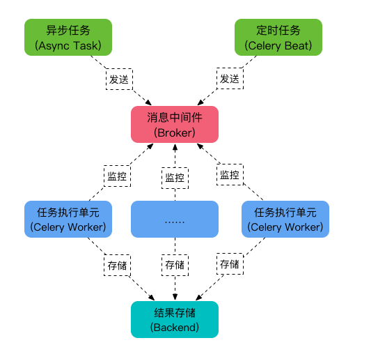

# Celery
> celery 是Python语言实现的分布式队列服务 ,除了支持及时任务,还支持定时任务,
> 

## Celery 有5个核心角色
1. Task
	任务(Task)就是你要做的事情
2. Broker
	celery本身不提供队列服务
	一般使用Redis或者RabbitMQ 来扮演Broker的角色
3. Worker
	worker 就是一直在后台执行任务的人,也称为任务的消费者
    会实时的监控队列中有没有任务,如果有就立即取出来执行
4. Beat
	Beat 是一个定时任务调度器
	它会根据配置定时将任务发给Broker,等待Worker消费
5. Backend
	Backend 用于保存任务的执行结果,每个人物都有返回值
	比如 发送邮件的服务会告诉我们有没有发送成功,这个结果就是存在Backend中,当然我们并不总是要关心任务的执行结果
	




## 快速入门

0. 安装celery

   ` pip install Celery `

1. 创建celery实例

   ``` python
   # tasks.py
   
   from celery import Celery
   app = Celery("tasks",broker="redis://localhost:6379/0")
   ```

2. 创建任务

   ``` python
   #tasks.py
   @app.task
   def send_mail(email):
       
       
       
       
       
       
   ```
