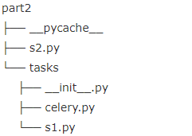

# Celery
> celery 是Python语言实现的分布式队列服务 ,除了支持及时任务,还支持定时任务,
>
> 1. 方便查看定时任务的 执行情况,如,是否成功,当前状态,执行任务花费的时间等
> 2. 使用功能齐备的管理后台或命令行添加,更新,删除任务
> 3. 方便把任务和配置管理相关联
> 4. 可选 多进程,Eventlet 和 Gevent 三种模型并发执行
> 5. 提供错误处理机制
> 6. 提供多种任务原语,方便实现任务分组,拆分和调用链
> 7. 支持多种消息代理和存储后端
> 8. celery 是语言无关的. 它提供了python等常见语言的接口支持

## Celery 有5个核心角色
1. Task
	任务(Task)就是你要做的事情
2. Broker
	celery本身不提供队列服务
	一般使用Redis或者RabbitMQ 来扮演Broker的角色
3. Worker
	worker 就是一直在后台执行任务的人,也称为任务的消费者
    会实时的监控队列中有没有任务,如果有就立即取出来执行
4. Beat
	Beat 是一个定时任务调度器
	它会根据配置定时将任务发给Broker,等待Worker消费
5. Backend
	Backend 用于保存任务的执行结果,每个人物都有返回值
	比如 发送邮件的服务会告诉我们有没有发送成功,这个结果就是存在Backend中,当然我们并不总是要关心任务的执行结果
	


### Celery 常用配置参数汇总

配置项 | 说明
-:| -:
CELERY_DEFAULT_QUEUE | 默认队列
CELERY_BROKER_URL |Broker 地址
CELERY_RESULT_BACKEND|结果存储地址
CELERY_TASK_SERIALIZER|任务序列化方式
CELERY_RESULT_SERIALIZER|任务执行结果序列化方式
CELERY_TASK_RESULT_EXPIRES|任务过期时间
CELERY_ACCEPT_CONTENT|指定任务接受的内容类型(序列化)

### 安装

1. celery 安装

   1. pip install celery
   2. pip install celery[redis]

2.  flower 安装

   xxxxx

   访问端口就可以看到web界面


## 简单使用-快速入门

0. 安装celery

    ` pip install Celery `

1. 创建celery实例

   ``` python
   # tasks.py
   
   from celery import Celery
   app = Celery("tasks",broker="redis://localhost:6379/0")
   ```

2. 创建任务

   ``` python
   #tasks.py
   @app.task
   def send_mail(email):
       print("send mail to",mail)
       import time 
       time.sleep(2)
       return "success"
   ```

   在没有celery的情况下,程序顺序执行,在没个步骤都需要等上一步执行完成,又叫同步操作

   例如

   1. 插入记录到数据库
   2. 发邮件
   3. 注册成功

   我们可以把2放在一个任务中交给celery去异步执行,这样我们就不需要等待发邮件完成,你只需要安排celery去处理帮我去完成就好了,代码就变成了

   1. 插入记录到数据库
   2. 安排celery 帮我去发送邮件
   3. 注册成功

   第二部是非常块的,它只需要把任务放进队列里面去,并不会等任务真正执行完,

3. 启动Worker ` celery -A tesks worker -l info`

   启动worker ,监听Broker中是否有任务,命令:`celery Worker` ,你可能需要执行参数

   -A 指定celery 实例在哪个模块中,例子中,celery实例在tasks.py文件中,启动成功后,就能看到信息

   

   函数用app.task 装饰器修饰之后,就会成为celery中的一个task

4. 调用任务

   在主程序中调用程序,将任务发送给Broker, 而不是真正执行该任务,比如下面的主程序是 register

   ``` python
   user.py
   from tasks import send_mail
   
   def register():
       import time
       start = time.time()
       print("1. 插入记录到数据库")
       print("2. celery 帮我发邮件")
       send_mail.delay("xx@gmail.com")
       print("3. 告诉用户注册成功")
       print("耗时：%s 秒 " % (time.time() - start))
   
   if __name__ == '__main__':
       register()
   ```


   在主程序中,调用函数 `.delay` 方法

   在Worker 窗口看日志信息

   


## 其他用法

###  基础用法

``` python
"""
celery worker  -A tasks -l info

"""
import pytz
from celery import Celery

app = Celery('tasks', broker='amqp://47.98.134.86:5672', backend='amqp://47.98.134.86:5672')

@app.task
def add(x, y):
    print("running...", x, y)
    import time
    time.sleep(10)
    return x + y
```


``` python
#!/usr/bin/env python
# -*- coding:utf-8 -*-
from s1 import add

"""
# 执行任务
result = add.delay(4, 4)
print(result)

# 检查任务是否已经完成
print(result.ready())

# 获取任务结果：可以设置timeout超时
v = result.get()
print(v)
"""

result = add.delay(4, 4)
from celery.result import AsyncResult
print(result,type(result))

"""
from celery.task.control import revoke
revoke(id, terminate=True)
"""
```


### 返回值相关

``` python

In : from proj.tasks import add

In : r = add.delay(1, 3)

In : r

Out: <AsyncResult: 93288a00-94ee-4727-b815-53dc3474cf3f>

In : r.result

Out: 4

In : r.status

Out: u'SUCCESS'
In : r.successful()

Out: True

In : r.backend

Out: <celery.backends.redis.RedisBackend at 0x7fb2529500d0> # 保存在Redis中
    
 
#可以在worker 的终端上显示了执行的任务
#根据上面提到的task_id获得,可以通过用如下两种方式随时找到函数运行完的结果
1.
task_id = '93288a00-94ee-4727-b815-53dc3474cf3f'

In : add.AsyncResult(task_id).get()

Out: 4
    
    
    
2.
In : from celery.result import AsyncResult

In : AsyncResult(task_id).get()

Out: 4   


```


### 多文件



Celery 文件

``` python
#!/usr/bin/env python
# -*- coding:utf-8 -*-
from celery import Celery

# app = Celery('tasks', broker='redis://192.168.0.100:6379/0', backend='redis://192.168.0.100:6379/0')
app = Celery('tasks', broker='amqp://47.98.134.86:5672', backend='amqp://47.98.134.86:5672', include=['tasks.s1'])

app.conf.update(
    result_expires=3600,
)
```

s1.py

``` python

#!/usr/bin/env python
# -*- coding:utf-8 -*-
import time
from .celery import app


@app.task
def add1(x, y):
    time.sleep(1)
    return x + y


@app.task
def add2(x, y):
    time.sleep(2)
    return x + y


@app.task
def add3(x, y):
    time.sleep(3)
    return x + y

```


s2.py

``` python
#!/usr/bin/env python
# -*- coding:utf-8 -*-
from tasks.s1 import add1


result = add1.delay(4, 4)
from celery.result import AsyncResult
print(result,type(result))

```

```
celery worker ``-``A tasks

celery multi start n1 ``-``A task
celery multi stop  n1 ``-``A task
celery multi stopwait  n1 ``-``A task
```


### 定时任务

1. 函数版本

``` python
#!/usr/bin/env python
# -*- coding:utf-8 -*-
"""
启动定制任务：
    celery beat -A s1
    需要依赖celerybeat-schedule.db，所以要对文件夹有写的权限
    或 celery -A periodic_task beat -s /home/celery/var/run/celerybeat-schedule

执行：
    celery worker -A s1


"""
from celery import Celery
from celery.schedules import crontab

app = Celery('tasks', broker='amqp://47.98.134.86:5672', backend='amqp://47.98.134.86:5672')


@app.on_after_configure.connect
def setup_periodic_tasks(sender, **kwargs):
    # 每10s执行一次：test('hello')
    sender.add_periodic_task(10.0, test.s('hello'), name='add every 10')

    # 每30s执行一次:test('world')
    sender.add_periodic_task(30.0, test.s('world'), expires=10)

    # 每天早上7:30执行一次：test('Happy Mondays!')
    sender.add_periodic_task(
        crontab(hour=7, minute=30, day_of_week=1),
        test.s('Happy Mondays!'),
    )

    # 每周3,5的3,7,20点 每12分钟执行一次：test('Happy Mondays!')
    sender.add_periodic_task(
        crontab(
            minute=12, hour="3,7,20", day_of_week='thu,fri', day_of_month="*", day_of_year='*',
        ),
        test.s('11111'),
    )

    # 每周3,5的3,7,20点 每12分钟执行一次：test('Happy Mondays!')
    sender.add_periodic_task(
        crontab(
            minute=25, hour=7, day_of_month=11, month_of_year=4,
        ),
        test.s('11111'),
    )


@app.task
def test(arg):
    print(arg)
```


2. 配置文件版本

   1. 项目目录

      celery_task/

      ​	init.py

      ​	celery.py

      ​	celeryconfig.py

      ​	tasks.py

   2.  内容

    - celery.py

      ``` python
      from __future__ import absolute_import
      from celery import Celery
      
      app = Celery()
      
      app.config_from_object("celery_task.celeryconfig")
      ```

   - celeryconfig.py 配置文件

     ``` python
     from __future__ import absolute_import
     from celery.schedules import crontab
     import datetime
     
     BROKER_URL = "redis://127.0.0.1:6379/0" #指定Broker 消息代理
     CELERY_RESULT_BACKEND = 'redis://127.0.0.1:6379:6379/1' # 指定 Backend 结果存储 
     
     ## 注 结果存储 和消息代理可以用不同 消息代理存储  流行 RabbitMQ 做消息代理，保证持久性 redis 做结果存储
     
     CELERYD_PREFETCH_MULTIPLIER = 10  # 并发量 同一个worker 可以同时处理任务上限
     
     CELERY_TASK_RESULT_EXPIRES = 60 * 60 * 24 #结果存储过期时间,任务过期时间
     CELERY_TASK_ALWAYS_EAGER = False # 如果是这样True，所有任务将通过阻塞在本地执行，直到任务返回
     
     # 字符相关
     CELERY_TASK_SERIALIZER = 'json' # 任务序列化和反序列化使用msgpack方案
     CELERY_RESULT_SERIALIZER = 'json'  # 读取任务结果一般性能要求不高，所以使用了可读性更好的JSON
     CELERY_ACCEPT_CONTENT = ['json'] # 指定接受的内容类型
     
     
     # Timezone
     CELERY_TIMEZONE = 'Asia/Shanghai' #指定时区,不指定默认 UTC
     CELERY_ENABLE_UTC = False # 
     
     #导入不同的tasks
     CELERY_IMPORTS = [
         'celery_task.tasks',
     ]
     
     
     # 定时执行执行任务
     CELERYBEAT_SCHEDULE  = {
         "send_mail_5_second": {
             "task": "celery_task.tasks.send_mail",
             "schedule": datetime.timedelta(seconds=5),
             # "schedule": crontab(minute="*/1"),
             
             "args": ("meng@emc.com",), #任务函数的参数
         },
     
     }
     ```

   - task.py

     ``` python
     from celery_task.celery import app
     
     @app.task
     def send_mail(email):
         import time
         print 'start'
         print email
         time.sleep(3)
         print "end"
     
     ```

3.  启动

   1. 启动一个worker 

      `celery -A celery_task worker -l info`

   2. 启动一个 beat # 随时检查配置变化

      `celery -A celery_task.celery beat -l info` 或

      `celery  beat -A celery_task.celery -l info `


## Celery 相关命令

``` python
# 在celery_task同级目录下执行   celery worker/beat xxx
celery -A celery_task beat  # 发布任务
celery -A celery_task worker --loglevel=info  # 执行任务
celery -B -A celery_task worker --loglevel=info  # 合并成一条
tails/80940643 

```


 ## 定时方式

``` python
from celery.schedules import crontab
from datetime import timedelta
......

方式一：
 "schedule": timedelta(seconds=30), # hours=xx,minutes=xx 每小时/每分钟  （此项可以精确到秒）

方式二：
 "schedule": crontab(minute="*/10"),   # every 10 minutes  

```

``` python
# 后台启动 celery worker进程 
celery multi start work_1 -A appcelery  
# work_1 为woker的名称，可以用来进行对该进程进行管理

# 多进程相关
celery multi stop WOERNAME      # 停止worker进程,有的时候这样无法停止进程，就需要加上-A 项目名，才可以删掉
celery multi restart WORKNAME        # 重启worker进程

# 查看进程数
celery status -A celery_task       # 查看该项目运行的进程数   celery_task同级目录下

执行完毕后会在当前目录下产生一个二进制文件，celerybeat-schedule 。
该文件用于存放上次执行结果：
　　1、如果存在celerybeat-schedule文件，那么读取后根据上一次执行的时间，继续执行。
　　2、如果不存在celerybeat-schedule文件，那么会立即执行一次。
　　3、如果存在celerybeat-schedule文件，读取后，发现间隔时间已过，那么会立即执行。

```


## 参考链接


1. [](<https://foofish.net/celery-toturial1.html>)

2. [官方文档](<http://docs.jinkan.org/docs/celery/index.html>)
3. [celery定时任务简单使用](<https://blog.csdn.net/Shyllin/article/details/80940643>)
4. [使用Celery](<https://zhuanlan.zhihu.com/p/22304455>)