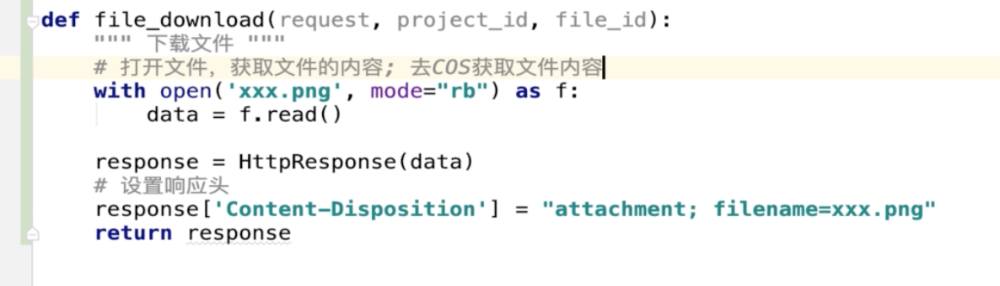

### Django 文件下载一直未默认名称，设置header不管用（中文名无法使用，英文名正常）

原因是不同浏览器对于下载文件文件名的编码解析格式不一样，常用浏览器解析格式如下：

IE浏览器，采用URLEncoder编码
Opera浏览器，采用filename*方式
Safari浏览器，采用ISO编码的中文输出
Chrome浏览器，采用Base64编码或ISO编码的中文输出
FireFox浏览器，采用Base64或filename*或ISO编码的中文输出

```python
response['Content-Disposition'] = 'attachment; ' \
          'filename=' + the_file_name.encode('utf-8').decode('ISO-8859-1')
```


``` python
def file_download(request, project_id, file_id):
    """ 下载文件 """
    # 文件内容 响应头
    file_obj = models.FileRepository.objects.filter(id=file_id, project_id=project_id).first()
    res = requests.get(file_obj.file_path)
    # res.encoding = "utf-8"
    data = res.content

    # response['Content-Type'] = 'application/octet-stream'
    # 以流的形式下载文件,这样可以实现任意格式的文件下载
    # Content-Disposition
    # 就是当用户想把请求所得的内容存为一个文件的时候提供一个默认的文件名
    response = HttpResponse(data)
    response['Content-Type'] = 'application/octet-stream'
    response['Content-Disposition'] = "attachment; filename={}".format(file_obj.name.encode('utf-8').decode('ISO-8859-1'))
    return response

```

