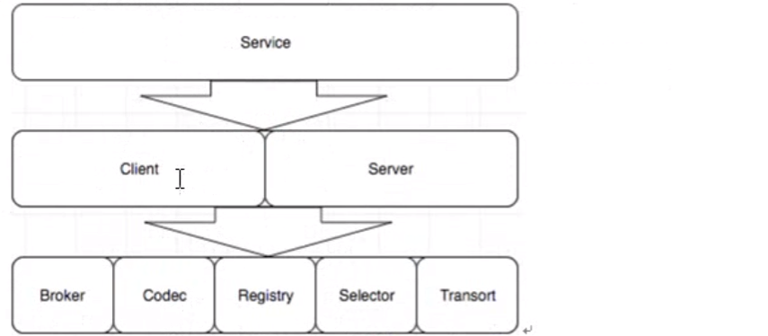

Go Micro 

## 1.go-micro 简介
- Go Micro 是一个插件化的基础框架,基于此可以构建微服务.Micro的设计哲学是可插拔的贾建华架构
- 在架构之外,它默认是实现了consul 做为服务发现(2019年源码修改了默认使用mdns),通过http进行通信,通过protobuf和json进行编解码

## 2.go-micro 的主要功能
1. 服务发现:
	自动服务注册和名称解析.服务发现是微服务开发的核心.当服务A需要和服务B通话时,它需要该服务的位置.默认发现机制是多播DNS(mdns),一种零配置系统.您可以使用SWLM协议为跑p网络设置八卦,或者为弹性云原生设置 consul.
2. 负载均衡:
	基于服务发现构建的客户端负载均衡.一旦我们获得了服务的任意数量实例的地址,我们现在需要一种方法来决定要路由到哪个节点.我们使用随机三列负载均衡来提供服务的均匀发布,并在出现问题时重试不同的节点
3. 消息编码:
	基于内容类型的动态消息编码.客户端和服务器将使用编解码器和内容类型为您无缝编码和解码Go类型.可以编码任何种类的消息并从不同的客户端发送.客户端和服务端r默认处理此问题.这包括默认的protobuf和json
4. 请求/响应:
	基于RPC的请求/响应,支持双向流.我们提供了同步通信的抽象.对服务的请求将自动解决,负载平衡,拨号和流式传输.启用tls时,默认传输为http1.1 或http2
5. Async Messaging:
	PubSub 是异步通信和时间驱动框架的一流公民.事件通知到是微服务开发的核心模式.启用tls时,默认消息船体是点对点http/1.1 或http2
6. 可插拔接口: 
	GoMicro 为每个分布式系统抽象使用Go接口,因此,这些接口是可插拔的,并允许go micro 与运行时无关,可以插入任何基础技术
	- 插件地址: https://github.com/micro/-go-plugins

## 3.go-micro 通信流程
1. Server 监听客户端的调用,和Brocker推送过来的信息进行处理.并且Server端需要向Register注册自己的存在和消亡,这样Client才能知道自己的状态
2. Register 服务的注册的发现,Client端从Register中得到Server的信息,然后每次调用都根根据算法选择一个的Server进行通信,当然通信要经过编码/解码,选择传输协议等一系列过程的.
3. 如果有需要通知所有的Server端可以使用Brocker进行消息的推送,Brocker信息队列金牛星消息的接收和发布

## 4.go-micro 核心接口
go-micro 之所以可以高度定制和它的框架结构是分不开的,go-micro由8个关键的interface 组成,每一个interface都可以根据自己的需要重新实现,这8个interface也构成了go-micro的框架结构.

## go-micro接口详解

1. Transort 通信接口

   服务之间通信的接口,也就是服务发送和接收的最终实现方式,是由这些接口定制的

2. Codec 编码接口

   go-micro有很多种编解码方式,默认的实现方式是protobuf,当然也有其他的实现方式,json jsonrpc mercury 等等

3. Resistry 注册接口

   服务的注册和发现,目前实现的有consul/mdns/etcd/zookeeper/kubernetes 等

4. Selector 负载均衡

5. Broker 发布订阅接口

6. Client客户端接口

7. Server服务端接口

8. Service服务端接口

