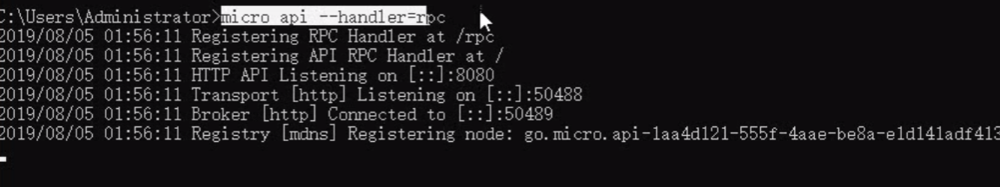
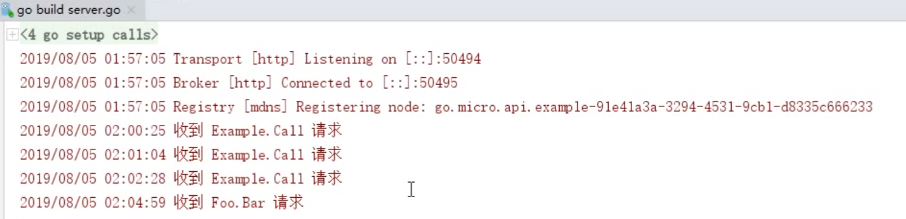

## 安装

1. 查看的网址: https://github.com/micro
2. cmd中输入下面3条命令下载,会自动下载相关的很多包
   1. go get -u -v github.com/micro/micro    // go get github.com/micro/micro
   2. go get -u -v github.com/micro/go-micro
   3. go get -u -v github.com/micro/protoc-gen-micro

**编译安装micro**

> $ cd $GOPATH/src/github.com/micro/micro
>
> $ go build -o micro main.go
>
> $ sudo cp micro /bin/

## 实现

生成micro proto文件
`protoc -I . --micro_out=. --go_out=. ./hello.proto`

Server端

Client

----

第二个例子 通过http访问 内部转换成rpc方式访问

client

先启动这个,

