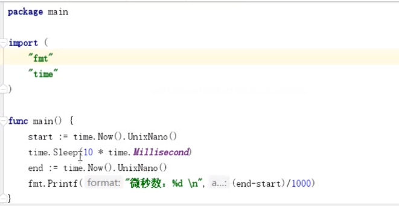

## time 包下的 Time 类型用来表示时间


## time.Now() 获取当前时间

```go
func main() {
	now := time.Now()
	fmt.Println(now)

	// 分别获取年月日
	now.Year()
	now.Month()
	now.Day()
	hour := now.Hour()
	now.Minute()
	now.Second()
	// 02d 代表不足两位数,补0
	fmt.Printf("%02d",hour)

	// 获取时间戳
	now.Unix()

	

}
```


## 用 time.Now().Unix() 获取当前时间戳

从 1970.1.1 00000 到现在的秒数


## 时间戳可以转为Time类型

```go
import (
   "fmt"
   "time"
)

func main() {
   timestamp := time.Now().Unix()
   // 根据时间戳 获取time对象
   timeObj := time.Unix(timestamp, 0) // [0, 999999999]
   fmt.Println(timeObj)

   // 然后获取年月日
   timeObj.Year()
   timeObj.Month()
}
```


## 源码中常量的定义

时间

```go
const (
    // 纳秒
   Nanosecond  Duration = 1
    // 微妙
   Microsecond          = 1000 * Nanosecond
    // 毫秒
   Millisecond          = 1000 * Microsecond
   Second               = 1000 * Millisecond
   Minute               = 60 * Second
   Hour                 = 60 * Minute
)
```


日期

```go
const (
   Sunday Weekday = iota
   Monday
   Tuesday
   Wednesday
   Thursday
   Friday
   Saturday
)
```


## 时间类型格式化 

time.Now().Format() 可以将时间格式化   

```
"2006-01-02 15:04:05.999999999 -0700 MST"
```


```go
func main() {
   now := time.Now()
   fmt.Println(now)

   timeStr := now.Format("2006-01-02 15:04:05")
   fmt.Println(timeStr)

}
```


## 练习

1. 写一个程序, 获取当前时间, 并格式化

   ```go
   func main() {
      now := time.Now()
      // Sprintf
      timeStr :=fmt.Sprintf("%02d-%02d-%02d %02d:%02d:%02d", now.Year(), now.Month(), now.Month(), now.Hour(), now.Minute(), now.Second())
      fmt.Println(timeStr)
      
      // time.Format
      fmt.Println(now.Format("2006-01-02 15:04:05"))
   }
   ```

2. 写一个程序, 统计一段代码的执行耗时, 单位精确到微妙

   


