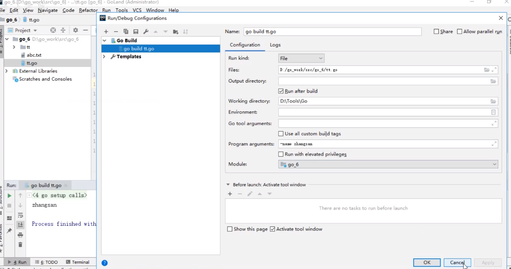

## 命令行参数

用户终端输入的命令. 使用flag标准包


- os.Args

```go
func main() {
   // 获取命令行参数 os.Args
   fmt.Println(os.Args)
   // 遍历参数
   for index,val := range os.Args{
      fmt.Println(index,val)
   }
}
```


- flag

  ```go
  import (
     "flag"
     "fmt"
  )
  
  // 命令行参数 -name xx -age 22 -money 12.4 --isstupid true
  func main() {
     // 参数1 传的参数的key
     // 参数2 默认值
     // 参数3 说明
     
     // 第一种 flag.String
     namePtr := flag.String("name", "无名氏", "名字")
     agePtr := flag.Int("name", 0, "年龄")
     moneyPtr := flag.Float64("name", 0, "财富")
     isstupidPtr := flag.Bool("name", true, "isstupid")
  
     // 解析参数
     flag.Parse()
     fmt.Println(*namePtr, *agePtr, *moneyPtr, *isstupidPtr)
  -------------------------------------------------------------
     // 第二种 flag.StringVar
      var name string
  	flag.StringVar(&name,"name", "无名氏", "名字")
  
  	// 解析参数
  	flag.Parse()
  	fmt.Println(name)
  }
  ```

  




## 命令行参数练习

- 实现一个密码生成工具,支持以下功能

  - 用户可以通过 -l 指定密码的长度

  - 用户可以通过 -t 指定生成密码的字符集. 

    - 例如 -t num 生成的全是数字的密码, 
    - -t char 生成全是英文字符的密码. 
    - -t mix 申城包含数字和英文字符的密码. 
    - -t advance 生成包含数字 英文以及特殊字符的密码

  - 提示/: 用标准包 flag 解析命令行参数实现, 用于生成密码的字符串如下

    - const  (

      NumStr = "0123456789"

      CharStr = "A-z"

      SpecStr = "++@#,.[]()!%^*$"

      )

  