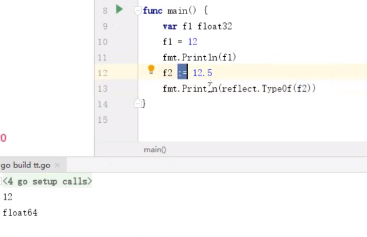

## 整形


int32 

int

## 浮点型


跟平台相关 自动推断是32还是64位



go不允许不同类型相加,编译错误


## 布尔型

只有 true 和 false


## byte

char 类型

``` go
var b byte = "c"
>> 99

格式化输出
fmt.Printf("%c",b) // %c 就是以char类型输出
>> c
// 查看类型
fm.t.Println(reflect.TypeOf(b)
>> uint8  // 一个字节
```


## 字符串

字符串的两种方式

1. " "

2. `` 反引号   

   > 保存原格式 里面的字符串不会给转义. 比如 \n 也不会

``` go
var str string
// 字符串是双引号
str = "abc"
// 取字符串第一个字符
ch := str[0]
fmt.Println(ch) // 97

// 原样输出
str2 := `hello
	kasd \n`

格式不变,原样输出

```


## fmt 用法  参见上一篇文章 fmt

​	


格式化输出


输入


## 类型别名

给类型定义一个自己的类型名字

type关键字定义类型 **


用处: 给自己类型定义自己的方法.类似字符串的split 


## 类型转换


- go语言不允许隐式转化.强制转换


- 


## 运算符

- Go中的运算符均是从左至右结合

优先级（从高到底）

- `^      !   `                （一元运算符）单个值为一元
- `*       /    %    <<    >>    &      &^`
- `+      -     |      ^ `                               （二元运算符）
- `==   !=   <    <=    >=    >`
- `<- `                         （专门用于channel）
- `&&`
- `||`

