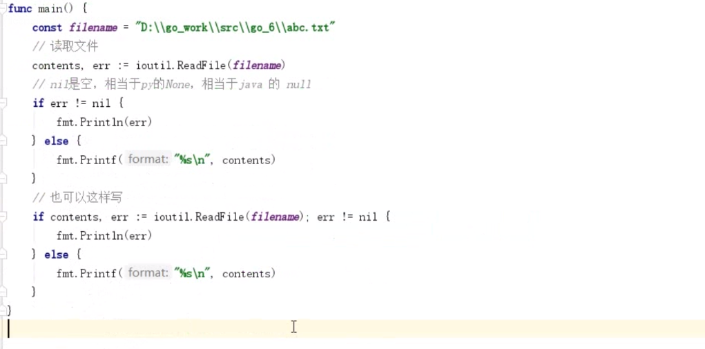
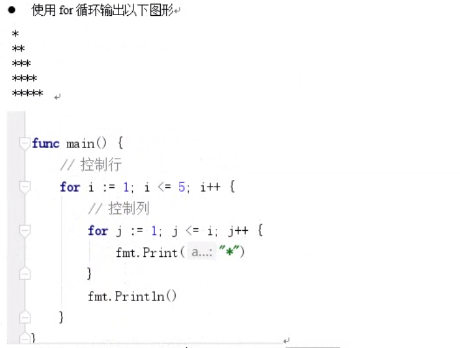

# 1.选择结构

- if else
- else if
- switch

----


## 判断语句 if

1. 条件表达式没有括号
2. 支持一个初始化表达式
3. 左大括号必须和条件语句或else 同一行
4. 支持单行模式
5. 初始化语句中的变量为block级别，同时隐藏外部同名变量

```go
func main(){
	a := true
	if  a,b,c := 1,2,3; a+b+c > 6 {
		fmt.Println("> 6")
	}else {
		fmt.Println("< 6")
		fmt.Println(a)
	}
	fmt.Println(a)
}
```





## 选择语句 switch

选择语句

1. 可以使用任何类型或表达式作为条件语句
2. 不需要写break，一旦条件符合自动终止
3. 如希望继续执行下一个case，需使用`fallthrough`语句
4. 如果一个初始化表达式（可以是并行方式），右侧需跟分号
5. 左大括号必须和条件语句在同一行
6. 最后 条件都没成功.执行  `default:`

``` go

// 1
func main(){
  a := 1
  switch a {
    case 0:
    	fmt.Println("a=0")
  	case 1 :
    	fmt.Println("a=1")
  }
}

//2 
func main(){
  a := 1 
  switch {
    case a >= 0:
    	fmt.Println("a=0")
    	fallthrough
    case a >=1:
    	fmt.Println("a=1")
  }
  fmt.Println(a)
}

//3
func main(){
  switch a := 1;{
    case a >=0:
    	fmt.Println("a>0")
    	fallthrough
    case a >=1 :
    fmt.Println("a=1")
  }
}


//4 
func main() {
	str := "a"
	switch str {
	case "a","b","c":
		fmt.Println("找到了")
	default:
		fmt.Println("没找到")

	}
}
```


# 2. 循环结构

- for
- range

----


## for循环

1. go 只有for一个循环语句关键字，但支持3种形式
2. 初始化和步进表达式可以是多个值
3. 条件语句每次循环都会被重新检查，因为不建议在条件语句中使用函数
   使用函数，尽量提前计算好条件病以变量或常量代替
4. 左大括号必须和条件语句在同一行

``` go
// 1 死循环
func main(){
	a := 1
	for {
		a++
		if a >3 {
			break
		}
	}
	fmt.Println(a)
}

// 2 没有其他条件 只有一个条件判断语句
func main{
	a := 1 
	for ;a <= 3; {
		a++
	}
	fmt.Println(a)
}

// 3  初始化语句;条件判断;结束语句 { 循环代码块 }
// 执行顺序  初始化语句-> 条件判断-> 循环代码块-> 结束语句
func main(){
	a := 1 
	for i:=0;i < 3;i++{
		a++
	}
	fmt.Prntln(a)	
}

// 4 多个
func main() {
	for num, i := 10, 1; i < 10 && num <= 18; i, num = i+1, num+1 {
		fmt.Printf("%d * %d = %d\n", num, i, num*i)
	}
}

```


## range 循环

下标,value := range args { }


```go
func main() {
   s := "abc"
   // 接收下标
   for i := range s {
      fmt.Printf("下标=%d, 值=%c \n", i, s[i])
   }
   // 接收下标和值
   for i, c := range s {
      fmt.Printf("下标=%d, 值=%c\n", i, c)
   }
}
```


# 3. 跳转语句

- break 和 continue
- goto


## 跳转语句 goto ，break ， continue

1. 三个语法都可以配合标签使用
2. 标签名区分大小写，若不使用会造成编译错误
3. break 与 continue 配盒标签可用于多层循环跳出
4. goto 是调整执行位置，与其他2个语句配合标签的结果并不相同

```go
func main(){
  LABEL:
  for {
    for i :=0;i <10;i++{
      if i > 2{
        break LABEL
      }else {
        fmt.Println(i)
      }
    }
  }
}


func main(){
  for {
    for i :=0;i <10;i++{
      if i > 2{
        // 跳转
        goto LABEL
      }else {
        fmt.Println(i)
      }
    }
  }
LABEL :
	  xxxx
}
```


## 九九乘法表


```go
func main() {
   for i := 1; i < 10; i++ {
      for j := 1; j <= i; j++ {
         fmt.Printf("%d+%d=%d\t", i, j, i*j)
      }
      fmt.Println()
   }
}
```


## 打印练习





```go
for i := 1; i <= 5; i++ {
   // 空格
   for j := 0; j < 5-1; j++ {
      fmt.Println(" ")
   }
   // 星
   for j := 1; j < 2*i; j++ {
      fmt.Println("*")
   }
}
```