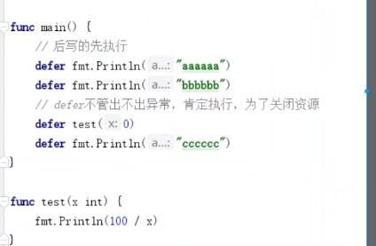
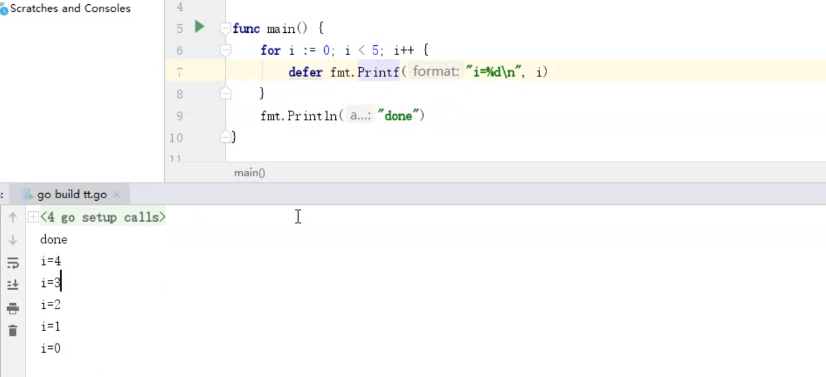
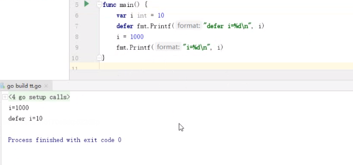

# 函数

## 函数介绍

- 定义: 有输入,有输出,用来执行一个指定任务的代码块,增加代码的可重用性

- 函数声明格式:

  func  函数名 ([参数列表]) [返回值列表] {

  ​	函数体

  }


## 自定义函数

- 无参无返回值
- 有参无返回值
- 有不定参数无返回值  (... 放在函数参数列表的最后面)
- 无参数有返回值
- 有参有返回值

返回值是否提前定义, 有名直接指定名,无名直接返回值


```go
// 循环
func main() {
   sum := 0
   for i := 1; i <= 100; i++ {
      sum += i
   }
   fmt.Println(sum)
}

//递归

```


### 练习: 循环和递归求1-100的和

```go
func main() {
	sum := 0
	for i := 1; i <= 100; i++ {
		sum += i
	}
	fmt.Println(sum)
}


// 传入最大值
func Test1(num int) int {
   if num == 1 {
      return 1
   }
   return num + Test1(num-1)
}

// 传入最小值
func Test2(num int) int {
   if num == 100 {
      return 100
   }
   return num + Test2(num+1)

}
func main() {
   fmt.Println(Test1(100))
   fmt.Println(Test2(1))
}
```


## defer 关键字

- defer 用于延迟一个函数或者方法的执行
- defer语句经常被用于处理成对的操作, 如打开,关闭,连接,断开连接,加锁,释放锁 等
- 通过defer机制,不论函数逻辑多复杂,都能保证在任何执行路径下,资源被释放
- 释放资源的defer应该直接跟在请求资源的语句后,以免忘记释放资源.


## 多个defer执行顺序

后写defer 先执行




即使报错还是会继续执行defer 





此时defer已经为10 , 只不过是暂且不执行而已




## 变量作用域

- 全局变量

  在main()前面定义,优先于main() 初始化

- 局部变量

  函数内部职能在函数内部使用


## 变量的可见性

- 包内任何变量和函数都是能访问的,包歪需要**名字首字母大写**才可以访问

  想让外面能访问就首字母大写


## 匿名函数

- 函数也是一种类型, 因为可以定义个函数类型的变量


```go
func add(a,b int) int  {
	return a+b
}

// 定义函数类型的变量
func test1() {
	f1 :=add
	fmt.Printf("f1类型是%T\n", f1)
	// 函数类型的变量调用函数
	sum := f1(2,3)
	fmt.Println(sum)
}


// 2. 定义和赋值写一起
func test2()  {
	f1 := func(a,b int) int { return a+b}
	fmt.Printf("f1类型是%T\n", f1)
	// 函数类型的变量调用函数
	sum := f1(2,3)
	fmt.Println(sum)
}


// 3.defer后写匿名函数
func test3()  {
	var i int = 0
	defer func() {
		fmt.Printf("defer i=%d\n", i)
		// 执行匿名函数 是最后才调用的,此时的i 已经等于100.这是无参
		// 弱传参,上面定义,下面传参,也叫闭包
	}()
	i = 100
	fmt.Printf("defer i=%d\n", i)
	return
}

func main() {
	test1()
}
```


## 函数类型作为参数


```go
// 函数类型当参数去用
func test1(a, b int, op func(int, int) int) int {
   return op(a, b)
}

// 计算2个数相减
func sub(a, b int) int {
   return a - b
}

func main() {
   res := test1(10, 5, sub)
   fmt.Println(res)
}
```


## 闭包

- 闭包是一个函数和与其他相关的引用环境组合而成的实体

  ``` go
  // 定义返回值是函数类型的方法
  func add() func(int) int {
     var x int
     // 局部变量x此时被匿名函数引用
     // 也就是x与匿名函数组成了一个实体
     // 所以下面函数若存活,则x会伴其左右
     return func(d int) int {
        x += d
        return x
     }
     
  }
  
  func main() {
     var f1 = add()
     fmt.Println(f1(1))
     fmt.Println(f1(20))
     fmt.Println(f1(100))
  }
  
  1
  21
  121
  ```

  

- 外部引用函数参数局部变量

  ``` go
  // 外部引用函数参数局部变量
  func add(base int) func(int) int {
  	return func(i int) int {
  		base += i
  		return base
  	}
  }
  
  func main() {
  	tmp1 := add(10)
  	fmt.Println(tmp1(1))
  	fmt.Println(tmp1(2))
  	// 此时tmp1 和 tmp2 不是一个实体
  	tmp2 := add(100)
  	fmt.Println(tmp2(1))
  	fmt.Println(tmp2(2))
  }
  
  11
  13
  101
  103
  ```

  

- 判断传入字符串,是否已某子串作为结尾

``` go
// 判断一个字符串是不是以什么结尾,不是就给添加上
func test1(suffix string) func(string ) string {
	return func(name string) string {
		if !strings.HasSuffix(name,suffix) {
			return name + suffix
		}
		return name
	}
}

func main() {
	func1 := test1(".bmp")
	func2 := test1(".jpg")
	fmt.Println(func1("test.bmp"))
	fmt.Println(func2("test"))
}
```


- 返回2个闭包

  ```go
  // 返回两个闭包函数
  func test1(base int) (func(int) int, func(int) int)  {
     // 定义两个函数 并返回
     add := func(i int) int {
        base += i
        return base
     }
  
     sub := func(i int) int {
        base -= i
        return base
     }
     return add, sub
  
  }
  
  func main() {
     f1, f2 := test1(10)
     fmt.Println(f1(1))
     fmt.Println(f2(2))
     // base 是一直没消的
     // 11 9
  
     fmt.Println(f1(3))
     fmt.Println(f2(4))
     // 12 8
  }
  ```

- 闭包的副作用

  ```
  
  // 注意区别
  func main() {
  	for i:=0; i<5; i++ {
  		go func() {
  			fmt.Println(i)
  		}()
  	}
  	time.Sleep(time.Second)
  }
  
  func main() {
     for i:=0; i<5; i++ {
        go func(index int) {
           fmt.Println(index)
        }(i)
     }
     time.Sleep(time.Second)
  }
  
  
  
  ```

```go

```


## 练习

1. 打印1到100所有的质数(大于1的自然数,除了1和它本身,不能被任何数整除)

   ```go
   func is_zhishu(num int) bool {
      if num == 1 {
         return false
      }
      for i := 2; i < num; i++ {
         if num%i == o {
            return false
         }
      }
      return true
   }
   
   func main() {
      for i := 2; i < 100; i++ {
         if is_zhishu(i){
            fmt.Printf("%d 是质数", i)
         }
      }
   }
   ```

   

2. 打印100 到1000 所有的水仙花数. (指一个数字,各位数字立方和等于该数本身,例如153 是一个水仙花数, 1^3 + 5^3 + 3^3 = 153)

   ```go
   func is_shuixianhua(num int) bool {
      //
      first := num%10
      second := (num/10)%10
      third := (num/100)%10
      sum := first*first*first + second*second*second  + third*third*third
      if sum == num {
         return true
      }
      return false
   }
   
   func main() {
      for i := 100; i < 1000; i++ {
         if is_shuixianhua(i){
            fmt.Printf("%d 是水仙花数\n", i)
         }
      }
   }
   ```

3. 输入一行字符, 分别统计出其中英文字母, 空格, 数字, 和其他字符的个数

   


