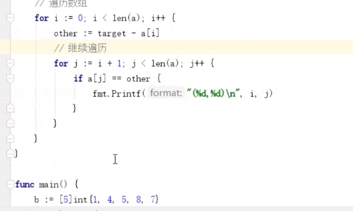

## 了解 python 和其他语言数组内存结构


数组是同一类型的. 索引取值为啥是从0开始

比如一个数字占4字节


数组是一体式


python 是乘4扩容,指向


## 1.数组的定义和初始化

- 数组格式

  `var 数组名[数组长度] 数组类型`

- 定义和初始化数组

  ```go
  func main() {
     // 1. 定义数组
     var arr1 [5]int
     // 2. := 声明并赋值
     arr2 := [3]int{1,2,3}
     //3. 省略大小
     arr3 := [...]int{2,4,6,8,10}
     //4.
     arr4 := [5]int{1,2,3}
     // 5. 指定位置
     arr5 := [5]int{3:100,4:200}
  
     fmt.Println(arr1,arr2,arr3,arr4,arr5)
     // [0 0 0 0 0] [1 2 3] [2 4 6 8 10] [1 2 3 0 0] [0 0 0 100 200]
  
     //6.部分赋值给别的数组
     arr6 :=[5]int{3:100,4:200}
     var arr7 [5]int
     arr7 = arr6
     fmt.Println(arr7)
  
  }
  ```

## 2.数组的遍历

```go
func main() {
   // 数组的遍历
   // 1.for
   arr1 := [5]int{3:100,4:200}
   for i:=0;i<len(arr1);i++ {
      fmt.Printf("arr1[%d]=%d\n",i,arr1[i])
   }

   // 2.range
   for i :=range arr1{
      fmt.Printf("arr1[%d]=%d\n",i,arr1[i])
   }
   for i,v := range arr1 {
      fmt.Printf("arr1[%d]=%d\n",i,v)
   }
}
```


## 3.二维数组 多维

```go
func main() {
   // 多维数组
   // 三行两列
   var a [3][2]int
   a[0][0] = 10
   a[0][1] = 20
   a[1][0] = 30
   a[1][1] = 40
   a[2][0] = 50
   a[2][1] = 60
   fmt.Println(a)

   // 遍历
   // 2个循环
   for i:=0;i<3;i++ {
      for j:=0; j<2;j++ {
         fmt.Printf("%d ",a[i][j])
      }
   }
   fmt.Println()
   // for rang
   for i,val := range a {
      fmt.Printf("row[%d] = %v\n",i,val)
      for j,val2 := range val {
         fmt.Printf("(%d,%d) = %d",i,j,val2)
      }
      fmt.Println()
   }

}
```


## 4.数组的拷贝和传参

默认是值传递(数组的拷贝)  


要是想修改值, 传递地址


## 5.数组练习

- 求数组所以元素的和

  ```go
  // 求元素和
  func sumArr(a [10]int) int  {
     var sum int = 0
     for i :=0;i<len(a); i++ {
        sum += a[i]
     }
     return sum
  }
  
  func main() {
     //弱想做一个真正的随机数,要种子
     //seed() 种子默认是1
     //rand.Seed(1)
     rand.Seed(time.Now().Unix())
     
     var b [10]int
     for i:=0;i<len(b);i++ {
        //产生一个1到1000的随机数
        b[i] = rand.Intn(1000)
     }
  }
  ```

  

- 找出数组中为给定值的两个元素的下标, 例如数组[1,3,5,7,9], 找出两个元素之和等于8的下标分别是(0,4)和(1,2)




## 了解常量池


go没有常量池,java是有常量池

理解为把 内存分为 栈和堆, 栈是程序使用的部分, 堆是程序员操作的部分

常量池把堆又分出来一块叫常量池, 定义同一个变量时,就把值放到常量,不会重复创建

go 不遵循

