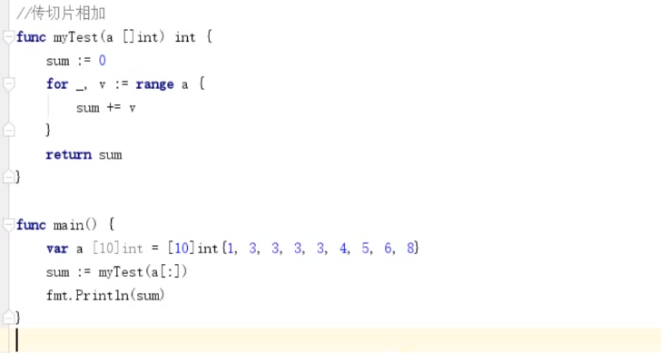

## Slice 切片  **引用类型**

**切片是真正意义上的动态数组,而且是一个引用类型,指向一个底层数组**


切片与数组的区别是固定长度
切片声明之后要初始化才能使用,不然是不能赋值,等slic函数操作


## slice 概述
切片本身不是数组，是基于数组类型的封装,可以自动扩容


## 切片三要素
  1. 地址 (切片中第一个元素指向的内存空间)

  2. len() 元素个数

  3. cap() 元素容量 (底层数组最多存放元素的个数)

     

## 切片扩容策略 

可以通过查看$GOROOT/src/runtime/slice.go源码

  > 每一次都是上一次的两倍.旧切片的长度小于1024
  > 如果旧切片的长度大于1024,则最终容量就增加原来的1/4


##  创建slice 三种方式

定义切片

`var 切片名 []切片类型`

1. 直接声明 

   ``` go
   未赋值为nil  
   var s1[]int 
   s1 = nil  
   
   s2:= []int{}
   空
   
   ```

   

2. 基于数组定义切片      

   len()为切片元素的个数,cap()为切片的起始位置到底层数组的最后  **特别重要**

   如果修改切片,原底层的数组的值也就修改

   

3. make 创建  声明并创建 make([]T, size, cap)

   

### 切片不能直接比较

	切片唯一合法的比较操作是和nil 比较 .
``` go
	var a []int   // 只是声明一个int类型的切片. len cap 都是0  只是声明并底层并没有内存地址和之对应. 可以用来和nil比较.== nil
	var b = []int{} // 声明并初始化            len cap 都是0
	c:= make([]int,0)						  len cap 都是0
```

``` go
### 1. 直接定义
func main() {
	// 声明切片类型
	var a []string              //声明一个字符串切片
	var b = []int{}             //声明一个整型切片并初始化
	var c = []bool{false, true} //声明一个布尔切片并初始化
	var d = []bool{false, true} //声明一个布尔切片并初始化
	fmt.Println(a)              //[]
	fmt.Println(b)              //[]
	fmt.Println(c)              //[false true]
	fmt.Println(a == nil)       //true
	fmt.Println(b == nil)       //false
	fmt.Println(c == nil)       //false
	// fmt.Println(c == d)   //切片是引用类型，不支持直接比较，只能和nil比较
}

2. 基于数组定义切片
func main() {
	// 基于数组定义切片
	a := [5]int{55, 56, 57, 58, 59}
	b := a[1:4]                     //基于数组a创建切片，包括元素a[1],a[2],a[3]
	fmt.Println(b)                  //[56 57 58]
	fmt.Printf("type of b:%T\n", b) //type of b:[]int
}

元素个数为切片包含的元素个数
容量为当前切片的起始位置到数组的最后一个元素

******* // 重要
可以对切片在切片,可以向后扩张,不可以向前扩展.但是索引不能超过原数组的长度，否则会出现索引越界的错误。
*****

3. 使用make()函数构造切片
make([]T, size, cap)
func main() {
	a := make([]int, 2, 10)
	fmt.Println(a)      //[0 0]
	fmt.Println(len(a)) //2
	fmt.Println(cap(a)) //10
}


### 查看cap的例子
func main() {
 
	// 定义一个数组
	a := [...]int{1, 3, 5, 7, 9, 11, 13}
	// 基于数组得到一个切片
	b := a[:]
	// 修改切片的第一个元素的值为100
	b[0] = 100
	// 数组 第一个元素也会修改
	fmt.Println(a[0])
	// 切片的底层就是这个数组

	c := a[2:5]
	fmt.Println(c)      // [5,7,9]
	fmt.Println(len(c)) // 3
	fmt.Println(cap(c)) // 5 切片在数组中的起始位置到数组的最后 cap

	d := c[:6] // 错误 超出数组
	fmt.Println(d)
}


```


## 切片操作

| 操作            | 含义                                                         |
| --------------- | ------------------------------------------------------------ |
| s[n]            | 切片从s中索引位置为n的项                                     |
| s[:]            | 从切片s的索引位置0到len(s)-1 处所获得的切片                  |
| s[low:]         | 从切片s的索引位置low到len(s)-1出所获得的切片                 |
| s[:high]        | 从切片的索引位置0到high处所所得的切片. len=high              |
| s[low:high]     | 从切片s的索引位置low到high出所获得的切片. len = high-low     |
| s[low:high:max] | 从切片s的索引位置low到high出所获得的切片.len=high-low cap=max-low |
| len(s)          | 切片s的长度.总是<=cap(s)                                     |
| cap(s)          | 切片s的容量,总是>=len(s)                                     |


```go
func main() {
   // 定义数组
   arr := []int{0,1,2,3,4,5,6,7}
   // 切片
   fmt.Println(arr[2:6])
   fmt.Println(arr[:6])
   fmt.Println(arr[2:])
   fmt.Println(arr[:])
}
/*
[2 3 4 5]
[0 1 2 3 4 5]
[2 3 4 5 6 7]
[0 1 2 3 4 5 6 7]
*/
```


## 切片方法

可通过go doc 命令查看
`>go doc  builtin.append`


### Reslice

1. Reslice 按索引取值
2. 索引不可以超过被slice的切片的容量cap()值
3. 索引越界不会导致底层数组的重新分配，而是引发错误

   `s1[0]`


### append() 为切片添加元素 扩容

1. 可以在slice尾部追加元素
2. 可以将一个slice追加在另一个slice尾部
3. 如果最终长度未超过追加到slice的容量则返回原始slice
4. 如果超过追加到的slice的容量则将重新分配数组并拷贝原始数据
5. 追加一个切片的时候,使用   追加的切片名称...
6. 
``` go
func main() {
	//append()添加元素和切片扩容 %p 打印内存地址
	var numSlice []int
	for i := 0; i < 10; i++ {
		numSlice = append(numSlice, i)
		fmt.Printf("%v  len:%d  cap:%d  ptr:%p\n", numSlice, len(numSlice), cap(numSlice), numSlice)
	}
}

[0]  len:1  cap:1  ptr:0xc0000a8000
[0 1]  len:2  cap:2  ptr:0xc0000a8040
[0 1 2]  len:3  cap:4  ptr:0xc0000b2020
[0 1 2 3]  len:4  cap:4  ptr:0xc0000b2020
[0 1 2 3 4]  len:5  cap:8  ptr:0xc0000b6000
[0 1 2 3 4 5]  len:6  cap:8  ptr:0xc0000b6000
[0 1 2 3 4 5 6]  len:7  cap:8  ptr:0xc0000b6000
[0 1 2 3 4 5 6 7]  len:8  cap:8  ptr:0xc0000b6000
[0 1 2 3 4 5 6 7 8]  len:9  cap:16  ptr:0xc0000b8000
[0 1 2 3 4 5 6 7 8 9]  len:10  cap:16  ptr:0xc0000b8000


// append()函数还支持一次性追加多个元素 
var citySlice []string
// 追加一个元素
citySlice = append(citySlice, "北京")
// 追加多个元素
citySlice = append(citySlice, "上海", "广州", "深圳")
// 追加切片
a := []string{"成都", "重庆"}
citySlice = append(citySlice, a...)
fmt.Println(citySlice) //[北京 上海 广州 深圳 成都 重庆]


```


关于底层数组的变化

```go
func main() {
   // 定义数组
   arr := []int{0,1,2,3,4,5,6,7}
   s1 := arr[2:6]
   fmt.Println(s1)
   s2 := s1[3:5]
   fmt.Println(s2)
   // 映射到底下是覆盖操作
   s3 := append(s2,10)
   fmt.Println(s3)
   fmt.Println(arr)
   fmt.Println()
   // 底层去自动扩容了,此时打印的是原数组
   s4 := append(s3,11)
   fmt.Println(s4)
   fmt.Println(arr)
   s5 := append(s4,12)
   fmt.Println(s5)
   fmt.Println(arr)
}
```


### copy()函数复制切片
> copy(destSlice, srcSlice []T)
> srcSlice: 数据来源切片
> destSlice: 目标切片

``` go
func main() {
	// copy()复制切片
	a := []int{1, 2, 3, 4, 5}
	c := make([]int, 5, 5)
	copy(c, a)     //使用copy()函数将切片a中的元素复制到切片c
	fmt.Println(a) //[1 2 3 4 5]
	fmt.Println(c) //[1 2 3 4 5]
	c[0] = 1000
	fmt.Println(a) //[1 2 3 4 5]
	fmt.Println(c) //[1000 2 3 4 5]
}

// 在两个slice间复制数据, 两个slice可指向同一底层数组
func main() {
	// 定义数组
	arr := []int{0,1,2,3,4,5,6,7,8,9,10,11,12,13,14,15}
	s1 := arr[8:] // 8 9 10 ...
	s2 := arr[:5] // 0 1 2 3 4
	// 第二个参数,曹蓓到第一个里面
	// 按照个数从左侧开始覆盖
	copy(s1,s2)
	fmt.Println(s1)
	fmt.Println(arr)
	/*
	[0 1 2 3 4 13 14 15]
	[0 1 2 3 4 5 6 7 0 1 2 3 4 13 14 15]
	*/
}

```


### 从切片中删除元素

> 并没有提供特定的删除方法
总结一下就是：要从切片a中删除索引为index的元素，操作方法是a = append(a[:index], a[index+1:]...)
``` go
func main() {
	// 从切片中删除元素
	a := []int{30, 31, 32, 33, 34, 35, 36, 37}
	// 要删除索引为2的元素
	a = append(a[:2], a[3:]...)
	fmt.Println(a) //[30 31 33 34 35 36 37]
}
```


### 切片的遍历

``` go

func main() {
	s := []int{1, 3, 5}

	for i := 0; i < len(s); i++ {
		fmt.Println(i, s[i])
	}

	for index, value := range s {
		fmt.Println(index, value)
	}
}
```


### sort 包排序
``` go
func main() {
	// 使用sort包对数组进行快速排序 ,
	// sort.Ints 支持对切片,所以要转成切片
	var a = [...]int{3, 7, 8, 9, 1}
	sort.Ints(a[:])
	fmt.Println(a)
}

```


## 切片作为参数传递




