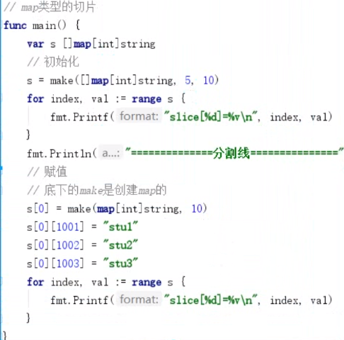
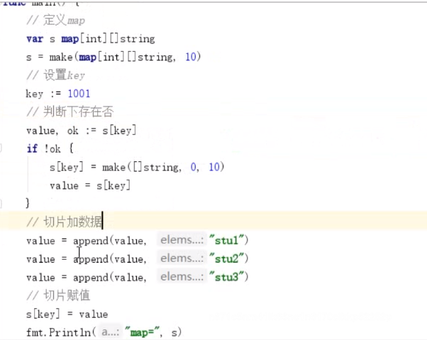

## map类型  引用类型

map 是go内置的数据结构,是一种**无序的键值对**的集合, 可以通过 key 快速找到 value 的值

**map 必须初始化才能使用, 否则报错**


1. 定义, 必须初始化才能使用 (直接定义,或者make) 提前规划好容量,省的以后还要动态扩容
2. 遍历 
3. 判断key
4. delete


fmt.printf("%#v",a)

1. 类似其他语言中的哈希表或者字典 key-value
2. key必须具有唯一性，可hash
3. map 中的元素是无序的，遍历的时的顺序是随机的
4. 在访问，删除元素时，都要计算key的hash值，然后找到对应的hash bucket，进而找到hash bucket中的key value
5. go中的map是一个指针，它的底层是数组，而且用到了两个数组，其中一个更底层的数组用语打包保存key和value
6. 超出容量时会自动扩容，但尽量提供一个合理的初始值
7. 使用`len()`获取元素的个数
8. 键值不存在时自动添加，使用`delete()`删除某键值对
9. 使用for range 对map 和slice 进行迭代操作


## 定义  map

> 可以通过make() 创建map，它会先创建好底层数据结构，然后再创建map，并让map指向底层数据结构

`my_map := make(map[string]int)`

其中 string 表示map 的 key 的数据类型,int 表示 key 对应的值

也可以直接通过大括号创建并初始化赋值

``` go
1. 声明变量
var m1 map[int]string    // == nil

2.通过 make 创建
m2 := make(map[int]string)

3. 通过 make 创建并指定长度,只是指定了容量,但是里面却是一个数据也没有,但是随着元素的不停的添加,会不停的扩充,提前订好容量的好处,提前申请好,
m3 := make(map[int]string,10)


// 空 map
my_map := map[string]string{}

// 初始化赋值
my_map:= map[string]string{"Red":"111","Orange":"222"}


```


其中 map 的 keykey 是任意内置的数据类型,或者其他可以通过 "==" 进行等值标记哦的数据类型,如 interface 和指针可以,slice 数组 map struct 类型都不能作为 key

但是 value 基本可以是任意类型,例如嵌套一个 slice 到 map 中:

`my_map := map[string][]int{}`


## 访问map 元素

访问 map 中的元素时,指定它的 key 即可,主要 string 类型的 key 必须加上引号:

``` go
my_map:= map[string]int{
  "Java":11,
  "Prel":8,
  "Python":13,
}
// 访问
println(my_map["Perl"])

//赋值已有的 key & value
my_map["Prel"] = 12
println(my_map["Prel"])

// 赋值新的 key & value
my_map["Shell"] = 13
println(my_map["Shell"])
```


## nil map 和 空 map

空 map 时不做任何赋值的 map:

``` go
//空 map
my_map := map[string]string{}
```


nil map,它将不会做任何初始化,不会指向任何数据结构:

``` go
//nil map
var my_map map[string]string
```


nil map 和 empty map 的关系,就像 nil slice 和 empty slice 一样,两者都是空对象,未存储数据,

但是前者不指向底层数据结构,后者指向底层数据结构,只不过指向的底层对象是空对象

``` go
package main

func main() {
    var nil_map map[string]string
    println(nil_map)

    emp_map := map[string]string{}
    println(emp_map)
}


0x0
0xc04204de38
```

所以 map 类型实际上就是一个指针


## map 中元素的返回值

当访问map中某个元素的时候，有两种返回值的格式：

```go

value := my_map["key"]
value,exists := my_map["key"]
```

第一种很好理解，就是检索map中key对应的value值。如果key不存在，则value返回值对应数据类型的0。例如int为数值0，布尔为false，字符串为空""。

第二种不仅返回key对应的值，还根据key是否存在返回一个布尔值赋值给exists变量。所以，当key存在时，value为对应的值，exists为true；当key不存在，value为0(同样是各数据类型所代表的0)，exists为false。

看下例子：

```go

my_map := map[string]int{
                "Java":11,
                "Perl":8,
                "Python":13,
            }

value1 := my_map["Python"]
value2,exists2 := my_map["Perl"]
value3,exists3 := my_map["Shell"]

println(value1)
println(value2,exists2)
println(value3,exists3)
```

上面将输出如下结果：

```go
13
8 true
0 false
```

在Go中设置类似于这种多个返回值的情况很多，即便是自己编写函数也会经常设置它的exists属性


## len() 和 delete()

len()函数用于获取map中元素的个数，即有多个少key。delete()用于删除map中的某个key。

```go
func main() {
    my_map := map[string]int{
        "Java":   11,
        "Perl":   8,
        "Python": 13,
        "Shell":  23,
    }

    println(len(my_map))    // 4

    delete(my_map,"Perl")

    println(len(my_map))    // 3
}
```


## 测试map中元素是否存在

两种方式可以测试map中是否存在某个key：

1. 根据map元素的第二个返回值来判断

2. 根据返回的value是否为0(不同数据类型的0不同)来判断


方式一：直接访问map中的该元素，将其赋值给两个变量，第二个变量就是元素是否存在的修饰变量。

```go
my_map := map[string]int{
                "Java":11,
                "Perl":8,
                "Python":13,
            }

value,exists := my_map["Perl"]

if exists {
    println("The key exists in map")
}
```

可以将上面两个步骤合并起来，看着更高大上一些：

```go
if value,exists := my_map["Perl"];exists {
    println("key exists in map")
}
```

方式二：根据map元素返回的value判断。因为该map中的value部分是int类型，所以它的0是数值的0。

```go
my_map := map[string]int{
                "Java":11,
                "Perl":8,
                "Python":13,
            }

value := my_map["Shell"]
if value == 0 {
    println{"not exists in map"}
}
```

如果map的value数据类型是string，则判断是否为空：

```go
if value == "" {
    println("not exists in map")
}
```

由于map中的value有可能本身是存在的，但它的值为0，这时就会出现误判断。例如下面的"Shell"，它已经存在，但它对应的值为0。

```go
my_map := map[string]int{
                "Java":11,
                "Perl":8,
                "Python":13,
                "Shell":0,
            }
```

所以，应当使用第一种方式进行判断元素是否存在


## 迭代遍历map

因为map是key/value类型的数据结构，key就是map的index，所以range关键字对map操作时，将返回key和value。

```go
my_map := map[string]int{
                "Java":11,
                "Perl":8,
                "Python":13,
                "Shell":23,
            }

for key,value := range my_map {
    println("key:",key," value:",value)
}
```

如果range迭代map时，只给一个返回值，则表示迭代map的key：

```go
my_map := map[string]int{
                "Java":11,
                "Perl":8,
                "Python":13,
                "Shell":23,
            }

for key := range my_map {
    println("key:",key)
}
```


## 对无序的map排序

```go
package main

import (
   "fmt"
   "math/rand"
   "sort"
   "time"
)

func main() {
   var a map[string]int = make(map[string]int, 50)
   var s1 = make([]string, 0, 50)

   rand.Seed(time.Now().UnixNano())
   for i := 0; i < 5; i++ {
      key := fmt.Sprintf("stu%d", i)
      value := rand.Intn(1000)
      a[key] = value
   }

   for key, val := range a {
      fmt.Printf("调整前 a[%s]=%d\n", key, val)
      s1 = append(s1, key)
   }

   sort.Strings(s1)
   for _,val := range s1 {
      fmt.Printf("调整后 a[%s]=%d\n", val, a[val])
   }

}
```


## 获取 map 中所有的 key

Go中没有提供直接获取map所有key的函数。所以，只能自己写，方式很简单，range遍历map，将遍历到的key放进一个slice中保存起来。

```go
package main

import "fmt"

func main() {
    my_map := map[string]int{
        "Java":   11,
        "Perl":   8,
        "Python": 13,
        "Shell":  23,
    }

    // 保存map中key的slice
    // slice类型要和map的key类型一致
    keys := make([]string,0,len(my_map))

    // 将map中的key遍历到keys中
    for map_key,_ := range my_map {
        keys = append(keys,map_key)
    }

    fmt.Println(keys)
}
```

注意上面声明的slice中要限制长度为0，否则声明为长度4、容量4的slice，而这4个元素都是空值，而且后面append()会直接对slice进行一次扩容，导致append()后的slice长度为map长度的2倍，前一半为空，后一般才是map中的key


## map类型的切片

切片 和 map 一定要初始化才能使用




## 切片类型的map





## 传递 map 给函数

map是一种指针，所以将map传递给函数，仅仅只是复制这个指针，所以函数内部对map的操作会直接修改外部的map。

例如，addone()用于给map的key对应的值加1。

``` go
package main

func main() {
    my_map := map[string]int{
        "Java":   11,
        "Perl":   8,
        "Python": 13,
        "Shell":  23,
    }

    println(my_map["Perl"])   // 8
    addone(my_map,"Perl") 
    println(my_map["Perl"])   // 9
}

func addone(m map[string]int,key string) {
    m[key] += 1
}
```


## 使用函数作为 map 的值

map的值可以是任意对象，包括函数、指针、stuct等等。如果将函数作为key映射的值，则可以用于实现一种分支结构

``` go
map_func := map[KEY_TYPE]func() RETURN_TYPE {......}
map_func := make(map[KEY_TYPE]func() RETURN_TYPE)
```

例如

``` go
func main() {
    mf := map[int]func() int{
        1: func() int { return 10 },
        2: func() int { return 20 },
        5: func() int { return 50 },
    }
    fmt.Println(mf)  // 输出函数的指针
    a := mf[1]()     // 调用某个分支的函数
    println(a)
}
```

``` go
unc main() {
    mf := make(map[int]func() string)
    mf[1] = func() string{ return "10" }
    mf[2] = func() string{ return "20" }
    mf[3] = func() string{ return "30" }
    mf[4] = func() string{ return "40" }

    fmt.Println(mf[2]())
}
```


## 练习 统计单词个数

``` go
// 统计单词个数

func WordCount(str string) map[string]int {
	words := strings.Split(str, " ")
	total := make(map[string]int, len(words))
	for _, key := range words {
		if _, ok := total[key]; !ok {
			total[key] = 1
		} else {
			total[key] += 1
		}
	}
	return total
}
func main() {
	var str = "hello ni hao hello hello"
	fmt.Println(WordCount(str))

}

```


## 练习 学生信息

写一个程序,实现学生信息的存储,学生有id, 年龄, 分数等信息, 需要非常方便的通过id查找对应学生的信息

使用空接口 interface()

```go
func main() {
   // map 值类型不确定 使用任意类型 interface
   var stuMap map[int]map[string]interface{}
   stuMap = make(map[int]map[string]interface{}, 16)

   var id = 1
   var name = "stu01"
   var score = 99.2
   var age = 12
   value, ok := stuMap[id]
   if !ok {
      value = make(map[string]interface{}, 8)
   }

   // 小map添加数据
   value["name"] = name
   value["id"] = id
   value["score"] = score
   value["age"] = age
   stuMap[id] = value


   fmt.Println(stuMap)
   fmt.Println(stuMap[1])
}
```


