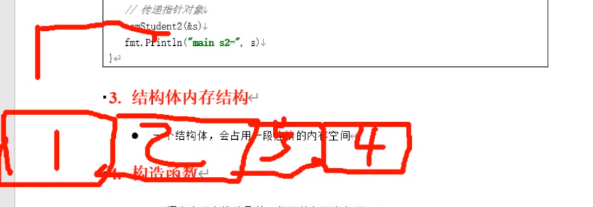

# 结构体 struct


## 结构体定义和初始化

`type 结构体名 struct{}`

### 常规定义

```go
package main

import "fmt"

type Student struct {
   id   int
   name string
   sex  byte
   age  int
   addr string
}

func main() {
   // 1.初始化对象
   var s1 = Student{1, "zx", 'f', 11, "xx"}
   fmt.Println(s1)

   // 2.指定某几个字段赋值
   var s2 = Student{id: 2, age: 12}
   fmt.Println(s2)

   // 3.先定义 在初始化
   var s3 Student
   s3.id = 3
   s3.age = 12
   fmt.Println(s3)

   // 4.结构体作为指针变量初始化
   var s4 *Student = &Student{1, "zx", 'f', 11, "xx"}
   fmt.Println(s4)
   // s4.id也行,但是go会自动转为(*s4).id
   fmt.Println((*s4).id)
   fmt.Println(s4.id)

   // 5.:=
   s5 := &Student{1, "zx", 'f', 11, "xx"}
   fmt.Println(s5)

   // 6.new()  结构体指针
   s6 := new(Student)
   s6.id = 6
   s6.age = 111
   fmt.Println(s6)

}
```

### 匿名结构体

```go
func main() {
   // 匿名结构体
   a := struct {
      Name string
      age  int
   }{
      Name: "joe",
      age:  12,
   }
   fmt.Println(a)
}
```


### 结构体嵌套

```go
type Person struct {
   Name string
   Age int
   Contact struct{
      Phone,City string
   }
}

func main() {
   a := Person{Name:"joe",Age:12}
   a.Contact.Phone = "1111"
   a.Contact.City = "bj"
   fmt.Println(a)
}
// {joe 12 {1111 bj}}
```


### 匿名字段

```go
type Person struct {
   string
   int
}

func main() {
   a := Person{"joe", 12}
   var b Person
   b = a
   fmt.Println(b)
}
```


### 结构体嵌入结构

```go
type Human struct {
   Sex int
}
type Teacher struct {
   Human
   Name string
   Age  int
}
type Student struct {
   Human
   Name string
   Age  int
}

func main() {
   a := Teacher{Name: "joe", Age: 11, Human: Human{Sex: 1}}
   b := Student{Name: "joe", Age: 12, Human: Human{Sex: 2}}
   fmt.Println(a, b)
   // 修改结构体字段的值
   a.Name = "joe2"
   a.Age = 13
   a.Sex = 11 // 	a.Human.Sex = 12
   fmt.Println(a)
}
```


### 结构体字段内名称相同

```go
// 如果结构体内字段名称想同
type A struct {
   B
   Name string
}

type B struct {
   Name string
}

func main() {
   a := A{Name:"A",B:B{Name:"B"}}
   fmt.Println(a)
}
--------------------------------------------------------
// 如果 a 中没有 name 字段,两种都可以去到 name
type A struct {
	B
}

type B struct {
	Name string
}

func main() {
	a := A{B: B{Name: "B"}}
	fmt.Println(a.Name, a.B.Name)
}

```


```go
type A struct {
   B
   C
}

type B struct {
   Name string
}

type C struct {
   Name string
}

func main() {
   a := A{B: B{Name: "B"}, C: C{Name: "C"}}
   // a.Name 错误. 不能找到要打印的是哪个结构体的Name
   fmt.Println(a.B.Name)
}
```

也可以把 C 放到 B 结构体内


## 结构体当 函数参数

1. 值传递,形参无法修改,  拷贝一份值修改的也是 copy 的那份
2. 指针传递,地址传递,可以修改内部变量值

```go
type Student struct {
   id   int
   name string
   sex  byte
   age  int
   addr string
}

func test01(s Student) {
   s.id = 999
   fmt.Println("test01: ", s)

}

func test02(s *Student) {
   s.id = 990
   fmt.Println("test02: ", s)

}

func main() {
   s := Student{1, "mike", 'm', 12, "bj"}
   // 值传递,形参无法修改实参
   test01(s)
   fmt.Println("main: ", s)

   // 地址传递(指针传递), 形参可以修改实参
   test02(&s)
   fmt.Println("main01: ", s)
}
```


## 结构体内存结构

一个结构体, 会占用一段连续的内存空间




## 构造函数


## 结构体比较和赋值

1. 比较不同结构体内的每个成员是否相等
2. 同类型的结构体可以赋值

```go
type Student struct {
   id   int
   name string
   sex  byte
   age  int
   addr string
}

func main() {
   s1 := Student{1, "mike", 'm', 11, "bj"}
   s2 := Student{1, "mike", 'm', 11, "bj"}
   s3 := Student{3, "mike", 'm', 11, "bj"}
   fmt.Println("s1 == s2 ", s1 == s2)
   fmt.Println("s1 == s3 ", s1 == s3)

   // 同类型的2个结构体变量可以相互赋值
   var tmp Student
   tmp = s3
   fmt.Println("tmp= ", tmp)
}

/*
s1 == s2  true
s1 == s3  false
tmp=  {3 mike 109 11 bj}
*/
```

