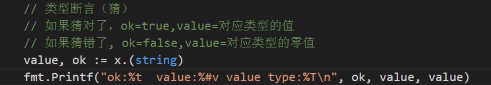
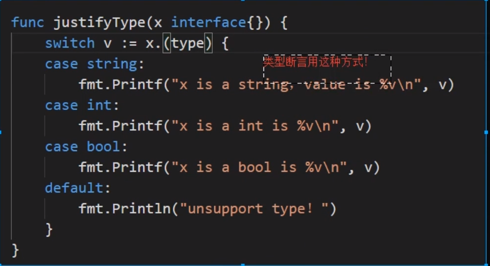

接口是一个引用类型 

Go语言中的变量是分为两部分的:

- 类型信息：预先定义好的元信息。
- 值信息：程序运行过程中可动态变化的。

类型断言

## 反射

类型太多了,类型断言猜不全,使用反射就能直接拿到接口值的动态类型和动态值

## 反射的应用

各种web框架, 配置文件解析库, ORM框架

=======
>>>>>>> fdb5d8aacb74c86a3e6007b7319b93f5753408a6
