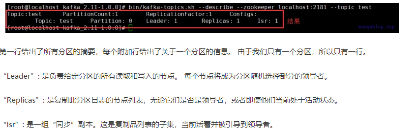

# 启动Zookeeper
使用安装包中的脚本启动单节点Zookeeper 实例：

$./bin/zookeeper-server-start.sh -daemon ./config/zookeeper.properties
[2018-05-19 04:26:59,585] INFO Reading configuration from: config/zookeeper.properties (org.apache.zookeeper.server.quorum.QuorumPeerConfig)....

# 启动Kafka 服务
使用kafka-server-start.sh 启动kafka 服务：

$./bin/kafka-server-start.sh ./config/server.properties
[2018-05-19 04:28:56,115] INFO Verifying properties (kafka.utils.VerifiableProperties)
[2018-05-19 04:28:56,141] INFO Property broker.id is overridden to 0 (kafka.utils.VerifiableProperties)


## 创建topic
使用kafka-topics.sh 创建单分区单副本的topic test：

$ .$/bin/kafka-topics.sh --create --zookeeper localhost:2181 --replication-factor 1 --partitions 1 --topic hellotopic
Created topic "hellotopic".


## 查看topic：

$./bin/kafka-topics.sh --list --zookeeper localhost:2181
hellotopic
test
test1
## 产生消息
使用kafka-console-producer.sh 发送消息：

$ ./bin/kafka-console-producer.sh --broker-list localhost:9092 --topic hellotopic
>hello1
>world1
>kafka
>


## 消费消息
使用kafka-console-consumer.sh 接收消息并在终端打印：

$ ./bin/kafka-console-consumer.sh --zookeeper localhost:2181 --topic hellotopic --from-beginning
Using the ConsoleConsumer with old consumer is deprecated and will be removed in a future major release. Consider using the new consumer by passing [bootstrap-server] instead of [zookeeper].
hello1
world1

 ## 删除Topic
 bin/kafka-topics.sh --delete --zookeeper localhost:2181 --topic test


 ## 查看描述 Topic 信息
 bin/kafka-topics.sh --describe --zookeeper localhost:2181 --topic test

 


# 集群配置

kafka支持两种模式的集群搭建

 	1. 单机多broker 集群配置
 	2. 多机多broker 集群配置

## 单机多breoker

利用单节点部署多个broker。不同的broker不同的id，监听端口以及日志目录，如：

- 将配置文件复制两份

```
cp config/server.properties config/server-1.properties
cp config/server.properties config/server-2.properties 
```

- 修改配置文件信息

```
vim config/server-1.properties
#修改内容
broker.id=2
listeners=PLAINTEXT://your.host.name:9093
log.dirs=/data/kafka-logs-1


vim config/server-2.properties
#修改内容
broker.id=3
listeners=PLAINTEXT://your.host.name:9094
log.dirs=/data/kafka-logs-2
```

- 启动多个kafka服务

```
in/kafka-server-start.sh config/server-1.properties 

bin/kafka-server-start.sh config/server-2.properties 
```

- 最后按照上面方法产生和消费信息。

## 多机多broker

分别在多个节点按上述方式安装Kafka，配置启动多个Zookeeper 实例。如：192.168.18.130、192.168.18.131、192.168.18.132三台机器

分别配置多个机器上的Kafka服务 设置不同的broke id，zookeeper.connect设置如下:

```
zookeeper.connect=192.168.18.130:2181,192.168.18.131:2181,192.168.18.132:2181
```