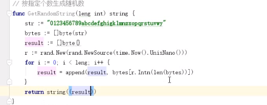

```go
func GetRandomString() {
   str := "+-*/"
   i := rand.New(rand.NewSource(time.Now().UnixNano()))
   for k := 0; k < 20; k++ {
      fir := rand.Intn(100)
      se := string(str[i.Intn(4)])
      th := rand.Intn(100)
      if fir == 0 || th == 0 {
         if k != 0 {
            k--
         }
         continue
      }
      if se == "-" && th > fir {
         if k != 0 {
            k--
         }
         continue
      }
      if se == "/" && fir%th != 0 {
         if k != 0 {
            k--
         }
         continue
      }
      fmt.Printf("%d%s%d=\n", fir, se, th)
   }

}
```

