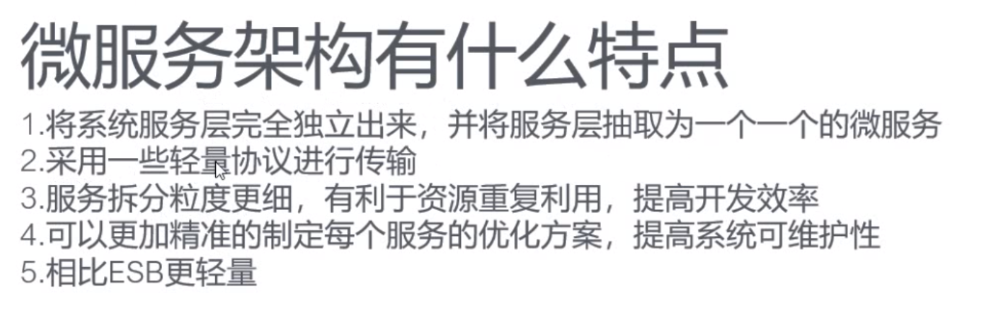
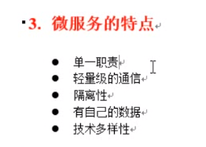
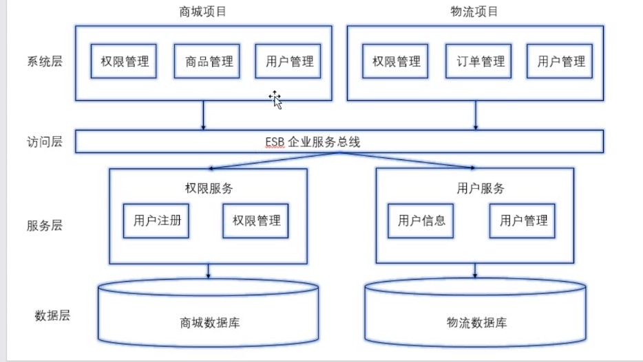
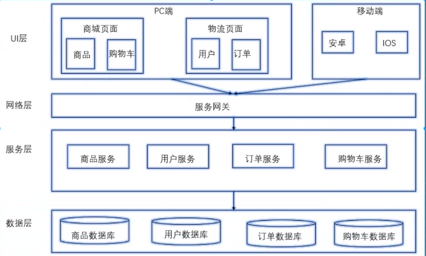
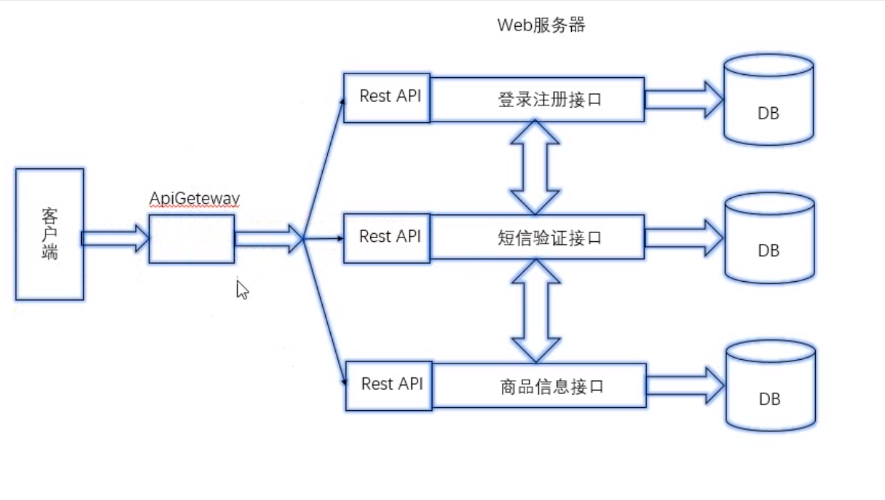
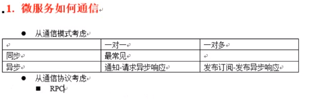
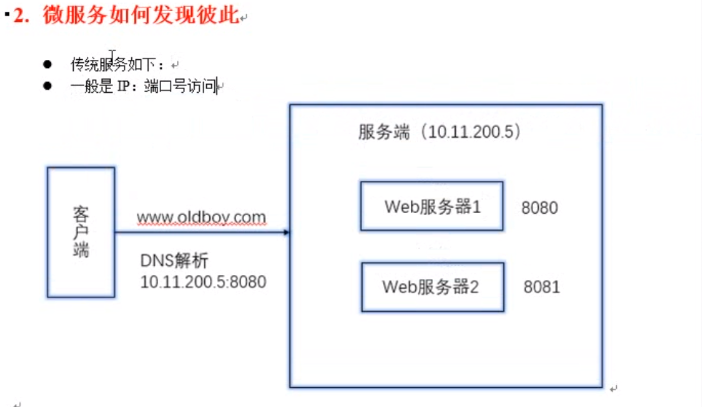
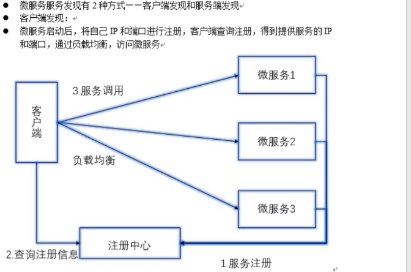
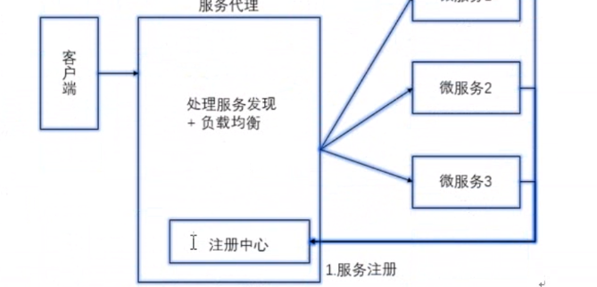

1. 认识微服务架构

2. RPC远程调用

3. gRPC的使用

4. go-micro 的使用

5. 综合案例

   

   

   ### 什么是微服务

   -  使用一套小服务来开发单个应用的方式,每个服务云顶在独立的进程里,一般采用轻量级的通讯机制互联,并且他们可以用过自动化的方式部署.
   - 微是设计思想, 代码反而变多了

   

   ### 微服务的特点

   - 单一职责
   - 轻量级的通信, 需要RPC通信
   - 隔离性
   - 有自己的数据
   - 技术多样性

   

   ### 互联网架构演进之路

   - 单体架构
     - 所有功能放在一个项目中,数据库用一个
     - 不好维护
   - 垂直架构
     - 
   - SOA架构
     - 企业总线 ESB , 面向接口编程
   - 微服务架构

   ### 微服务架构的优势

   - 独立性
   - 使用者容易理解
   - 技术栈灵活
   - 高效团队

   

   ### 微服务架构的不足

   - 额外的工作, 服务的拆分
   - 保证数据的一致性
   - 添加了沟通成本

   

   ### 应用平台

   - 日志平台
   - 监控平台
   - 服务管理平台
   - 服务治理平台

   

   

   

   ### 服务注册和发现

   - 服务端做注册中心
   - 客户端做注册中心

   

   

   

   

   

   

   

   

互联网架构演化

 1.  单体架构

 2.  垂直架构

 3.  SOA 架构 面向服务架构

     

 4.  微服务

微服务架构图

微服务如何通信?

服务端发现

