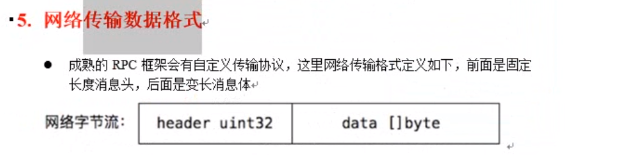
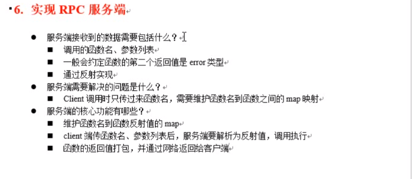

\


### 两个库

- golang官方的net/rpc库使用encoding/gob进行编解码,. 只能使用go语言
- net/rpc/jsonrpc 使用json进行数据编解码, 可以跨语言,基于tcp实现,不支持http传输


### 四个必须条件  必须遵守

- 结构体首字母要大写
- 函数名也是首字母大写
- 服务端函数参数, 第一个参数是接收参数,第二个参数是服务端返回给客户端的参数,第二个参数必须是指针类型,
- 服务端定义的函数, 必须有一个返回值 error


### 网络传输数据格式  前面固定长度的消息头, 后面是变成消息体

``` go
// 设定固定长度 定义4个长度
buf := make([]byte,4+len(data))
binary.BigEndian.PutUnit32(buf[:4],unit32(len(data)))
copy(buf[4:],data)

header := make([]byte,4)
_, err :=io.ReadFull(s.conn,header) // 读取指定长度


```


### RPC Client


RPC Server


\

RPC JSON 格式

server


client


RPC的调用流程

对外 REST API ,对内RPC协议








