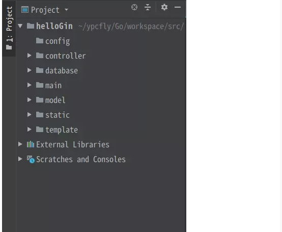

- config 主要是配置相关的文件
- controller 主要放handler
- database 数据库相关代码
- mian包下只有main.go 一个文件
- model 就是数据模型,即自己定义的一些结构体
- static 下放置的是静态文件
- template 是html页面


## main.go

``` go
func main()  {
    // Engin
    //router := gin.Default()
    router := gin.New()
        // 加载html文件，即template包下所有文件
    router.LoadHTMLGlob("template/*")
    router.GET("/hello", hello)
    // 路由组
    user := router.Group("/user")
    {   // 请求参数在请求路径上
        user.GET("/get/:id/:username",controller.QueryById)
        user.GET("/query",controller.QueryParam)
        user.POST("/insert",controller.InsertNewUser)
        user.GET("/form",controller.RenderForm)// 跳转html页面
        user.POST("/form/post",controller.PostForm)
        //可以自己添加其他，一个请求的路径对应一个函数

        // ...
    }

    file := router.Group("/file")
    {
        // 跳转上传文件页面
        file.GET("/view",controller.RenderView) // 跳转html页面
        // 根据表单上传
        file.POST("/insert",controller.FormUpload)
        file.POST("/multiUpload",controller.MultiUpload)
        // base64上传
        file.POST("/upload",controller.Base64Upload)
    }

    // 指定地址和端口号
    router.Run(":9090")
}
```


## UserController的代码内容

```go
func init()  {
    log.Println(">>>> get database connection start <<<<")
    db = database.GetDataBase()
}

// localhost:9090/user/query?id=2&name=hello
func QueryParam(context *gin.Context) {
    println(">>>> query user by url params action start <<<<")
    id := context.Query("id")
    name := context.Request.URL.Query().Get("name")
    var u model.User
    context.Bind(&u)
    println(u.Username)
    rows := db.QueryRow("select username,address,age,mobile,sex from t_user where id = $1 and username = $2",id,name)
    var user model.User
    err := rows.Scan(&user.Username,&user.Address,&user.Age,&user.Mobile,&user.Sex)
    checkError(err)

    checkError(err)
    context.JSON(200,gin.H{
        "result":user,
    })

}
// localhost:9090/user/get/2/hello
func QueryById (context *gin.Context) {
    println(">>>> get user by id and name action start <<<<")

    // 获取请求参数
    id := context.Param("id")
    name := context.Param("username")

    // 查询数据库
    rows := db.QueryRow("select username,address,age,mobile,sex from t_user where id = $1 and username = $2",id,name)

    var user model.User
    err := rows.Scan(&user.Username,&user.Address,&user.Age,&user.Mobile,&user.Sex)
    checkError(err)

    context.JSON(200,gin.H{
        "result":user,
    })
}

// json格式数据
func InsertNewUser (context *gin.Context) {
    println(">>>> insert controller action start <<<<")
    var user model.User

    // 使用ioutile读取二进制数据
    //bytes,err := ioutil.ReadAll(context.Request.Body)
    //if err != nil {
    //  log.Fatal(err)
    //}
    //err = json.Unmarshal(bytes,&user)

    // 直接将结构体和提交的json参数作绑定
    err := context.ShouldBindJSON(&user)

    // 写入数据库
    res,err := db.Exec("insert into t_user (username,sex,address,mobile,age) values ($1,$2,$3,$4,$5)",
        &user.Username,&user.Sex,&user.Address,&user.Mobile,&user.Age)
    var count int64
    count,err = res.RowsAffected()
    checkError(err)
    if count != 1 {
        context.JSON(200,gin.H{
            "success":false,
        })
    } else {
        context.JSON(200,gin.H{
            "success":true,
        })
    }

}

// form表单提交
func PostForm(context *gin.Context) {
    println(">>>> bind form post params action start <<<<")
    var u model.User
    
    // 绑定参数到结构体
    context.Bind(&u)
    res,err := db.Exec("insert into t_user (username,sex,address,mobile,age) values ($1,$2,$3,$4,$5)",
        &u.Username,&u.Sex,&u.Address,&u.Mobile,&u.Age)
    var count int64
    count,err = res.RowsAffected()
    checkError(err)

    if count != 1 {
        context.JSON(200,gin.H{
            "success":false,
        })
    } else {
        //context.JSON(200,gin.H{
        //  "success":true,
        //})

        // 重定向
        context.Redirect(http.StatusMovedPermanently,"/file/view")
    }

}

// 跳转html
func RenderForm(context *gin.Context) {
    println(">>>> render to html action start <<<<")

    context.Header("Content-Type", "text/html; charset=utf-8")
    context.HTML(200,"insertUser.html",gin.H{})
}

func checkError(e error) {
    if e != nil {
        log.Fatal(e)
    }
}
```

