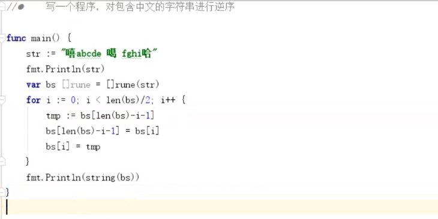

## 字符串原理 rune byte

- 字符串底层就是一个byte数组

- 字符串是有byte字节组成

- 字符串中的字符是不能 **直接** 修改的

  ```go
  func main() {
     var str = "hello"
     fmt.Printf("%c,",str[0])
     fmt.Println(len(str))
  
     // 编译错误, 定义不能修改
     //str[0] = 'x'
  
     // 用底层数组可以修改
     var bs []byte = []byte(str)
     fmt.Println(bs)
     bs[0] = 'x'
     // 切片转为字符串
     str = string(bs)
     fmt.Println(str)
  }
  ```

- rune 类型是用于表示 utf8 的字符

  ```go
  func main() {
     var str1 = "hello"
     fmt.Println(len(str1))
  
     // 一个中文 三个长度
     str2 := "hello你好"
     fmt.Println(len(str2)) // 11
     var bs []byte = []byte(str2)
     fmt.Println(bs)
     
     // 可以将字符串转为[]rune 切片. 认为一个中文字符就是一个字符了
     var r []rune = []rune(str2)
     fmt.Println(r)
     fmt.Println(len(r)) // 7
  }
  ```


## 字符串操作— 常用函数

### Contains  是否包含


### join 拼接


### index  查看字符串的索引值


### repeat 字符串重复多少次


### replace 替换


### split 指定分割 返回 slice

 


### trim  去除两头的空格


### fields 去除空格,并按照空格分割返回 slice


``` go
// 标准库的 `strings` 包提供了很多有用的字符串相关的函数。
// 这里是一些用来让你对这个包有个初步了解的例子。

package main

import s "strings"
import "fmt"

// 我们给 `fmt.Println` 一个短名字的别名，我们随后将会经常
// 用到。
var p = fmt.Println

func main() {

    // 这是一些 `strings` 中的函数例子。注意他们都是包中的
    // 函数，不是字符串对象自身的方法，这意味着我们需要考
    // 虑在调用时传递字符作为第一个参数进行传递。
    p("Contains:  ", s.Contains("test", "es"))
    p("Count:     ", s.Count("test", "t"))
    p("HasPrefix: ", s.HasPrefix("test", "te"))
    p("HasSuffix: ", s.HasSuffix("test", "st"))
    p("Index:     ", s.Index("test", "e"))
    p("Join:      ", s.Join([]string{"a", "b"}, "-"))
    p("Repeat:    ", s.Repeat("a", 5))
    p("Replace:   ", s.Replace("foo", "o", "0", -1))
    p("Replace:   ", s.Replace("foo", "o", "0", 1))
    p("Split:     ", s.Split("a-b-c-d-e", "-"))
    p("ToLower:   ", s.ToLower("TEST"))
    p("ToUpper:   ", s.ToUpper("test"))
    p()

    // 你可以在 [`strings`](http://golang.org/pkg/strings/)
    // 包文档中找到更多的函数

    // 虽然不是 `strings` 的一部分，但是仍然值得一提的是获
    // 取字符串长度和通过索引获取一个字符的机制。
    p("Len: ", len("hello"))
    p("Char:", "hello"[1])
}

```

``` go
$ go run string-functions.go
Contains:   true
Count:      2
HasPrefix:  true
HasSuffix:  true
Index:      1
Join:       a-b
Repeat:     aaaaa
Replace:    f00
Replace:    f0o
Split:      [a b c d e]
toLower:    test
ToUpper:    TEST
Len:  5
Char: 101
```


### format


### parse


# 

## 字符串转换


### `strconv.Append `

append 系列函数: 将整数等转换为字符串后,添加到现有的字节数组中

```go
import (
	"fmt"
	"strconv"
)


func main() {
	str := make([]byte,0,100)
	// 以10进制的方式追加
	str = strconv.AppendInt(str,4567,10)
	str = strconv.AppendBool(str,false)
	str = strconv.AppendQuote(str, "abcd")
	str = strconv.AppendQuoteRune(str,'单')
	fmt.Println(string(str))
}
```


### `strconv.FormatBool`

Format 系列函数: 把其他类型的转换为字符串

```go
import (
   "fmt"
   "reflect"
   "strconv"
)

func main() {
   a := strconv.FormatBool(false)
   b := strconv.FormatInt(-1234,10)
   
   // uint 无符号
   c := strconv.FormatUint(123, 10)
   // 与FormatInt 一样, 简写
   d := strconv.Itoa(-2234)
   fmt.Println(a,b,c,d)
   fmt.Println(reflect.TypeOf(a))
}
```


## 字符串练习

1. 写一个程序, 对英文字符串进行逆序  	    []byte[] 切片
2. 写一个程序, 对包含中文的字符串进行逆序   []rune 切片
3. 写一个程序, 判断一个字符串是否是回文





```go
package main

import "fmt"

func main() {
   var str = "上海自来水来自海上"
   var r []rune = []rune(str)
   for i := 0; i < len(r)/2; i++ {
      tmp := r[len(r)-i-1]
      r[len(r)-i-1] = r[i]
      r[i] = tmp
   }
   str2 := string(r)
   if str == str2 {
      fmt.Println("是回文")
   }

}
```

