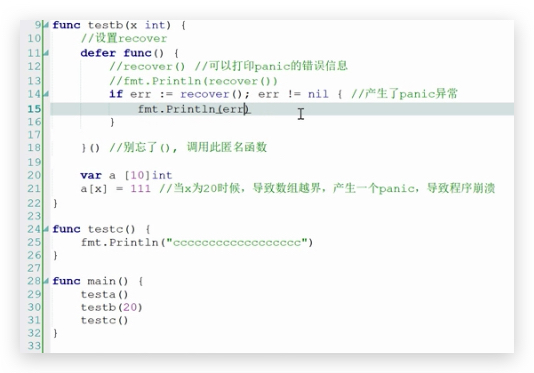

## recover 的使用




接受 recover 返回的参数,判断是否为空


``` go
package main

import "fmt"

func main()  {

	fmt.Println(1)
	defer func() {
		err := recover()
		if err != nil{
			fmt.Println("err = ",err)
			fmt.Println(2)
		}
		fmt.Println(3)
	}()
	f()
	fmt.Println(4)

}

func f()  {
	fmt.Println(5)

	panic("123")

}
```