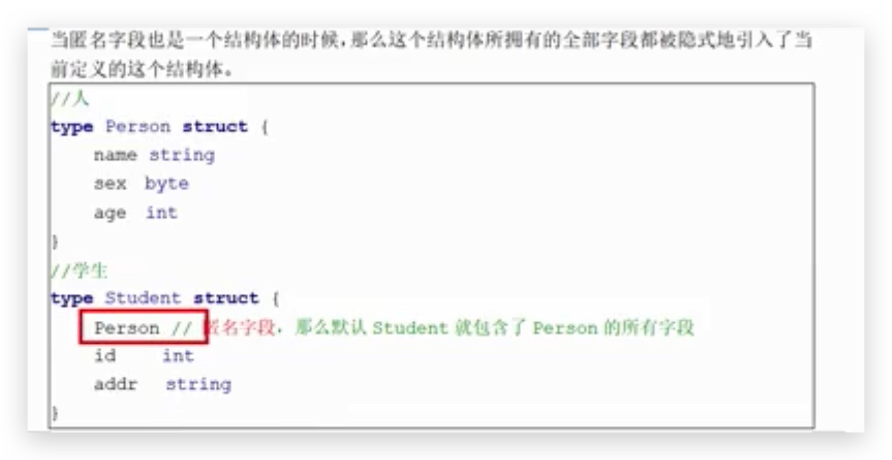
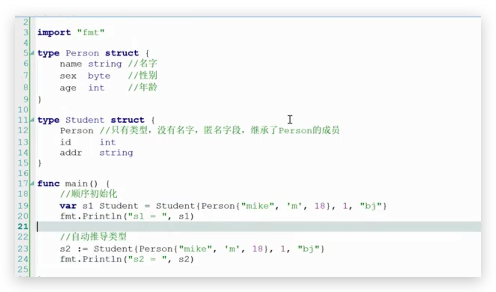
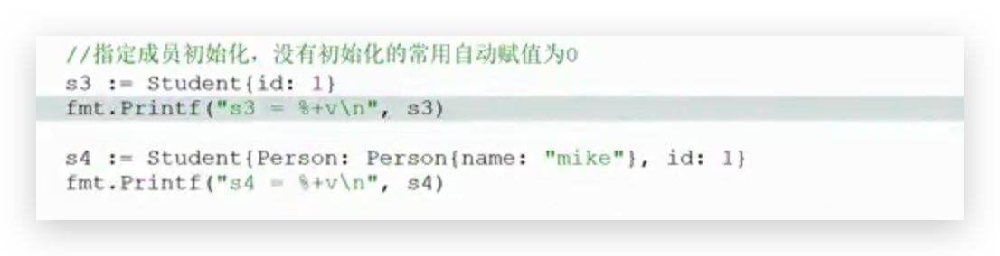
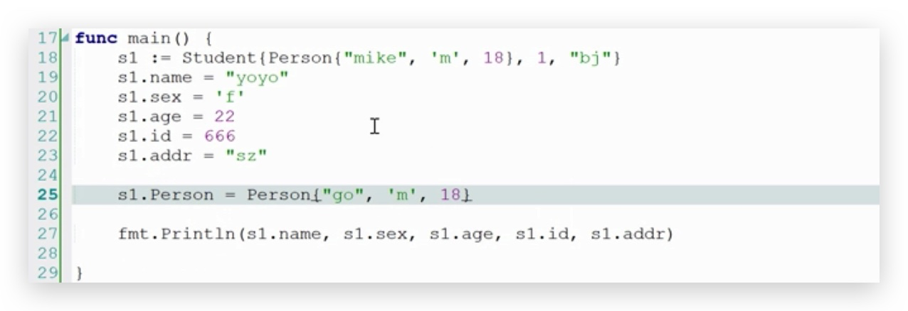
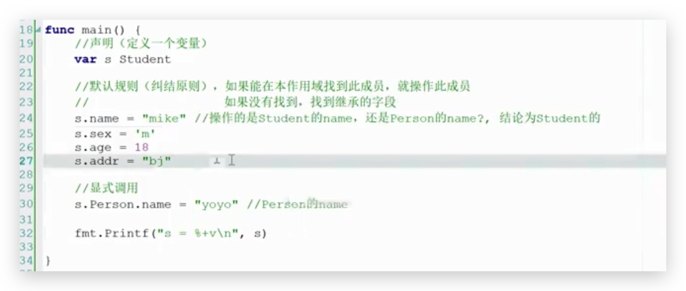
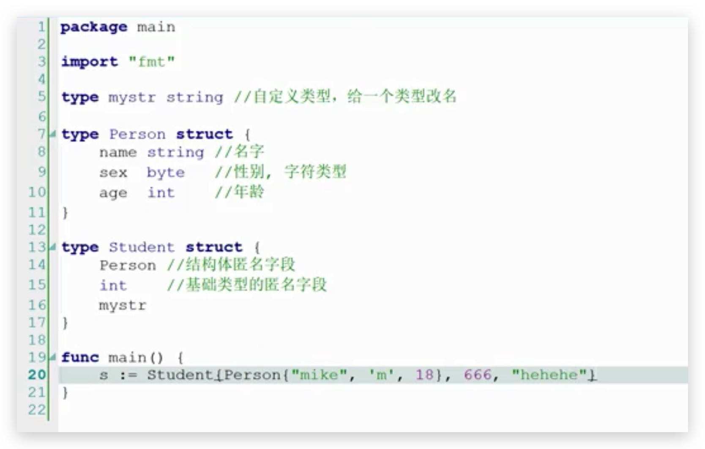
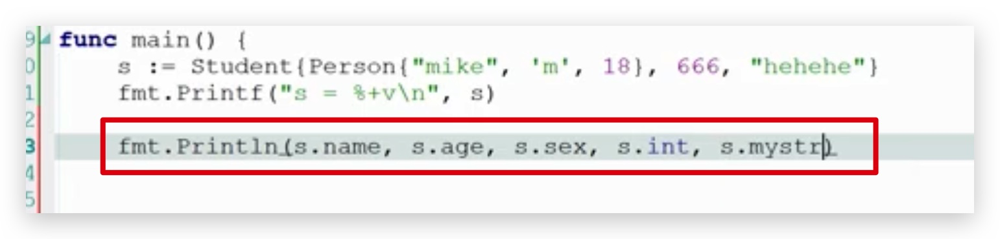
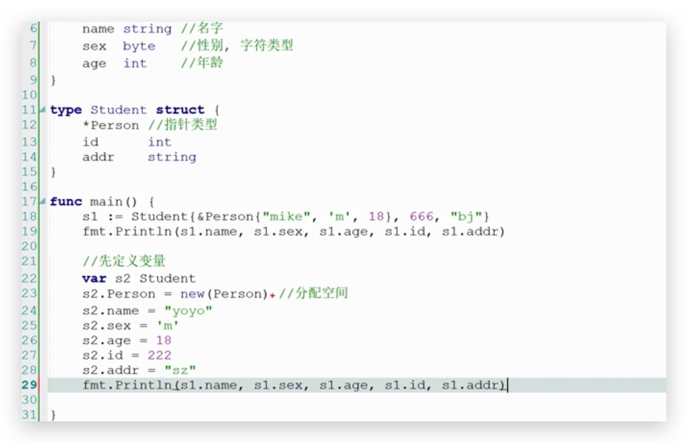

# 匿名组合

## 结构体匿名字段

只有名字,没有类型,匿名字段,继承了 Person 的成员

### 结构体匿名字段的初始化

1. 顺序初始化
2. 自动推导类型
3. 指定成员初始化,没有初始化的常用自动赋值 0

----

### 成员的操作

直接通过`.`方法赋值.

----

### 同名字段

struct 字段名称重复,遵循默认原则(就近原则),

​	如果能在本作用域找到此成员,就操作此成员,

​	如果没有找到,找到继承的字段

---

##其他匿名字段

### 非结构体匿名字段

匿名字段使用

### 结构体指针类型的匿名字段

两种方式,

1. 直接去地址 然后赋值
2. 先分配内存,然后赋值

