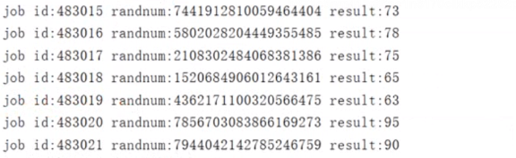

goruntine 奉行   **通过通信来共享内存,而不是共享内存来通信**


## channel 类型

​	和map类型,channel也是一个对应make创建的底层数据结构的引用


创建 


``` go
package main

import (
	"fmt"
	"time"
)

func main()  {
    // 也可以使用var 定义
    // var ch1 chan int  nil类型
    // make函数定义并初始化  slice map channel
    
	ch := make(chan string)  // 定义channel
	defer fmt.Println("主协成也结束了")

	go func() {
		defer fmt.Println("zi xie cheng jieshu ")
		for i:=0; i <2;i++ {
			fmt.Println("子协成 i=",i)
			time.Sleep(time.Second)

		}
		 ch <- "我是子协成,要工作完毕"

	}()

	str := <- ch  // 如果没有就会阻塞
	fmt.Println("str:",str)
}
```


## 无缓冲channel

创建格式

​	`make(chan Type)` // 等价于 make(chan Type,0)  容量为0

len(ch), cap(ch) 都为0

如果没有指定缓冲区容量,那么该通道就是同步的,因此会阻塞到发送者准备好发送和接受者准备好接收

``` go
package main

import (
	"fmt"
	"time"
)

func main() {

	//创建一个无缓存的channel
	ch := make(chan int, 0)

	//len(ch) 缓冲区剩余数据个数, cap(ch) 缓冲区大小
	fmt.Println(len(ch), cap(ch))

	//新建协成
	go func() {
		for i := 0; i < 3; i++ {
			fmt.Println(i)
			ch <- i
		}
	}()

	// 延时
	time.Sleep(2 * time.Second)

	for i := 0; i < 3; i++ {
		//fmt.Println(i)
		num := <-ch
		fmt.Println("num=", num)
	}
}
```


## 有缓存 channel

创建格式

​	`make(chan Type,capacity) ` 指定容量

如果给定了一个缓冲区容量,通道就是异步的,只要缓冲区有未使用空间用于发送数据,或者 还包含可以接收的数据,那么通信就会无阻塞的进行

``` go
package main

import (
	"fmt"
	"time"
)

func main() {

	//创建一个有缓存的channel
	ch := make(chan int, 3)

	//len(ch) 缓冲区剩余数据个数, cap(ch) 缓冲区大小
	fmt.Println(len(ch), cap(ch))

	//新建协成
	go func() {
		for i := 0; i < 10; i++ {
			fmt.Println(i)
			ch <- i
		}
	}()

	// 延时
	time.Sleep(2 * time.Second)

	for i := 0; i < 10; i++ {
		//fmt.Println(i)
		num := <-ch
		fmt.Println("num=", num)
	}
}
```


## 关闭 channel


``` go
import "fmt"

func main()  {
	// 创建一个无缓存channel
	ch := make(chan int)

	go func() {
		for i:=0;i <5; i++ {
			ch <- i
		}
		close(ch)
	}()

	for {

		// 如果ok 为true,说明管道没有关闭
		if num,ok := <- ch; ok == true {
			fmt.Println("num=",num)
		}else{
			//管道关闭
			break
		}
	}

}
```


注意 :

1. channel 不像文件一样需要经常去关闭,只有当你确定没有任何发送数据了,或者你想显示的结束range循环之类的,才去关闭channel
2. **关闭channel后,无法向channel在发送数据(引发panic 错误后导致接收立即返回零值)**
3. **关闭channel后,在接收数据, 如果里面有数据是可能取到的,但是如果里面没有数据,只能取到对应类型的零值 **
4. 对于nil channel,无论收发都会阻塞

主要注意 2,3 就ok


## 单方向的 channel

- 默认情况下, 通道是双向的, 也就是, 既可以往里面发送数据也可以接收数据

- go 可以定义当方面的通道, 也就是只能发送数据或者只接收数据. 声明如下

  ``` go
  var ch1 chan int // 正常的, 可以读, 可以写
  var ch2 chan <- float64 // 只写float64的管道
  var ch3 <- chan int // 只读int的通道
  ```

- 可以将 channel 隐式转换为单向队列, 只收或只发, 不能将单向channel 转换为普通的channel

```go
func main() {
   // 普通的通道
   c := make(chan int, 3)
   // c 转为只写
   var send chan<- int = c
   // 转为只读
   var recv <-chan int = c
   send <- 1
   fmt.Println(<-recv)
   // 不能在把单向的转回去
   
}
```


生产者 消费者

```go
package main

import "fmt"

// 生产者 消费者

// 生产者 只写
func producter(out chan<- int) {
   defer close(out)
   for i := 0; i < 5; i++ {
      out <- i

   }
}

// 消费者 只读

func cunsumer(in <-chan int) {
   for num := range in {
      fmt.Println(num)
   }
}
func main() {
   c := make(chan int, 3)
   // 生产者
   go producter(c)
   // 消费者
   cunsumer(c)
   fmt.Println("main 结束")
}
```


## Workpool 模型

- 本质上是生产者消费者模型
- 可以有效控制 goroutine 数量, 防止暴涨.
- 需求:
  - 计算一个数字的各位数之和, 例如 数字123, 结果为 1+2+3=6 
  - 随机生产数字进行计算
- 控制台输出结果如下




```go
package main

import (
   "fmt"
   "math/rand"
   "time"
)

type Job struct {
   // id
   Id int
   // 需要计算的随机数
   RandNum int
}

type Result struct {
   // 这里必须传对象实例地址
   job *Job
   // 求和
   sum int
}

// 创建工作池
func createPool(num int, jobChan chan *Job, resultChan chan *Result) {
   // 根据num个数,开几个协程
   for i := 0; i < num; i++ {
      go func(jobChan chan *Job, resultChan chan *Result) {
         // 执行运算
         // 遍历job管道所有数据,进行相加
         for job := range jobChan {
            // 随机数接过来
            r_num := job.RandNum
            // 随机数每一位相加
            // 定义返回值
            var sum int

            for r_num != 0 {
               tmp := r_num % 10
               sum += tmp
               r_num /= 10
            }

            // 想要的结果是result
            r := &Result{
               job: job,
               sum: sum,
            }
            //
            resultChan <- r
         }
      }(jobChan, resultChan)
   }
}
func main() {
   // 需要2个管道
   // 1. job 管道
   jobChan := make(chan *Job, 64)
   // 2.结果管道
   resultChan := make(chan *Result, 64)
   // 3.创建工作池
   createPool(32, jobChan, resultChan)
   // 4.开个打印的协成
   go func(resultChan chan *Result) {
      for result := range resultChan {
         fmt.Printf("job id:%v randnum:%v result:%d\n", result.job.Id,
            result.job.RandNum, result.sum)
      }
   }(resultChan)
   var id int
   // 循环创建 job,输入到管道
   for {
      id++
      // 生成随机数
      r_num := rand.Int()
      job := &Job{
         Id:      id,
         RandNum: r_num,
      }
      jobChan <- job
      time.Sleep(2 * time.Second)
   }
}
```


