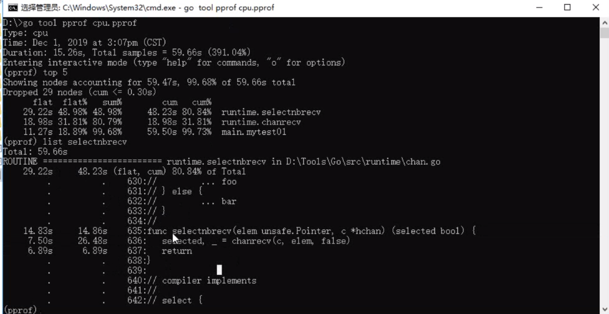
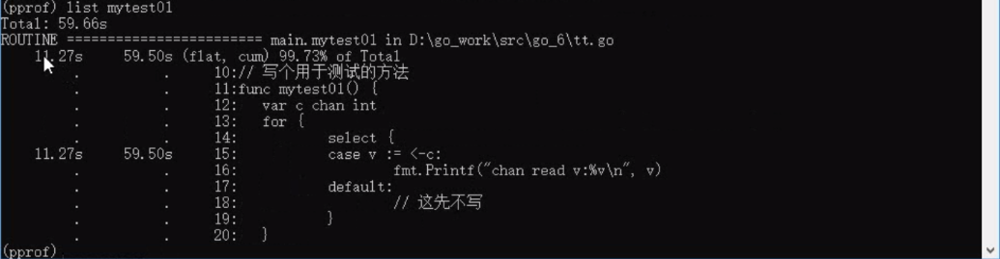
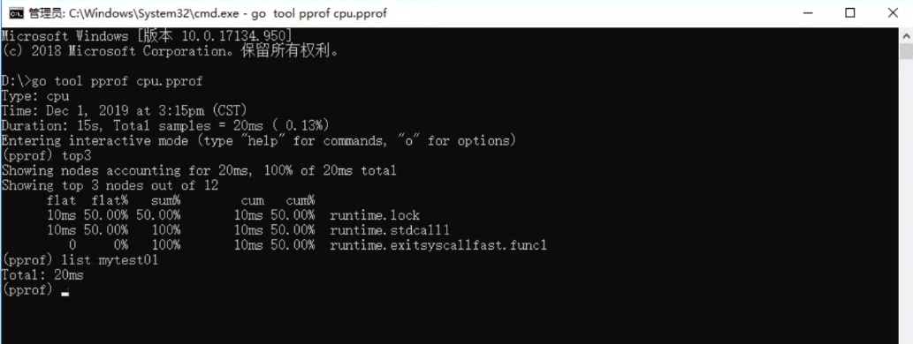
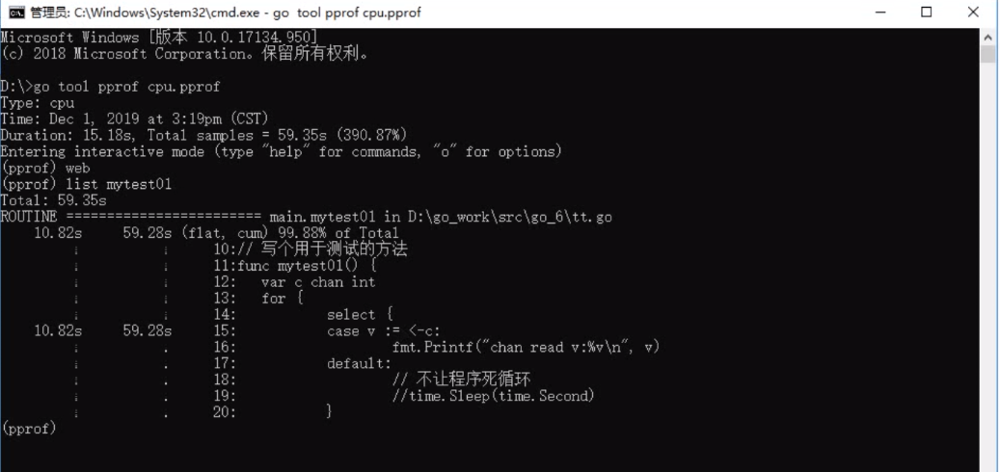

## 常用的优化手段

- 尽量减少HTTP请求数, 合并css,js以及图片
- 使用CDN系统, 实现就近访问, 是内容分发系统
- 启用gzip压缩, 降低网页传输大小
- 优化后端api服务的性能, 找到瓶颈点


## golang 中的性能优化

- cpu 维度的优化
- 内存维度的优化
- 锁竞争维度的优化


## 性能分析原理

- 需要知道程序占用了多少资源
- 需要知道程序各个函数上用的资源比例
- pprof 开启后, 每隔一段时间收集当前堆栈信息, 获取各个函数占用的cpu以及内存资源
- pprof 完成后, 通过采样数据进行分析, 行成性能分析报告


如果你的应用程序是运行一段时间就结束退出类型。那么最好的办法是在应用退出的时候把 profiling 的报告保存到文件中，进行分析。对于这种情况，可以使用`runtime/pprof`库。 首先在代码中导入`runtime/pprof`工具：

```go
import "runtime/pprof"
```


## cpu 性能分析

开启CPU性能分析：

```go
pprof.StartCPUProfile(w io.Writer)
```

停止CPU性能分析：

```go
pprof.StopCPUProfile()
```

应用执行结束后，就会生成一个文件，保存了我们的 CPU profiling 数据。得到采样数据之后，使用`go tool pprof`工具进行CPU性能分析。

```go
package main

import (
   "fmt"
   "os"
   "runtime/pprof"
   "time"
)

// 写个用于测试的方法

func my_test01() {
   var c chan int
   for {
      select {
      case v := <-c:
         fmt.Printf("chan read v :%v\n", v)
      default:
         //
      }
   }

}

func main() {
   file, e := os.OpenFile("D:/GOPATH/src/cpu.pprof", os.O_CREATE|os.O_WRONLY|os.O_APPEND, 0666)
   if e != nil {
      fmt.Println(e)
      return
   }
   defer file.Close()

   // 开始cpu分析. 将程序运行信息,收集到文件中
   _ = pprof.StartCPUProfile(file)
   defer pprof.StopCPUProfile()
   for i := 0; i < 8; i++ {
      go my_test01()
   }
   time.Sleep(time.Second * 15)
}
```


使用go tool 工具分析 pprof

​	>go tool pprof cpu.pprof



查看自己写的部分的cpu分析, 查看




修改占时较长的程序如下,再次进行cpu分析

```go
func my_test01() {
   var c chan int
   for {
      select {
      case v := <-c:
         fmt.Printf("chan read v :%v\n", v)
      default:
         // 不让程序死循环
         time.Sleep(time.Second)
      }
   }

}
```

查看分析




- flat：当前函数占用CPU的耗时
- flat：:当前函数占用CPU的耗时百分比
- sun%：函数占用CPU的耗时累计百分比
- cum：当前函数加上调用当前函数的函数占用CPU的总耗时
- cum%：当前函数加上调用当前函数的函数占用CPU的总耗时百分比
- 最后一列：函数名称


## cpu 性能分析图

### 安装graphviz

博客例子: <https://www.cnblogs.com/shuodehaoa/p/8667045.html>

- 安装 graphviz

  - 下载 <https://graphviz.gitlab.io/_pages/Download/Download_windows.html>

- 将bin目录添加到PATH环境变量

  D:Tools\Graphviz2.38\bin

- 进入windows命令行界面，输入`dot -version`，然后按回车，如果显示graphviz的相关版本信息，则安装配置成功


### 使用

go tool pprof cpu.pprof   -> web 自动会打开页面 




## 内存性能分析

启用内存性能分析: pprof.WriterHeapProfile(w io.Writer)

记录程序的堆栈信息

```go
pprof.WriteHeapProfile(w io.Writer)
```

得到采样数据之后，使用`go tool pprof xxx.prof ` 工具进行内存性能分析。

`go tool pprof`默认是使用`-inuse_space`进行统计，还可以使用`-inuse-objects`查看分配对象的数量。


