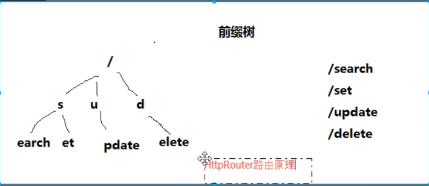

## GIN 框架

​	Gin 是一个用Go语言编写的web框架,简单易用的轻量级框架.


## Gin框架安装与使用

1. 安装 

   下载并安装Gin:

   `go get -u github.com/gin-gonic/gin`

2. 简单示例

   ``` go
   package main
   
   import (
   	"github.com/gin-gonic/gin"
   )
   
   func main() {
   	// 创建一个默认的路由引擎
   	r := gin.Default()
   	// GET：请求方式；/hello：请求的路径
   	// 当客户端以GET方法请求/hello路径时，会执行后面的匿名函数
   	r.GET("/hello", func(c *gin.Context) {
   		// c.JSON：返回JSON格式的数据
   		c.JSON(200, gin.H{
   			"message": "Hello world!",
   		})
   	})
   	// 启动HTTP服务，默认在0.0.0.0:8080启动服务
   	r.Run()
   }
   ```


## Gin 渲染

### HTML

Gin框架中使用`LoadHTMLGlob()`或者`LoadHTMLFiles()`方法进行HTML模板渲染。

```go
func main() {
	r := gin.Default()
	r.LoadHTMLGlob("templates/**/*")
	//r.LoadHTMLFiles("templates/posts/index.html", "templates/users/index.html")
	r.GET("/posts/index", func(c *gin.Context) {
		c.HTML(http.StatusOK, "posts/index.html", gin.H{
			"title": "posts/index",
		})
	})

	r.GET("users/index", func(c *gin.Context) {
		c.HTML(http.StatusOK, "users/index.html", gin.H{
			"title": "users/index",
		})
	})

	r.Run(":8080")
}
```

1. 使用`LoadHTMLGlob()` 可以对所有的HTML文件直接渲染, `templates/**/*`

   ​	** 代表templates 下的文件夹

   ​	* 代表文件


2. `LoadHTMLFiles()`方法进行HTML模板渲染。

   ``` go
   //r.LoadHTMLFiles("templates/posts/index.html", "templates/users/index.html")
   ```

   就需要制定的html文件.

   **注意** : 必须要在html文件内 ,提前`{{define "users/index.html"}} html内容 {{end}}`

   ​	 c.HTML返回的时候也要带上 html 的路径 

   ```go
   c.HTML(http.StatusOK, "users/index.html", gin.H{
   			"title": "users/index",
   		})
   ```

   

   users/index.html

``` html
{{define "users/index.html"}}
<!DOCTYPE html>
<html lang="en">

<head>
    <meta charset="UTF-8">
    <meta name="viewport" content="width=device-width, initial-scale=1.0">
    <meta http-equiv="X-UA-Compatible" content="ie=edge">
    <title>users/index</title>
</head>

<body>
    {{.title}}
</body>
</html>
{{end}}
```


### JSON 渲染

两种方式,都是返回结构体

``` go
func main() {
	r := gin.Default()

	// gin.H 是map[string]interface{}的缩写
	r.GET("/someJSON", func(c *gin.Context) {
		// 方式一：自己拼接JSON
		c.JSON(http.StatusOK, gin.H{"message": "Hello world!"})
	})
	r.GET("/moreJSON", func(c *gin.Context) {
		// 方法二：使用结构体
		var msg struct {
			Name    string `json:"user"`
			Message string
			Age     int
		}
		msg.Name = "小王子"
		msg.Message = "Hello world!"
		msg.Age = 18
		c.JSON(http.StatusOK, msg)
	})
	r.Run(":8080")
}
```


### XML 渲染

注意需要使用具名的结构体类型。

```go
func main() {
	r := gin.Default()
	// gin.H 是map[string]interface{}的缩写
	r.GET("/someXML", func(c *gin.Context) {
		// 方式一：自己拼接JSON
		c.XML(http.StatusOK, gin.H{"message": "Hello world!"})
	})
	r.GET("/moreXML", func(c *gin.Context) {
		// 方法二：使用结构体
		type MessageRecord struct {
			Name    string
			Message string
			Age     int
		}
		var msg MessageRecord
		msg.Name = "小王子"
		msg.Message = "Hello world!"
		msg.Age = 18
		c.XML(http.StatusOK, msg)
	})
	r.Run(":8080")
}
```


### YMAL 渲染

```go
r.GET("/someYAML", func(c *gin.Context) {
	c.YAML(http.StatusOK, gin.H{"message": "ok", "status": http.StatusOK})
})
```


### protobuf渲染

```go
r.GET("/someProtoBuf", func(c *gin.Context) {
	reps := []int64{int64(1), int64(2)}
	label := "test"
	// protobuf 的具体定义写在 testdata/protoexample 文件中。
	data := &protoexample.Test{
		Label: &label,
		Reps:  reps,
	}
	// 请注意，数据在响应中变为二进制数据
	// 将输出被 protoexample.Test protobuf 序列化了的数据
	c.ProtoBuf(http.StatusOK, data)
})
```


## 设置静态文件

当我们渲染的HTML文件中引用了静态文件时，我们只需要按照以下方式在渲染页面前调用`gin.Static`方法即可。

```go
func main() {
	r := gin.Default()
    // 第一个参数是要返回别的使用的路径.  第二个参数是真实的路径
	r.Static("/static123", "./static")
	r.LoadHTMLGlob("templates/**/*")
   ...
	r.Run(":8080")
}
```


### 补充文件路径处理

关于模板文件和静态文件的路径，我们需要根据公司/项目的要求进行设置。可以使用下面的函数获取当前执行程序的路径。

```go
func getCurrentPath() string {
	if ex, err := os.Executable(); err == nil {
		return filepath.Dir(ex)
	}
	return "./"
}
```


## 获取参数

### 获取querystring 参数

> 获取get 带的参数

`querystring`指的是URL中`?`后面携带的参数，例如：`/user/search?username=小王子&address=沙河`。 获取请求的querystring参数的方法如下:

```go
func main() {
	//Default返回一个默认的路由引擎
	r := gin.Default()
	r.GET("/user/search", func(c *gin.Context) {
		username := c.DefaultQuery("username", "小王子")
		//username := c.Query("username")
		address := c.Query("address")
		//输出json结果给调用方
		c.JSON(http.StatusOK, gin.H{
			"message":  "ok",
			"username": username,
			"address":  address,
		})
	})

	r.Run()
}
```


### 获取form参数

> 获取POST提交带的参数

请求的数据通过form表单来提交，例如向`/user/search`发送一个POST请求，获取请求数据的方式如下：

```go
func main() {
	//Default返回一个默认的路由引擎
	r := gin.Default()
	r.POST("/user/search", func(c *gin.Context) {
		// DefaultPostForm取不到值时会返回指定的默认值
		//username := c.DefaultPostForm("username", "小王子")
		username := c.PostForm("username")
		address := c.PostForm("address")
		//输出json结果给调用方
		c.JSON(http.StatusOK, gin.H{
			"message":  "ok",
			"username": username,
			"address":  address,
		})
	})
	r.Run(":8080")
}
```


### 获取path参数

> 获取URL 拼接的参数

请求的参数通过URL路径传递，例如：`/user/search/小王子/沙河`。 获取请求URL路径中的参数的方式如下。

```go
func main() {
	//Default返回一个默认的路由引擎
	r := gin.Default()
    // 获取:username   :address 
	r.GET("/user/search/:username/:address", func(c *gin.Context) {
		username := c.Param("username")
		address := c.Param("address")
		//输出json结果给调用方
		c.JSON(http.StatusOK, gin.H{
			"message":  "ok",
			"username": username,
			"address":  address,
		})
	})

	r.Run(":8080")
}
```


## 重定向

### HTTP重定向

HTTP 重定向很容易。 内部、外部重定向均支持。

```go
r.GET("/test", func(c *gin.Context) {
	c.Redirect(http.StatusMovedPermanently, "http://www.google.com/")
})
```


### 路由重定向

路由重定向，使用`HandleContext`：

```go
r.GET("/test", func(c *gin.Context) {
    // 指定重定向的URL
    c.Request.URL.Path = "/test2"
    r.HandleContext(c)
})
r.GET("/test2", func(c *gin.Context) {
    c.JSON(http.StatusOK, gin.H{"hello": "world"})
})
```


## Gin 路由

### 普通路由

```go
r.GET("/index", func(c *gin.Context) {...})
r.GET("/login", func(c *gin.Context) {...})
r.POST("/login", func(c *gin.Context) {...})
```


### 匹配所有请求方法的`Any`方法 

```go
r.Any("/test", func(c *gin.Context) {...})
```


### 配置4040页面

为没有配置处理函数的路由添加处理程序。默认情况下它返回404代码。

```go
r.NoRoute(func(c *gin.Context) {
		c.HTML(http.StatusNotFound, "views/404.html", nil)
	})
```


### 路由组

我们可以将拥有共同的URL前缀的路由划分为一个路由组

```go
func main() {
	r := gin.Default()
	userGroup := r.Group("/user")
	{
		userGroup.GET("/index", func(c *gin.Context) {...})
		userGroup.GET("/login", func(c *gin.Context) {...})
		userGroup.POST("/login", func(c *gin.Context) {...})

	}
	shopGroup := r.Group("/shop")
	{
		shopGroup.GET("/index", func(c *gin.Context) {...})
		shopGroup.GET("/cart", func(c *gin.Context) {...})
		shopGroup.POST("/checkout", func(c *gin.Context) {...})
	}
	r.Run()
}
```

> 可以吧路由文件单独放一个文件, mian.go包 只放路由组文件


### 路由原理

Gin框架中的路由使用的是[httprouter](https://github.com/julienschmidt/httprouter)这个库。

其基本原理就是构造一个路由地址的前缀树。



