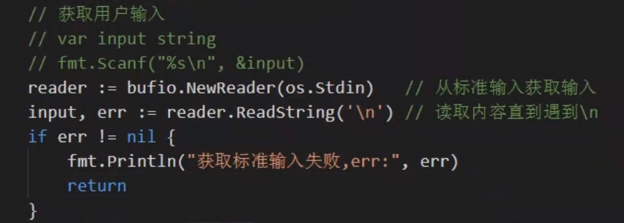
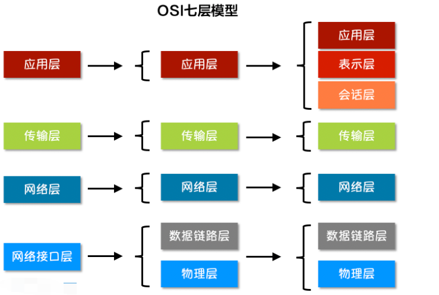
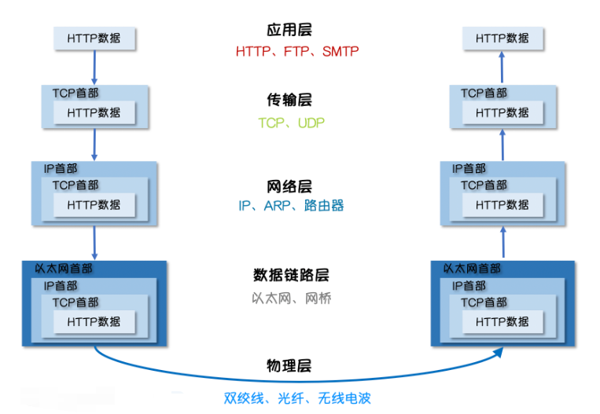
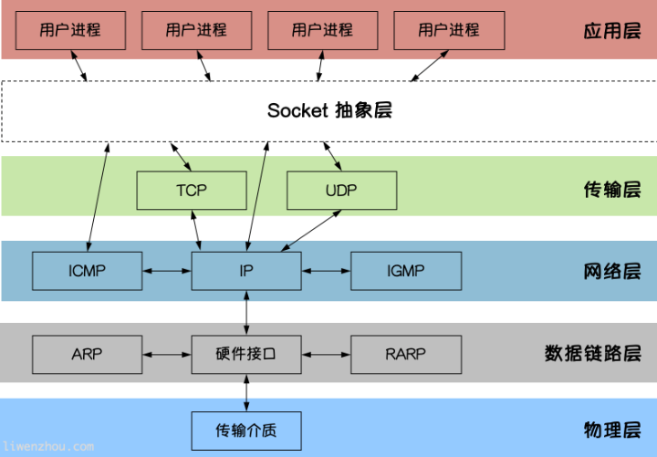

## 网络基本概念

- 网络编程的目的: 直接或间接地通过网络协议与其他计算机进行通讯
- 网络编程中的两个主要问题:
  - 如何准备定位网络上一台或多台计算机(通过IP)
  - 找到主机后如何进行数据传输(有OSI模型和TCP/IP模型)
- OSI 模型将网络分为7层, 过于理想化, 未能广泛推广
- TCP/IP 是事实上的国际标准
- IP分类
  - A类: 保留给政府机构 1.0.0.1 ~ 126.255.255.254
  - B类: 
- 

## HTTP 和 HTTPS 的区别是什么

- HTTP 发送明文不安全
- HTTP 考虑加密, 双方对称加密(怎么加怎么解)
- HTTPS 什么请CA认证证书 所以安全

## socket编程

Socket是BSD UNIX的进程通信机制，通常也称作”套接字”，用于描述IP地址和端口，是一个通信链的句柄。Socket可以理解为TCP/IP网络的API，它定义了许多函数或例程，程序员可以用它们来开发TCP/IP网络上的应用程序。电脑上运行的应用程序通常通过”套接字”向网络发出请求或者应答网络请求。

常用的Socket类型有两种, 流式Socket 和数据报式Socket

流式是一种面向连接的Socket, 针对于面向连接的TCP服务应用,

数据报式Socket是一种无连接的Socket, 针对于无连接的UDP服务应用

`Socket`是应用层与TCP/IP协议族通信的中间软件抽象层。在设计模式中，`Socket`其实就是一个门面模式，它把复杂的TCP/IP协议族隐藏在`Socket`后面，对用户来说只需要调用Socket规定的相关函数，让`Socket`去组织符合指定的协议数据然后进行通信。

