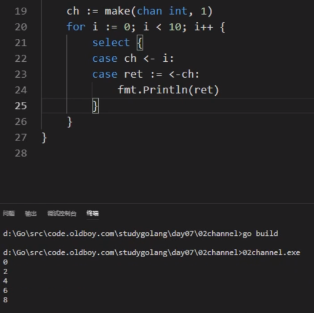

## goroutine 

1. 并发和并行
2. goroutine 是什么 ?
   1. 用户态线程, 用户可以控制的
3. 启动goroutine 
   1. 使用go 关键字
4. goroutine 的原理
   1. M:N   将M个goroutine调度到n个线程上. n默认是操作系统的逻辑核心数
5. goroutine 和 OS 线程的区别:
   1. goroutine 是用户态的线程,初始开销很小(2kb),可以随着需求扩充,最大能到1GB
   2. 一个OS线程是很重量级的,通常内存开销达2MB
   3. 通过  `runtime.GOMAXPRECES()` 用来设置GO并发使用的CPU核数,1.5版本之后默认跑满CPU
6. goroutine的特点:
   1. 一个goroutine 对应一个函数,这个函数就是要做的事情
   2. main 函数就是一个 goroutine 
   3. 当goroutine 对应的函数返回的时候,goroutine就结束了
   4. main函数所在的goroutine结束了,由它启动的那些goroutine也就结束了
7. sync.WaitGroup  等待goroutine 结束在退出
   1. 它是一个结构体类型 var wg sync.WaitGroup
   2. 三个方法
      1. wg.Add(n)
      2. wg.Done()
      3. wg.Wait()

## channel

1. channel 是一种类型, 一种引用的类型

2. channel 的声明和初始化

   1. `var ch chan int` 
   2. channel 声明之后要使用make函数初始化之后才能使用  `ch = make(chan int, [cap])`  使用make初始化的包括 slice map chan 

   

   

3. channel 的3个操作

   1. 发送  `chan <- 100 ` 
   2. 接收 ` <- ch` . 可以使用变量接收值: ` a := <- ch` 也可以直接丢弃 `<-ch`
   3. 关闭 `close(ch)`  
      1. 关闭后的通道,还是可以取值的,取完之后返回的是类型的零值.
      2. 关闭后通道不能在发送值
      3. 关闭的通道不能在关闭

4. 无缓冲区channel 和 有缓冲区channel

   1. 无缓冲区channel 又成为同步channel.  (必须有收发,不然放不进去, 阻塞,报错deadlock. 只能另起一个goroutine 去接收值)
   2. 有缓冲区的channel.超过容量就阻塞

5. 优雅的从通道取值(能判断是否被关闭)

   1. `v,ok := <-ch` 如果通道被关闭 ok返回的是false
   2. `for v := range ch{}`

6.  单向通道

   1. 只能接收 (`<- ch`) 或者只能发送的通道
   2. 多用在函数传参的时候,限制某个通道在函数中只能做什么类型的操作

7. select 多路复用

   1. 同一时刻可以对多个通道做 发送 和接收 操作

      

   8. 通道是线程安全的

## 并发控制 与 锁

1. 很多并发的场景下 需要goroutine 之间协同处理

2. 如果多个goroutine 操作同一个全局变量的时候,就会存在数据竞争

3. 互斥锁

   1. sync.Mutex  它是一个结构体类型 维护了一个计数器
   2. 声明锁
      1. `var lock sync.Mutex`  这个类型
   3. 操作
      1. 加锁 lock.Lock()
      2. 解锁 lock.Unlock()
   4. 读写锁
      1. `sync.RWMutex`  **适用于读多写少的场景. 类比网站数据库的读写分离声明读写锁**
      2. 声明读写锁
         1. `var rwLock sync.REMutex`
      3. 操作
         1. 加读锁  rwLock.RLock()
         2. 解读锁  rwLock.RUnlock()
         3. 加写锁  rwLock.lock()
         4. 解写锁  rwLock.Unlock()
   5. sync.Map
      1. 内置的map不是并发安全的
      2. 并发场景下推荐使用`sync.Map`
      3. sync.Map 的使用

   6. sync.Once  只有一个Do方法
      1. 只会加载一次 
      2. 闭包的应用  
      3. Do运行的函数是不行带参数的,所以就需要使用闭包封装下

## 原子操作

