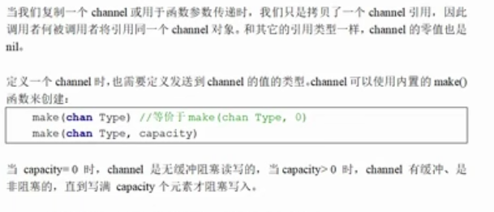
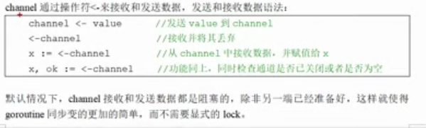
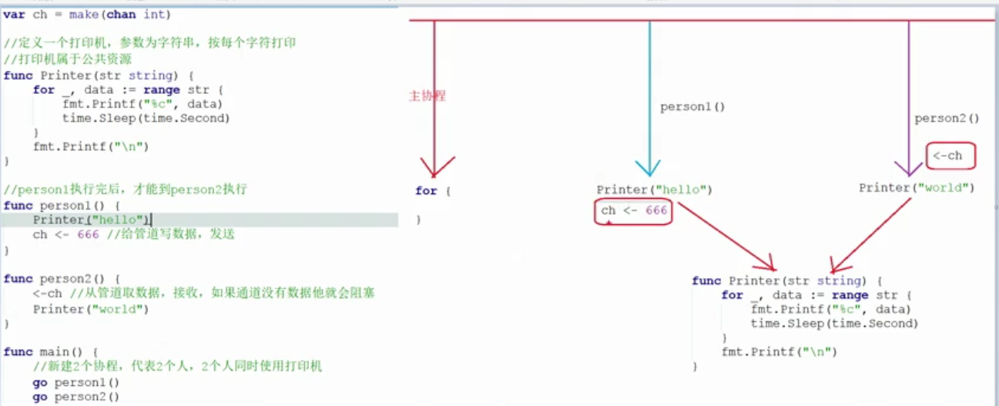

goruntine 奉行 通过通信来共享内存,而不是共享内存来通信


## channel 类型

​	和map类型,channel也是一个对应make创建的底层数据结构的引用


创建 









``` go
package main

import (
	"fmt"
	"time"
)

func main()  {
    // 也可以使用var 定义
    // var ch1 chan int  nil类型
    // make函数定义并初始化  slice map channel
    
	ch := make(chan string)  // 定义channel
	defer fmt.Println("主协成也结束了")

	go func() {
		defer fmt.Println("zi xie cheng jieshu ")
		for i:=0; i <2;i++ {
			fmt.Println("子协成 i=",i)
			time.Sleep(time.Second)

		}
		 ch <- "我是子协成,要工作完毕"

	}()

	str := <- ch  // 如果没有就会阻塞
	fmt.Println("str:",str)
}
```


## 无缓冲channel

创建格式

​	`make(chan Type)` // 等价于 make(chan Type,0)  容量为0

len(ch), cap(ch) 都为0

如果没有指定缓冲区容量,那么该通道就是同步的,因此会阻塞到发送者准备好发送和接受者准备好接收

``` go
package main

import (
	"fmt"
	"time"
)

func main() {

	//创建一个无缓存的channel
	ch := make(chan int, 0)

	//len(ch) 缓冲区剩余数据个数, cap(ch) 缓冲区大小
	fmt.Println(len(ch), cap(ch))

	//新建协成
	go func() {
		for i := 0; i < 3; i++ {
			fmt.Println(i)
			ch <- i
		}
	}()

	// 延时
	time.Sleep(2 * time.Second)

	for i := 0; i < 3; i++ {
		//fmt.Println(i)
		num := <-ch
		fmt.Println("num=", num)
	}
}
```


## 有缓存 channel

创建格式

​	`make(chan Type,capacity) ` 指定容量

如果给定了一个缓冲区容量,通道就是异步的,只要缓冲区有未使用空间用于发送数据,或者 还包含可以接收的数据,那么通信就会无阻塞的进行

``` go
package main

import (
	"fmt"
	"time"
)

func main() {

	//创建一个有缓存的channel
	ch := make(chan int, 3)

	//len(ch) 缓冲区剩余数据个数, cap(ch) 缓冲区大小
	fmt.Println(len(ch), cap(ch))

	//新建协成
	go func() {
		for i := 0; i < 10; i++ {
			fmt.Println(i)
			ch <- i
		}
	}()

	// 延时
	time.Sleep(2 * time.Second)

	for i := 0; i < 10; i++ {
		//fmt.Println(i)
		num := <-ch
		fmt.Println("num=", num)
	}
}
```


## 关闭 channel


``` go
import "fmt"

func main()  {
	// 创建一个无缓存channel
	ch := make(chan int)

	go func() {
		for i:=0;i <5; i++ {
			ch <- i
		}
		close(ch)
	}()

	for {

		// 如果ok 为true,说明管道没有关闭
		if num,ok := <- ch; ok == true {
			fmt.Println("num=",num)
		}else{
			//管道关闭
			break
		}
	}

}
```


注意 :

1. channel 不像文件一样需要经常去关闭,只有当你确定没有任何发送数据了,或者你想显示的结束range循环之类的,才去关闭channel
2. **关闭channel后,无法向channel在发送数据(引发panic 错误后导致接收立即返回零值)**
3. **关闭channel后,在接收数据, 如果里面有数据是可能取到的,但是如果里面没有数据,只能取到对应类型的零值 **
4. 对于nil channel,无论收发都会阻塞

主要注意 2,3 就ok


开始06 17章