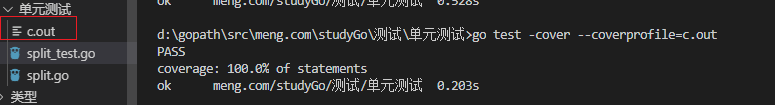
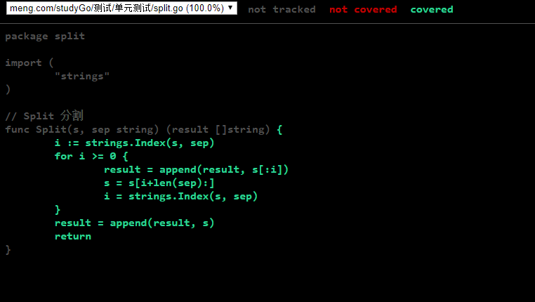

## go test 工具

内置包

go test 命令是一个按照一定约定和组织的测试代码的驱动程序.

在包的目录内, 所有以 _test.go 为后缀名的源代码文件都是 go test 测试的一部分, 不会被 go build 编译到最终的可执行文件中.


在 *_test.go 文件中有三种类型的函数, 单元测试函数/ 基准测试函数 和 示例函数

| 类型     | 格式                  | 作用                           |
| -------- | --------------------- | ------------------------------ |
| 测试函数 | 函数名前缀为Test      | 测试程序的一些逻辑行为是否正确 |
| 基准函数 | 函数名前缀为Benchmark | 测试函数的性能                 |
| 示例函数 | 函数名前缀为Example   | 为文档提供示例文档             |

`go test`命令会遍历所有的`*_test.go`文件中符合上述命名规则的函数，然后生成一个临时的main包用于调用相应的测试函数，然后构建并运行、报告测试结果，最后清理测试中生成的临时文件。


## 测试函数  -- 单元测试

### 测试函数的格式

每个测试函数必须导入 testing 包. 测试函数的基本格式(签名) 如下:

``` go
func TestName(t *testing.T){
    // ...
}
```

测试函数的名字必须以 Test  开头, 可选的后缀名必须以大写字母开头.

``` go
func TestAdd(t *testing.T){ ... }
func TestSum(t *testing.T){ ... }
func TestLog(t *testing.T){ ... }
```


其中参数`t`用于报告测试失败和附加的日志信息。 `testing.T`的拥有的方法如下：

``` go
func (c *T) Error(args ...interface{})
func (c *T) Errorf(format string, args ...interface{})
func (c *T) Fail()
func (c *T) FailNow()
func (c *T) Failed() bool
func (c *T) Fatal(args ...interface{})
func (c *T) Fatalf(format string, args ...interface{})
func (c *T) Log(args ...interface{})
func (c *T) Logf(format string, args ...interface{})
func (c *T) Name() string
func (t *T) Parallel()
func (t *T) Run(name string, f func(t *T)) bool
func (c *T) Skip(args ...interface{})
func (c *T) SkipNow()
func (c *T) Skipf(format string, args ...interface{})
func (c *T) Skipped() bool
```


### 示例:

1. 简单使用

我们定义一个`split`的包，包中定义了一个`Split`函数，具体实现如下：

``` go
package split

import (
	"strings"
)
// Split 分割
func Split(s, sep string) (result []string) {
	i := strings.Index(s, sep)
	for i >= 0 {
		result = append(result, s[:i])
		s = s[i+len(sep):]
		i = strings.Index(s, sep)
	}
	result = append(result, s)
	return
}
```


在当前目录下，我们创建一个`split_test.go`的测试文件，并定义一个测试函数如下：

```go
// split/split_test.go

package split

import (
	"reflect"
	"testing"
)

func TestSplit(t *testing.T) { // 测试函数名必须以Test开头，必须接收一个*testing.T类型参数
	got := Split("a:b:c", ":")         // 程序输出的结果
	want := []string{"a", "b", "c"}    // 期望的结果
	if !reflect.DeepEqual(want, got) { // 因为slice不能比较直接，借助反射包中的方法比较
		t.Errorf("excepted:%v, got:%v", want, got) // 测试失败输出错误提示
	}
}
```

在`split`包路径下，执行`go test`命令，可以看到输出结果如下：

```bash
split $ go test
PASS
ok      github.com/Q1mi/studygo/code_demo/test_demo/split       0.005s
```


我们可以为`go test`命令添加`-v`参数，查看测试函数名称和运行时间：

`go test -v`

还可以在`go test`命令后添加`-run`参数，它对应一个正则表达式，只有函数名匹配上的测试函数才会被`go test`命令执行。

`go test -v -run="More" 或者 go test -v -run More `


### 测试组  -- 多个测试情况写在一个测试函数内

示例:

在go 1.7+ 中新增了自测试, 我们可以按照如下方式使用 t.Run() 执行子测试

``` go
package split

import (
	"reflect"
	"testing"
)

// func TestSplit(t *testing.T) {
// 	got := Split("a:b:c", ":")
// 	want := []string{"a", "b", "c"}

// 	if !reflect.DeepEqual(want, got) {
// 		t.Errorf("目的值为:%#v, 实际得到了%#v", want, got)
// 	}
// }

// func TestMoreSplit(t *testing.T) {
// 	got := Split("abcd", "bc")
// 	want := []string{"a", "d"}
// 	if !reflect.DeepEqual(want, got) {
// 		t.Errorf("目的值为:%#v, 实际得到了%#v", want, got)
// 	}
// }

func TestSplit(t *testing.T) {
	type test struct {
		input string
		sep   string
		want  []string
	}

	tests := map[string]test{
		"simple": {input: "a,b,c", sep: ",", want: []string{"a", "b", "c"}},
		"wrong ": {input: "a,b,c", sep: "*", want: []string{"a,b,c"}},
		"more ":  {input: "abcd", sep: "bc", want: []string{"a"}},
	}
	for k, v := range tests {
		// got := Split(v.input, v.sep)
		// if !reflect.DeepEqual(v.want, got) {
		// 	t.Errorf("名字:%s,目的值为:%#v, 实际得到了%#v", k, v.want, got)
		// }
		t.Run(k, func(t *testing.T) {
			got := Split(v.input, v.sep)
			if !reflect.DeepEqual(v.want, got) {
				t.Errorf("名字:%s,目的值为:%#v, 实际得到了%#v", k, v.want, got)
			}
		})
	}
}
```


执行 go test 结果入下

```bash
$ >go test -v
=== RUN   TestSplit
=== RUN   TestSplit/simple
=== RUN   TestSplit/wrong_
=== RUN   TestSplit/more_
--- FAIL: TestSplit (0.00s)
    --- PASS: TestSplit/simple (0.00s)
    --- PASS: TestSplit/wrong_ (0.00s)
    --- FAIL: TestSplit/more_ (0.00s)
        split_test.go:45: 名字:more ,目的值为:[]string{"a"}, 实际得到了[]string{"a", "d"}
FAIL
exit status 1
FAIL    meng.com/studyGo/测试/单元测试  0.411s
```


执行指定的子测试用例,可以通过`-run=RegExp`来指定运行的测试用例，还可以通过**`/`**来指定要运行的子测试用例  `>go test -v -run /more`

``` go

d:\gopath\src\meng.com\studyGo\测试\单元测试>go test -v -run /more
=== RUN   TestSplit
=== RUN   TestSplit/more_
--- FAIL: TestSplit (0.00s)
    --- FAIL: TestSplit/more_ (0.00s)
        split_test.go:45: 名字:more ,目的值为:[]string{"a"}, 实际得到了[]string{"a", "d"}
FAIL
exit status 1
FAIL    meng.com/studyGo/测试/单元测试  0.161s
```


### 测试覆盖率

测试覆盖率是你的代码被测试套件覆盖的百分比, 通常我们使用的都是语句的覆盖率, 也就是在测试中至少被运行一次的代码占总代码的比例.

go提供内置功能来检查你的代码覆盖率. 我们可以使用 go test -cover 来查看测试覆盖率.

``` bash
d:\gopath\src\meng.com\studyGo\测试\单元测试>go test -cover
PASS
coverage: 100.0% of statements
ok      meng.com/studyGo/测试/单元测试  0.528s
```

上面的结果可以看到我们的测试用例覆盖了100%的代码


go 提供了一个额外的 -coverprofile 参数,用来将覆盖率相关的记录信息输出到一个文件.例如:




可以执行 go tool cover -html=c.out .

 使用cover工具来处理生成的记录信息,.该命令会打开本地的浏览器窗口生成一个HTML的报告.



上面中没个用绿色标记的语句块表示被覆盖了, 而红色的表示没有被覆盖.


