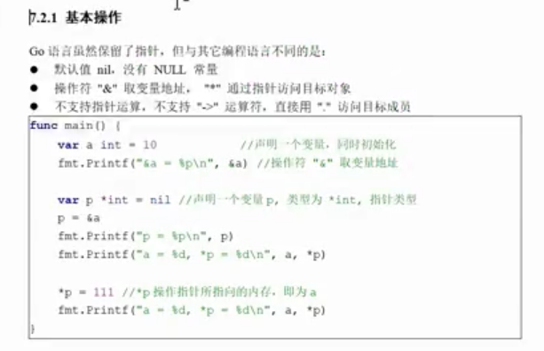
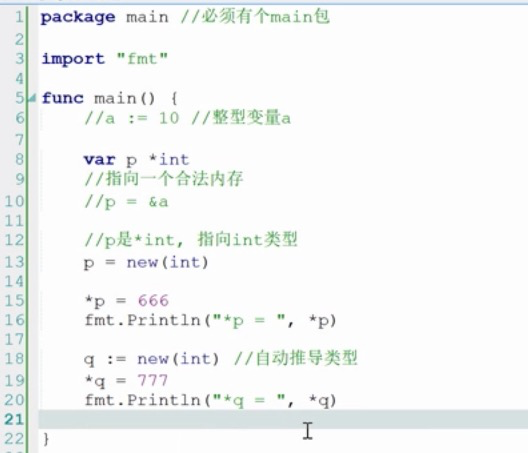
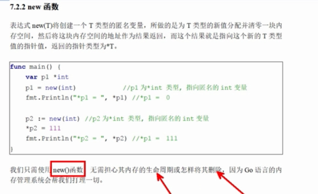

指针

----



----




----




----


创建struct 

    type person struct {
    
    ​	name string
    
    ​	age int
    
    }

生成新的对象 

	new() -> 返回的是指针类型 ,可以直接name age 赋值
	& 其实也是调用new() 但是使用& 可以直接赋值
	
	var p person , 也可以直接name age 赋值
	var p4 *person


​	
​	
​	
``` go
package main

import (
    "fmt"
)

type person struct {
    name string
    age  int
}

func main() {
    p1 := person{}
    p2 := &person{}
    p3 := new(person)
    var p4 *person
    fmt.Println(p1)
    fmt.Println(p2)
    fmt.Println(p3)
    p4 = &person{
    name:"longshuai",
    age:23,
	}
	fmt.Println(p4)
	
}

>>> { 0}
>>> &{ 0}
>>> &{ 0}
>>> &{longshuai 23}
```
----

Go函数给参数传递值的时候是以复制的方式进行的。

复制传值时，如果函数的参数是一个struct对象，将直接复制整个数据结构的副本传递给函数，这有两个问题：

函数内部无法修改传递给函数的原始数据结构，它修改的只是原始数据结构拷贝后的副本
如果传递的原始数据结构很大，完整地复制出一个副本开销并不小
所以，如果条件允许，应当给需要struct实例作为参数的函数传struct的指针。例如：

func add(p *person){...}
既然要传指针，那struct的指针何来？自然是通过&符号来获取。分两种情况，创建成功和尚未创建的实例。

对于已经创建成功的struct实例p，如果这个实例是一个值而非指针(即p->{person_fields})，那么可以&p来获取这个已存在的实例的指针，然后传递给函数，如add(&p)。

对于尚未创建的struct实例，可以使用&person{}或者new(person)的方式直接生成实例的指针p，虽然是指针，但Go能自动解析成实例对象。然后将这个指针p传递给函数即可。如：

p1 := new(person)
p2 := &person{}
add(p1)
add(p2)


默认值是nil,没有NULL变量
操作符
& 取变量地址,         --> 实例
* 通过指针访问目标对象  --> 指针


