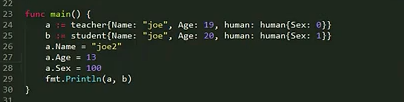

---
 
---


----


结构的初始化的时候,取地址符号,

赋值的时候并不需要加*

----

匿名结构


取内存地址 直接在 struct 前加&

----

结构的嵌套


----

匿名字段 

 严格按照结构类型赋值


----


----


嵌入结构 

匿名字段赋值


修改嵌入字段值



或 a.human.sex = 100 


----

https://gowalker.org


如果字段名称相同


如果 a 中没有 name 字段,两种都可以去到 name


----


可以把 c 放到 b 内

## 定义一个结构体

1. 顺序初始化,成员必须初始化

2. 指定成员初始化,没有初始化的成员,自动按照类型赋值为 0

3. 结构体指针变量初始化. 

   别忘记取地址,因为它是一个指针变量

   `var  *stu = &stu{}`

   打印可以*p 或者p

----

## 结构体成员的使用

1. 定义一个结构

   1.1 普通变量

``` go
type Student struct {
  id int
  name string
  sex byte //字符类型
  age int
  addr string
}

func main(){
  //定义一个结构体变量 
  var s Student
  
  //操作成员,需要使用点(.)运算符
  s.id= 1
  s.name= "mike"
  ...
  
  fmt.Prinln("s=",s)
}
```

​	1.2 指针变量

``` go
type Student struct {
  id int
  name string
  sex byte //字符类型
  age int
  addr string
}

func main(){
  //1.指针有合法指向后,才操作成员
  //先定义一个普通结构体变量
  var s Student
  // 在定义一个指针变量,保存 s 的地址
  var p1 *Student
  p1 = &s
  //通过指针操作成员 p1.id 和(*p).id 完全等价,只能使用.运算符
  p1.id = 18 或(*p).id = 18
  
  fmt.Prinln("p1=",p1)
  
  
  //2 通过 new 申请一个结构体
  p2 := nre(Student)
  p2.id = 18
  ...
  //操作成员,需要使用点(.)运算符
  ...
}
```


## 结构体比较和赋值

1. 比较不同结构体内的每个成员是否相等

2. 同类型的结构体可以赋值


## 结构体作为函数参数

1. 值传递,形参无法修改,  拷贝一份值修改的也是 copy 的那份


2. 指针传递,地址传递,可以修改内部变量值


