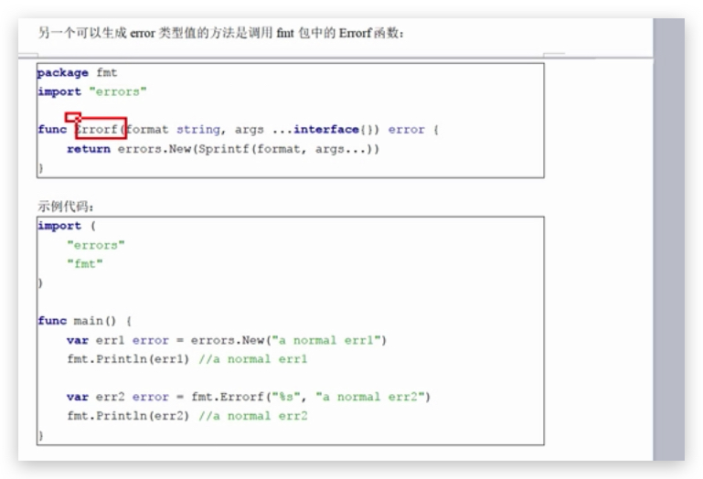
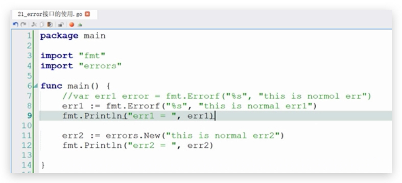

Go 语言引入了一个关于错误处理的标准模式,即err 接口,它是 go 语言内建的接口 模型


定义如下:

``` go
type error interface{
  Error() string
}
```


go 语言的标准库代码包 errors 为用户提供了如下方法:

``` go
package errors
type errorSting struct{
  text string
}

func New(text string) error {
  return &errorString(text)
}

func (e *errorString) Error() string{
  return e.text
}

```





例子:



作用我认为就是提示错误

