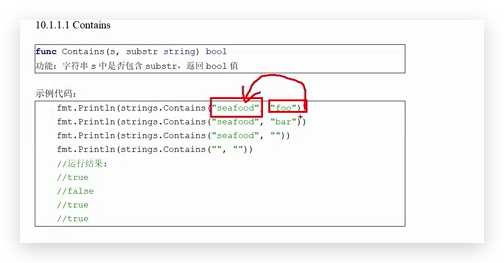
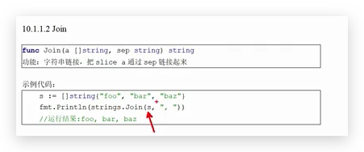
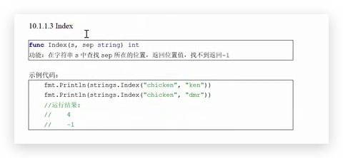
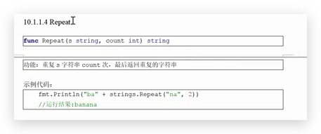
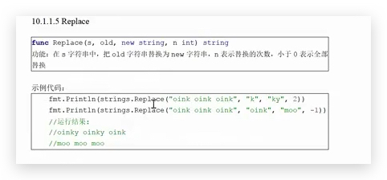
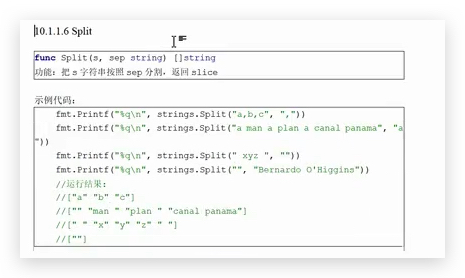
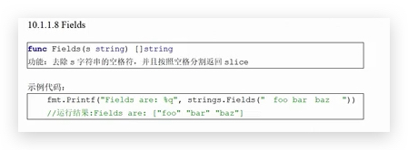
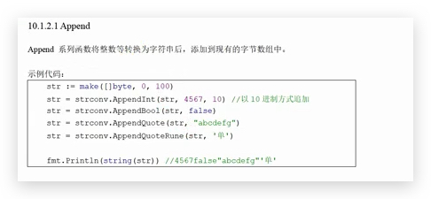
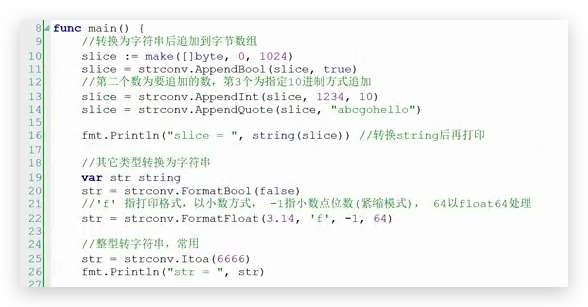
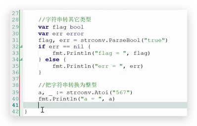

# 字符串处理— 常用函数

## Contains  是否包含

## join 拼接

## index  查看字符串的索引值

## repeat 字符串重复多少次

## replace 替换

## split 指定分割 返回 slice

 

## trim  去除两头的空格

## fields 去除空格,并按照空格分割返回 slice

# 

# 字符串替换

## `strconv.Append `

使用 strconv 包转换

## format

## parse

