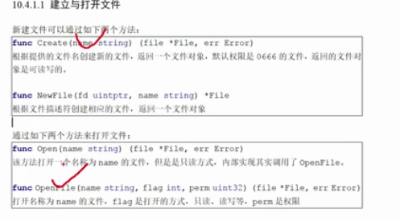
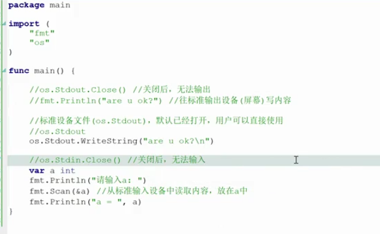

# 相关api介绍

## 1. 建立与打开文件







## 打开文件 ,写入文件,读取文件


``` go
package main

import (
	"fmt"
	"io"
	"os"
)

func WriteFile(path string) {
	f, err := os.Create(path)
	if err != nil {
		fmt.Println("err = ", err)
		return
	}
	defer f.Close()

	var buf string
	for i := 0; i < 10; i++ {
		buf = fmt.Sprintf("i = %d\n", i)
		n, err := f.WriteString(buf)
		if err != nil {
			fmt.Println("err = ", err)
			return
		}
		fmt.Println("n = ", n)
	}
}

func ReadFile(path string) {
	f, err := os.Open(path)
	if err != nil {
		fmt.Println("err = ", err)
		return
	}
	fmt.Println("f =", f)
	//关闭文件
	defer f.Close()

	buf := make([]byte, 1024*2)

	// n 代表从文件读取内容的长度
	n, err := f.Read(buf)
	if err != nil && err != io.EOF {  // 文件出错,同时没有到结尾
		fmt.Println("err = ", err)
		return
	}
	fmt.Println("buf = ", string(buf[:n]))
}
func main() {
	path := "./model.txt"
	//WriteFile(path)
	ReadFile(path)
}

```

## 按行读取文件,但是 "\n" 也会读取进去
``` go
package main

import (
	"bufio"
	"fmt"
	"io"
	"os"
)

func Readline(path string) {
	f, err := os.Open(path)
	if err != nil {
		fmt.Print("err = ", err)
		return
	}
	defer f.Close()

	//新建一个缓冲区,把内容先放在缓冲区
	r := bufio.NewReader(f)
	for {
		//遇到 \n 结束读取,但是 '\n'也读取进去了
		buf,err :=r.ReadBytes('\n')
		if err != nil{
			if err == io.EOF {//文件已经读完
				break
			}
			fmt.Println("err = ",err)
		}
		fmt.Printf("buf = #%s#\n",string(buf))
	}

}

func main() {
	path := "./model.txt"
	Readline(path)
}
```
## 拷贝文件 (读取文件)

``` go
package main

import (
	"fmt"
	"io"
	"os"
)

func main()  {
	list := os.Args // 获取命令行参数
	if len(list) != 3 {
		fmt.Println("usage:src  dst")
		return
	}

	srcFile := list[1]
	dstFile := list[2]

	if srcFile == dstFile {
		fmt.Println("源文件和目的文件名字不能相同")
		return
	}

	//只读文件打开源文件
	sf,err1 := os.Open(srcFile)
	if err1 != nil {
		fmt.Println("err1 = ",err1)
		return
	}

	//新建目的文件
	ds,err2 := os.Create(dstFile)
	if err2 != nil {
		fmt.Println("err2 =" ,err2)
		return
	}

	// 操作完毕,需要关闭文件
	defer  sf.Close()
	defer  ds.Close()

	// 核心处理,从源文件读取内容,往目的文件写,读多少写多少
	buf := make([]byte,4*1024)
	for {
		n,err := sf.Read(buf)
		if err != nil{
			fmt.Println("err = ",err)
			if err == io.EOF{
				break
			}
		}
		// 往目的文件写,读多少,写多少
		ds.Write(buf[:n])
	}


}

```

