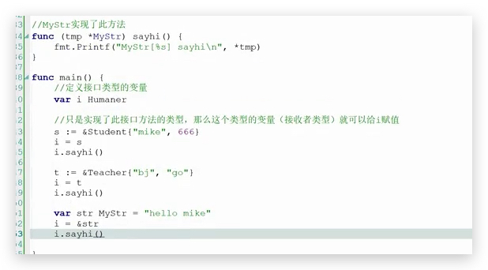

``` go
package main

import "fmt"

type Humer interface {
	SayHi()
}

type Teacher struct {
	Name string
	Id int
}

func (t *Teacher)SayHi()  {
	fmt.Println("teacher",t.Name,t.Id)
}

func main()  {
	var i Humer
	s := &Teacher{"mm",18}
	i = s
	i.SayHi()
}
```


