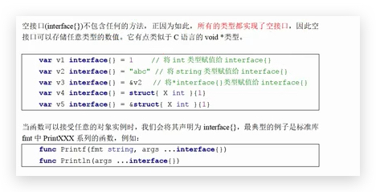

空接口(interface{}) 不包含任何的方法,整因为如此, **所有类型都是实现了空接口**  ,因此 空接口可以存储任意类型的数值,它有点类似于 C 语言的 void*类型




``` go
// 可以接受任意类型的数据,0 到多个都可以
func xxx(arg ...interface{}){
  
}

func main(){
  //空接口万能类型,保存任意类型的值
  
  var i interface{} = 1
  
  i = "abc"
	...  
}
```

