[视频地址](<https://www.bilibili.com/video/av74592164?p=22>)

## vue_shop

1. 终端vue ui 打开web界面 
2. 创建项目. 参见<https://www.bilibili.com/video/av74592164?p=5>
3. 插件 ->  添加插件 -> element
4. 依赖 -> 安装依赖 -> 运行依赖 axios


## 进度  

视频 107

----


源码链接https://pan.baidu.com/s/1z60ej714UHIZqFL4lzjIpg 里面有两个项目源码，这套视频用的“20-21vue  

  17-21 Vue.js项目实战开发\20-21vue电商\3.vue-项目实战day1\素材里面有个压缩包

## 搭建环境
mysql

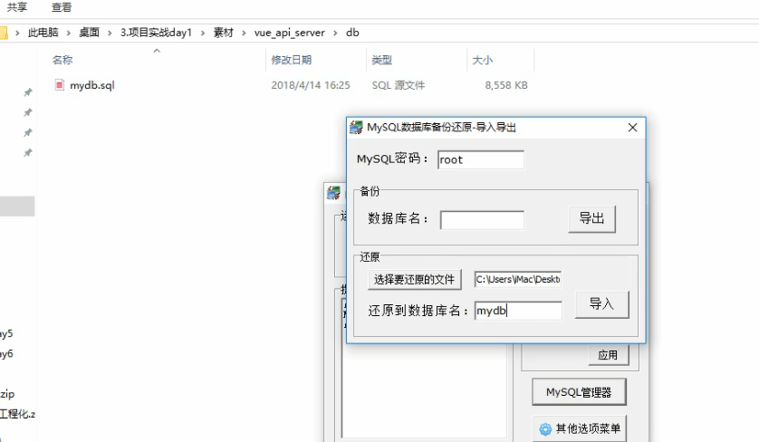


进入vue_api_server 目录, 执行 npm install

node ./app.js


## 前端项目初始化步骤

1. 安装vue 脚手架
2. 通过vue脚手架创建项目
3. 配置vue路由
4. 配置emement-ui组件库
5. 配置axios库
6. 初始化git远程仓库
7. 将本地项目托管到github


## token

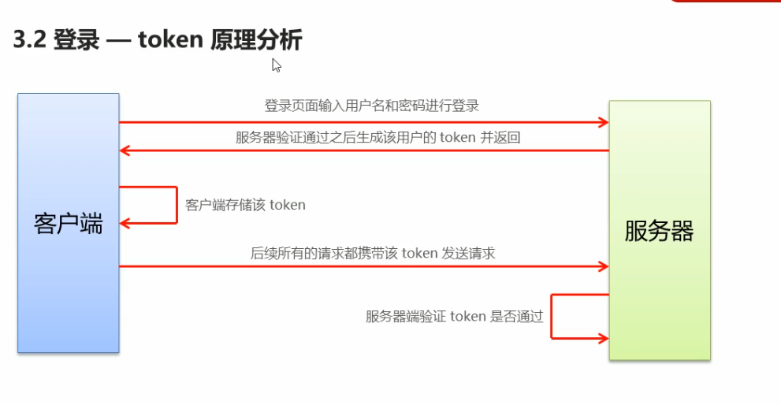


## 登录

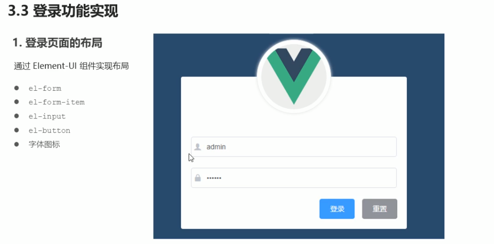


``` vue
// 路由重定向
const routes = [
  {
    path: '/',
    redirect: '/login'

  },
  {
    path: '/login',
    component: Login
  }
]

// 路由占位符
<router-view></router-view>
```


## login

###  为表单添加验证

1. 为form 加一个rules

   ` <el-form :model="ruleForm" :rules="rules" ref="ruleForm" label-width="100px" class="demo-ruleForm">`

2. 在data中添加规则

   ``` html
           rules: {
             name: [
               { required: true, message: '请输入活动名称', trigger: 'blur' },
               { min: 3, max: 5, message: '长度在 3 到 5 个字符', trigger: 'blur' }
             ],
             region: [
               { required: true, message: '请选择活动区域', trigger: 'change' }
             ],
             date1: [
               { type: 'date', required: true, message: '请选择日期', trigger: 'change' }
             ],
             date2: [
               { type: 'date', required: true, message: '请选择时间', trigger: 'change' }
             ],
             type: [
               { type: 'array', required: true, message: '请至少选择一个活动性质', trigger: 'change' }
             ],
             resource: [
               { required: true, message: '请选择活动资源', trigger: 'change' }
             ],
             desc: [
               { required: true, message: '请填写活动形式', trigger: 'blur' }
             ]
           }
   ```

3. 在 `el-form-item` 中添加`prop` 属性

   ``` html
     <el-form-item label="活动名称" prop="name">
       <el-input v-model="ruleForm.name"></el-input>
     </el-form-item>
   ```


## 配置消息弹框的效果

1. 在`plugins` 的`element.js` 中导入`Message`组件

2. 挂载Vue下,设置全局组件

   `Vue.prototype.$message = Message`

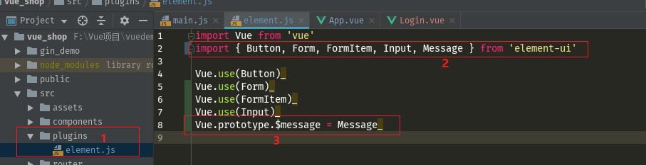


## 把`token` 放到`sessionStroage` 中

``` html
// 1. 将登录成功之后的token,保存到客户端的sessionStorage 中
// 1.1 项目中除了登录之外的其他API接口,必须在登录之后才能访问
// 1.2 token 只应在当前网站打开期间生效, 所有将token保存在sessionStorage中
window.sessionStorage.setItem('token', res.token)
// 2. 通过编程式导航跳转到后台主页, 路由地址是/hone
this.$router.push('/home')
```


## 登录 - 路由导航守卫控制权限

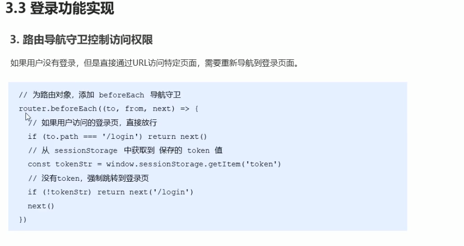

`router.js`

``` javascript
import Vue from 'vue'
import VueRouter from 'vue-router'
import Login from '@/components/Login.vue'
import Home from '@/components/Home.vue'

Vue.use(VueRouter)

/*
const router = new VueRouter({
  routes: [
    { path: '/', redirect: '/login' },
    { path: '/login', redirect: Login },
    { path: '/home', redirect: Home }
  ]
})

// 挂载路由导航守卫
router.beforeEach((to, from, next) => {
  // to 将要访问的路径
  // from 代表从哪个路径跳转而来
  // next 是一个函数, 表示方形
  // next() 放行, next('/login')  强制跳转到url
  if (to.path === '/login') return next()
  // 获取token
  const tokenStr = window.sessionStorage.getItem('token')
  if (!tokenStr) return next('/login')
  next()
})

export default router
*/

const routes = [
  {
    redirect: '/login',
    path: '/'
  },
  {
    path: '/login',
    component: Login
  },
  {
    path: '/Home',
    component: Home
  }
]

const router = new VueRouter({
  routes
})

// 挂载路由导航守卫
router.beforeEach((to, from, next) => {
  // to 将要访问的路径
  // from 代表从哪个路径跳转而来
  // next 是一个函数, 表示方形
  // next() 放行, next('/login')  强制跳转到url
  if (to.path === '/login') return next()
  // 获取token
  const tokenStr = window.sessionStorage.getItem('token')
  if (!tokenStr) return next('/login')
  next()
})

export default router

```


## 退出

清空 token .

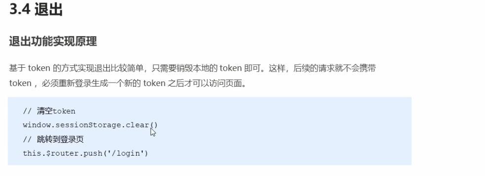


## 解决语法错误

1. 不能使用双引号
2. 默认后面要添加分号

新添加文件

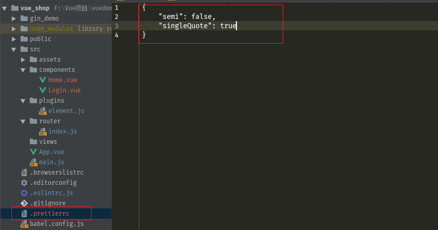


函数名后面必须要添加空格

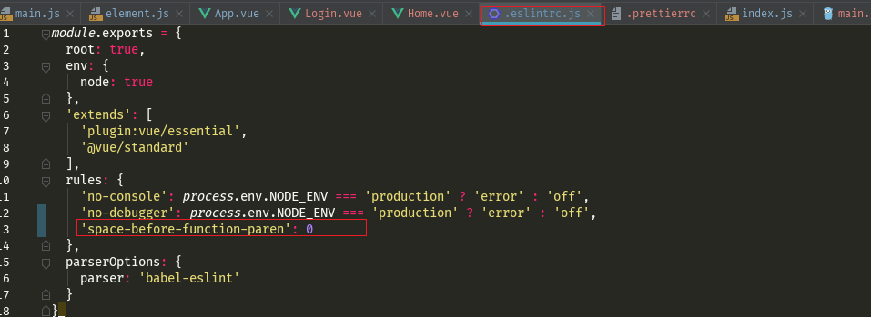


# 主页布局

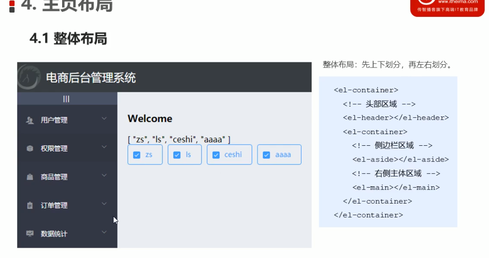


## 使用element-ui 的container 布局要先导入

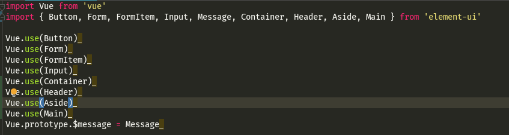


## 左侧菜单

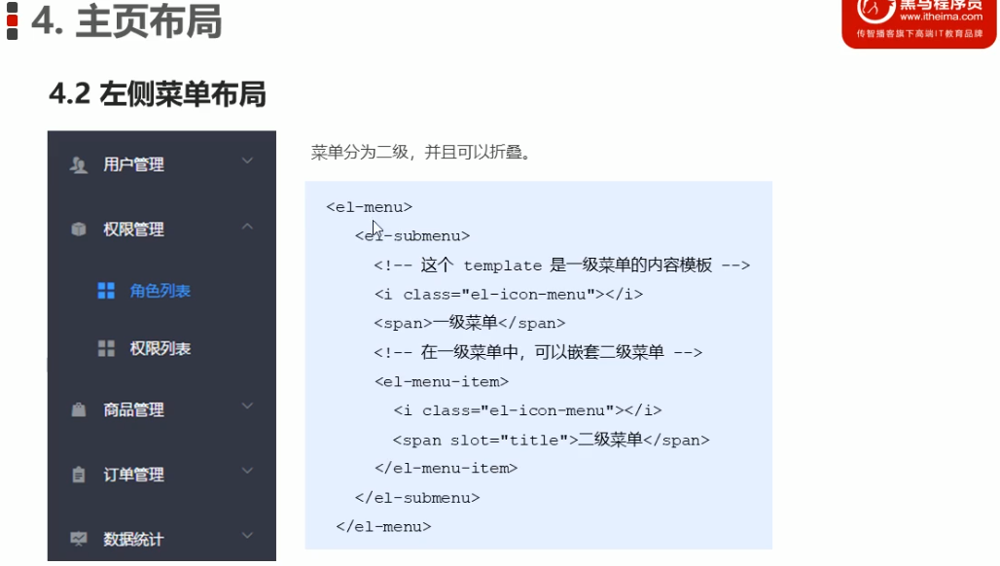


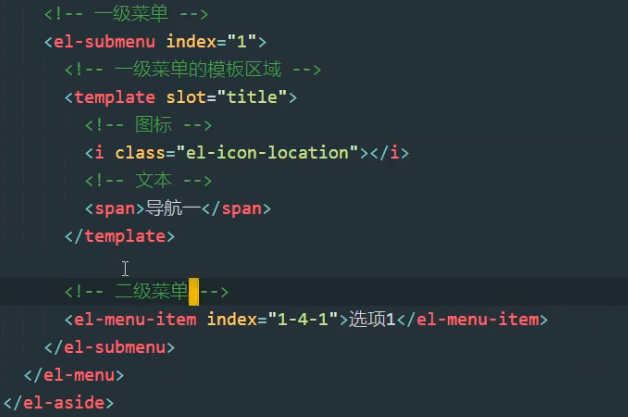


请求必须携带token, 预处理过程.


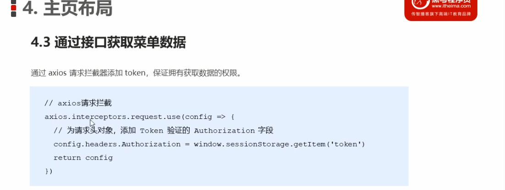

main.js

添加请求头.`headers.Authorization`

``` javascript
import axios from 'axios'
//
import '@/assets/css/global.css'

axios.defaults.baseURL = 'http://127.0.0.1:8888/api/private/v1'
axios.interceptors.request.use(config => {
  // console.log(config)
  config.headers.Authorization = window.sessionStorage.getItem('token')
  return config
})
Vue.prototype.$http = axios
```


## 作用域插槽

``` html
<!--        用户列表去-->
        <el-table :data="userList" border stripe >
          <el-table-column type="index" label="#"></el-table-column>
          <el-table-column label="姓名" prop="username"></el-table-column>
          <el-table-column label="邮箱" prop="email"></el-table-column>
          <el-table-column label="电话" prop="mobile"></el-table-column>
          <el-table-column label="角色" prop="role_name"></el-table-column>
          <el-table-column label="状态" >
            <template slot-scope="scope">
<!--              拿到这行的数据-->
<!--              {{ scope.row }}-->
              <el-switch
                v-model="scope.row.mg_state"
                active-color="#13ce66"
                inactive-color="#ff4949">
              </el-switch>
            </template>
          </el-table-column>
          <el-table-column label="操作" ></el-table-column>
        </el-table>
```


## switch 状态修改

监听 switch 状态改变 , 提交


## Dialog 对话框


## form 验证

`:model` 数据绑定

`:rules` 规则绑定

`ref` 引用名字, 就是代表这个对象

``` html
        <el-form :model="addForm" :rules="addFormRules" ref="addFormRef" label-width="70px" >
          <el-form-item label="用户名" prop="username">
            <el-input v-model="addForm.username"></el-input>
          </el-form-item>
          <el-form-item label="密码" prop="password">
            <el-input v-model="addForm.password"></el-input>
          </el-form-item>
          <el-form-item label="邮箱" prop="email">
            <el-input v-model="addForm.email"></el-input>
          </el-form-item>
          <el-form-item label="邮箱" prop="mobile">
            <el-input v-model="addForm.mobile"></el-input>
          </el-form-item>
        </el-form>


export default {
  name: 'users',
  data () {
    return {
      addForm: {
        username: '',
        password: '',
        email: '',
        mobile: ''
      },
      addFormRules: {
        username: [
          { required: true, message: '请输入用户名', trigger: 'blur' },
          { min: 3, max: 10, message: '用户名长度在3~10个字符之前', trigger: 'blur' }
        ],
        password: [
          { required: true, message: '请输入密码', trigger: 'blur' },
          { min: 6, max: 15, message: '密码长度在6~15个字符之前', trigger: 'blur' }
        ],
        email: [
          { required: true, message: '请输入邮箱', trigger: 'blur' }
        ],
        mobile: [
          { required: true, message: '请输入手机', trigger: 'blur' }
        ]
      }
    }
  },
```


## MessageBox 使用

弹出确认提示框


## 使用其他分支提交代码

`git push -u origin user`

以user分支提交代码

把user的分支合并到master分支

1. 切换到主分支

   ` git checkout master`

2. 合并user分支

   `git merge user`

3. 把master分支提交到GitHub

   `git push `


## el-cascader 面板现实过长的问题

在你的全局global.css里面添加

```
.el-cascader-menu {
  height: 300px;
}
```

就可以解决了。

这是element的新版本的坑