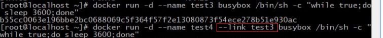
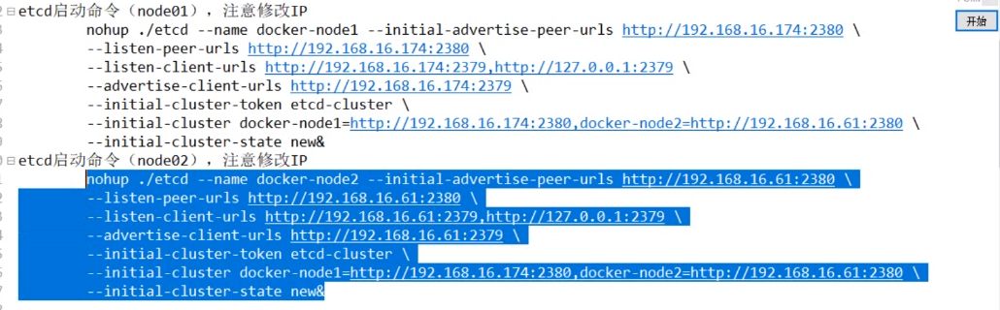
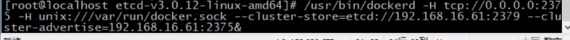

# docker的网络

## 网络分类

- 单机
  - Bridge Network
  - Host Network
  - None Network
- 多机
  - Overlay Network

## Linux 网络命名空间 namespace

命名空间是docker 底层重要的概念

`ip netns list`

`ip netns add test1`

`ip netns delete test1`

查看test1 命名空间内ip情况

`ip netns exec test1 ip a `

启动命名空间内ip 网卡

`ip netns exec test1 ip link set dev lo up`

添加veth对

`ip link add veth-test1 type veth peer veth-test2`

`ip link set veth-test1 netns test1`

### docker  网络

`docker network ls `

## Bridge 详解

默认的网络

`docker network inspect bridge `

查看Linux网卡详细信息 `brctl show `

## 容器通信

不知道容器ip的情况下,--link 下直接使用容器name也是可以的

## 端口映射

实现外界访问

docker run 的时候指定 -p 80:80 

`docker run --name web -d -p 80:80 nginx`

  

## 网络的none 和 host

- none 应用场景: 安全性要求要,存储绝密数据等
- host 网络类似于NAT

创建容器默认的网络类型是  **`bridge`** 类型

创建容器指定网络类型  --network none/host

docker network inspect none

## 多容器部署和应用

## 多机多容器通信

思路: 多机情况下,要保证容器ip不冲突,所以要记录所有ip,使用分布式

node1 16.174

node2  16.61

`./etcdctl cluster-health`  # 查看集群

把docker 停掉 执行 换成node1/node2 的ip

在node1上创建网络,在node2上也能看到

创建container 名字冲突也不行,相当于一个集群

注意: 两个机器的名字要区分

## overlay 网络和etcd通信

docker

