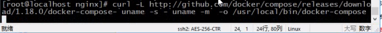
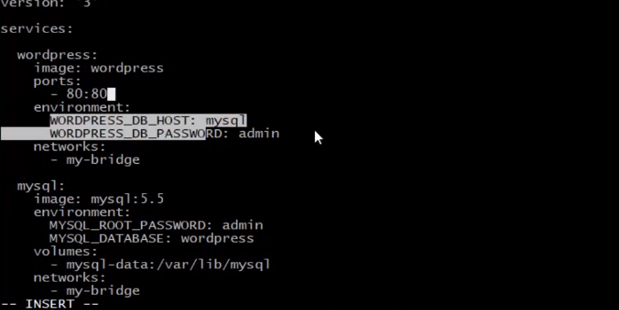
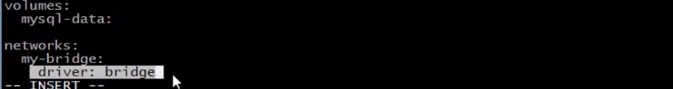
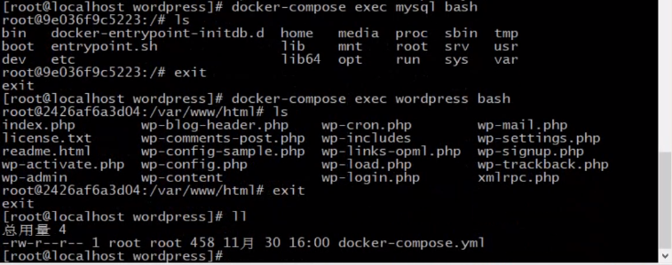
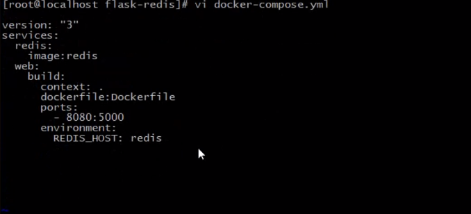
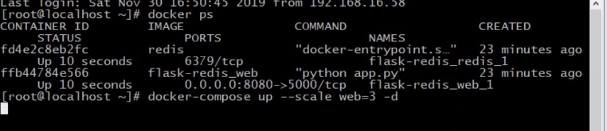
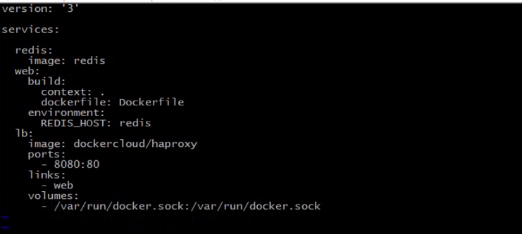

## docker compose 介绍

多容器的app 很那部署和管理, docker compose 就类似批处理


## 安装 和 使用

- 下载   ## <https://get.daocloud.io/#install-compose>

  

```bash
curl -L https://get.daocloud.io/docker/compose/releases/download/1.25.0/docker-compose-`uname -s`-`uname -m` > /usr/local/bin/docker-compose
chmod +x /usr/local/bin/docker-compose
```


### 创建 dockerpose.yml 文件 






``` dock compose
version: "3"
services:

volume:

network:

```


### 使用

在docker-compose.yml 文件所在的位置 

`docker-compose  up  或者 docker-compose -f 指定文件 up`  # 启动  

`docker-compose stop` # 停止

`docker-compose down` # 停止并删除


### 交互




## docker-compose.yml 和 dockfile 同时使用




## 容器扩展和负载均衡

1. 容器动态扩展: scale 
2. 负载均衡器: dockercloud/haproxy


### 容器扩展

在docker-compose 文件夹执行

`docker-compose up --scale web=3 -d` # 把web 扩展成3个,或者指定几个缩减.放在后台运行,

- 把docker-compose.yml 文件内指定web的ports 删除掉,让它自己分配




### 负载均衡器





## 复杂应用部署


