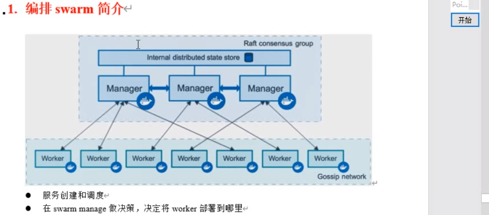
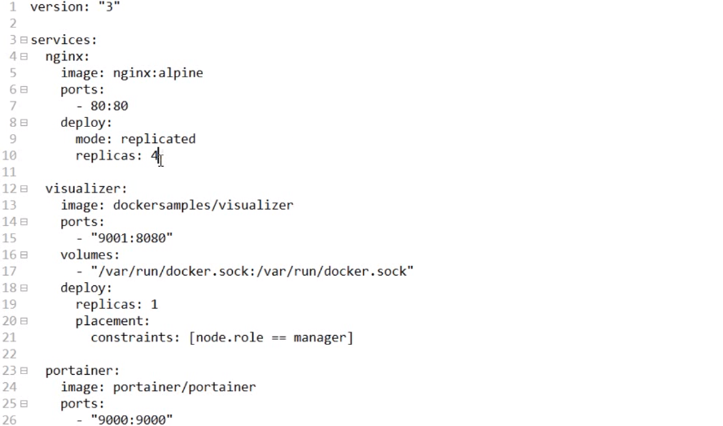
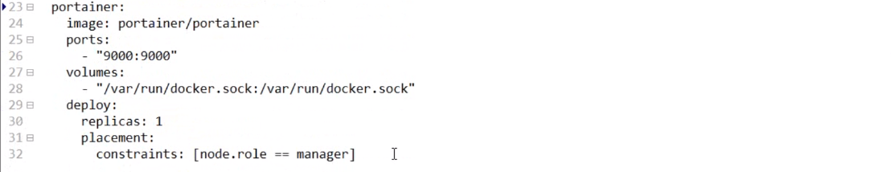
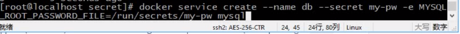
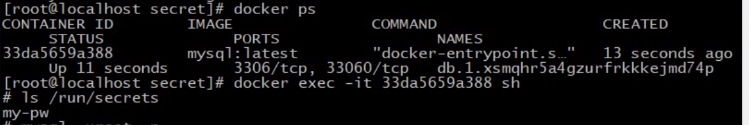
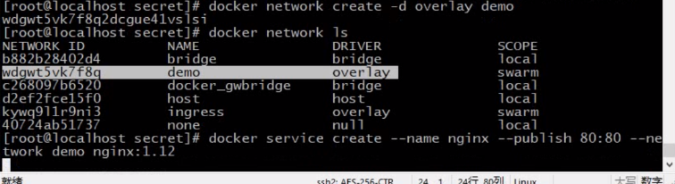
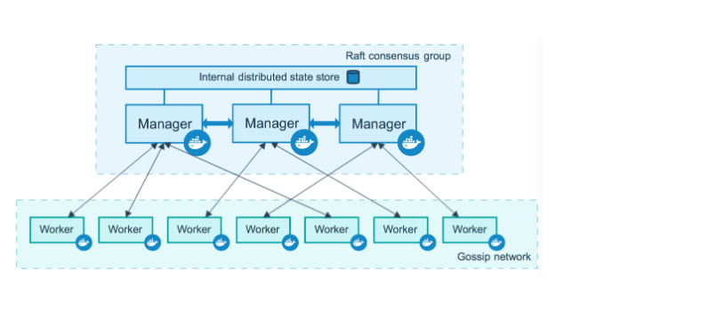

## docker Swarm




### 部署swarm 集群

1. `docker swarm init --advertise-addr=ip` # 设置主的地址
2. 其他机器复制 生成的 token 


### 基础命令

`docker node ls` # 在主swarm 上 查看节点信息

`docker swarm leave -f`  # 退出集群


### 创建维护service并扩展

使用集群命令 `docker service`

创建测试容器,

`docker service create --name demo busybox sh -c "while true;do sleep 3600;done"`

`docker service ls` # 查看集群的容器

`docker service scale demo=5` # 扩容demo 容器的个数变成5个


### dockerStack   

相当于集群的Dockerfile

使用dockerStack 部署可视化应用. 可以指定容器所在的位置(manager / worker)

`docker-compose.yml`






在 swarm manager 节点上运行.

`docker stack deploy -c docker-compose.yml stack-demo`   # 指定文件,并指定名字

`docker stack services stack-demo`  # 查看状态


### stack 扩容

`docker service scale stack-demo_porainer=3` # 扩容到3个


### 删除

` docker stack rm stac-demo`


### docker secret 使用

`docker secret create my-pw password`    # 根据password 这个文件里的内容, 创建密码

`echo "admin" | docker secret my-pw2 -` # 使用echo创建密码

`docker secret ls`          # 查看

`docker secret rm name` # 删除


指定使用刚才生成的密码.




密码放在 容器内部的/run/secrets 下,




### 更新service版本

创建一个service容器, `--publish` 指定端口, `--network` 指定网络


先创建一个叫demo的网络,启动nginx的container, 使用刚才创建的网络, 开放端口




`sh -c "while true; do curl 127.0.0.1&& sleep 1;done"` # 测试不停的访问

第一种 更新版本

`docker service update --image nginx:1.13 nginx`  # 更新nginx的image 版本

第二种 更新端口

`docker service update --publish-rm 80:80 --publish-add 8080:80 nginx`  # 更新端口, 把80映射到8080


----

## 别人博客文档


 



 

------

##  一、简介

**Swarm 是 Docker 官方提供的一款集群管理工具**，其主要作用是把若干台 Docker 主机抽象为一个整体，并且通过一个入口统一管理这些 Docker 主机上的各种 Docker 资源。

Docker Swarm 包含两方面：一个企业级的 Docker 安全集群，以及一个微服务应用编排引擎。

集群方面，Swarm 将一个或多个 Docker 节点组织起来，使得用户能够以集群方式管理它们，**可以自如地添加或删除节点**。

编排方面，Swarm 提供了一套丰富的 API 使得部署和管理复杂的微服务应用变得易如反掌。通过将应用定义在声明式配置文件中，就可以使用原生的 Docker 命令完成部署。

此外，甚至还**可以执行滚动升级、回滚以及扩缩容操作**，同样基于简单的命令即可完成。

以往，Docker Swarm 是一个基于 Docker 引擎之上的独立产品。自 Docker 1.12 版本之后，**它已经完全集成在 Docker 引擎中**，执行一条命令即可启用。

到2018年，除了原生 Swarm 应用，它还可以部署和管理 Kubernetes 应用。Swarm 和 Kubernetes 比较类似，但是更加轻，具有的功能也较 kubernetes 更少一些。

> **集群管理:**  docker swarm 子命令有 init, join, leave, update （docker swarm --help查看帮助）
>
> **节点管理:**  docker node子 命令有 accept, promote, demote, inspect, update, tasks, ls, rm （docker node --help查看帮助）
>
> **配置管理:**  docker config 子命令有 create, inspect, ls, rm （docker config--help查看帮助）
>
> **服务管理:**  docker service 子命令有 create, inspect, update, remove, tasks, ls, rm, ps （docker service--help查看帮助）
>
> **堆栈管理:**  docker stack 子命令有 deploy, services, ps, rm （docker stack--help查看帮助）

 

------

## 二、部署


### 　　前期工作

　　准备几台机器，安装**docker v1.12+**，添加私有镜像仓库源

> /etc/docker/daemon.json
>
> { "insecure-registries":["xxx.xxx.xxx.xxx:5000"] }

 　  集群节点之间保证**TCP 2377、TCP/UDP 7946和UDP 4789**端口通信（或者直接关闭防火墙 systemctl stop firewalld）

> firewall-cmd --zone=public --add-port=2377/tcp --permanent 　　 # 集群管理端口
>
> firewall-cmd --zone=public --add-port=7946/tcp --permanent 　　 # 节点之间通讯端口
> firewall-cmd --zone=public --add-port=7946/udp --permanent
>
> firewall-cmd --zone=public --add-port=4789/tcp --permanent 　　 # overlay网络通讯端口
> firewall-cmd --zone=public --add-port=4789/udp --permanent
>
> firewall-cmd --reload

　　

### 　　初始化swarm

> docker swarm init \　　　　　　　　# 默认初始化节点为manager
>
> --advertise-addr 192.168.89.14 \ 　　# 多网卡的情况下，指定需要使用的ip
>
> --listen-addr 192.168.89.14:2377　　 # 指定监听的 ip 与 port

　　

 

###  　　添加工作节点

　　　　--token 初始化时获取，或者通过命令获取（**docker swarm join-token worker**）

> docker swarm join \
>
> --advertise-addr 192.168.89.15 \
> --listen-addr 192.168.89.15:2377 \　　# 可不加，根据实际需求
>
> --token SWMTKN-1-29ynh5uyfiiospy4fsm4pd4xucyji2rn0oj4b4ak4s7a37syf9-ajkrv2ctjr5cmxzuij75tbrmz \　　# 节点token
>
> 192.168.89.14:2377　　# 管理节点

　　

### 　　管理节点

> docker node ls 　　# 查看节点
>
> docker node rm　　 # 移除节点
>
> docker swarm leave　　 # 退出节点(对应节点上运行)


 　　更详细部署推荐>>> [Docker Swarm集群部署实践](https://www.jianshu.com/p/028b40ca4f2a)

 

------

## 三、Docker config

**17.06引入了群体服务配置**，使您可以在服务映像之外或运行中的容器之外存储非敏感信息，例如配置文件。这使您可以保持映像尽可能通用，而无需将安装文件绑定安装到容器中或使用环境变量。

可以随时在服务中添加或删除配置，并且服务可以共享配置。您甚至可以将配置与环境变量或标签结合使用，以实现最大的灵活性。配置值可以是通用字符串或二进制内容（**最大500 kb**）。

注意：Docker配置**仅适用于群集服务**，不适用于独立容器。

将配置添加到群集时，Docker会通过双向TLS连接将配置发送到群集管理器。该**配置存储在Raft日志中**，该日志已加密。整个Raft日志会在其他管理器之间复制，以确保对配置的高可用性保证与其他集群管理数据一样。

当您授予对配置的新创建或正在运行的服务访问权限时，该配置将作为文件安装在容器中。容器中安装点的位置默认为**/<config-name>**Linux容器中的位置。

>  docker config create jmdiservice-application.properties ~/local/application.properties　　# 为创建服务所引用


 

------

## 四、Docker service


服务是自 Docker 1.12 后新引入的概念，并且仅适用于 Swarm 模式。

**使用服务仍能够配置大多数熟悉的容器属性**，比如容器名、端口映射、接入网络和镜像。

此外还增加了额外的特性，比如可以声明应用服务的期望状态，将其告知 Docker 后，Docker 会负责进行服务的部署和管理。

更多概念推荐>>> [Docker管理工具-Swarm](https://www.cnblogs.com/bigberg/p/8761047.html)

###  

### 服务创建

> ```
> docker service create \
> --with-registry-auth \
> --mode global \
> --name jmdiservice \
> --config source=jmdiservice-application.properties,target=/root/application.properties \
> --mount type=bind,source=/opt/lib,destination=/root/lib \
> --env JAVA_OPTS="-Xms1024m -Xmx1024m" \
> --publish 20036:20036 \
> -td xx.xx.xx.xx:5000/zwx/jmdiservice:1123　　　　
> ```

### 命令详解：

--with-registry-auth：将registry身份验证详细信息发送给集群代理。

--mode global：全局模式，在这种模式下，每个节点上仅运行一个副本。
　　　另一种是复制模式(--replicas 3)，这种模式会部署期望数量的服务副本，并尽可能均匀地将各个副本分布在整个集群中。

--name：服务名称。（避免使用符号，容易解析错误）

--config：指定要向服务公开的配置。（添加配置参考docker config create）

--mount：将文件系统挂载附加到服务。（需要保留/读取的容器外信息）

--env：设置环境变量。

--publish：将端口发布为节点端口。（默认把需要发布的端口映射到本地）

-td：分配伪TTY，并后台运行。

**注意：**镜像地址、名称、标签一定填写正确

 

### 　　服务更新：

> docker service update --args "ping www.baidu.com" redis  　　# 添加参数
> docker service scale redis=4　　　　# 为服务扩(缩)容scale
> docker service update --image redis:3.0.7 redis　　# 更新服务的镜像版本
> docker service update --rollback redis　　# 回滚服务

 

------

## 五、Docker stack

大规模场景下的多服务部署和管理是一件很难的事情，Docker Stack由此而生。

**Stack 通过提供期望状态、滚动升级、简单易用、扩缩容、健康检查等特性简化了应用的管理**，这些功能都封装在一个完美的声明式模型当中。

Stack 能够在单个声明文件中定义复杂的多服务应用，还提供了简单的方式来部署应用并管理其完整的生命周期：**初始化部署 -> 健康检查 -> 扩容 -> 更新 -> 回滚**。

 

步骤很简单，在 Compose 文件中定义应用，然后通过 docker stack deploy 命令完成部署和管理。

> export logpath=/home/jhmyPro/logs　　　　　　
> export tag=latest　　　　　　　　　　　　　　# 使用环境变量，增强可用性
> **docker stack deploy --with-registry-auth -c docker-compose.yml QS**　　　　

****

 

[](javascript:void(0);)

```dockerfile
# file: docker-compose.yml

version: "3.7"
services:
  JmDiService:  # 服务名
    image: xx.xx.xx.xx:5000/zwx/jmdiservice:${tag}
    
    environment:    # 环境变量
      LOG_PATH: ${logpath}　　　　
      PKG_NAME: "JmDiService"
      JAVA_OPTS: "-Xms512m -Xmx1024m"
    
    networks:    # 网络设置
      overlay:
    
    ports:  # 端口映射 [宿主机:容器]
      - 20036:20036
    
    configs:    # 读取配置 [配置名:容器]
      - source: JmDiService-application.properties
        target: /root/application.properties
    
    volumes:    # 挂载数据卷 [宿主机:容器]
      - ${logpath}:${logpath}
      - /opt/lib:/root/lib
      - /usr/local/nginx/html/clientexe:/usr/local/nginx/html/clientexe
      
    deploy:     # 部署设置
      mode: replicated
      replicas: 3
      
      restart_policy:   # 重启策略 [条件,延时,最大次数,检测时间]
        condition: on-failure
        delay: 5s
        max_attempts: 3
        window: 30s
      
      update_config:    # 升级配置 [并发数,延时,失败处理,监听时间,更新规则]
        parallelism: 1
        delay: 5s
        failure_action: rollback
        monitor: 5s
        order: start-first
        
      resources:    # 资源控制 [cpu,mem]
        limits:
          #cpus: '0.2'
          memory: 1024M

configs:　　　　　　# 定义配置
  JmDiService-application.properties:
    external: true
    
networks:　　　　　# 定义网络
  overlay:
```


