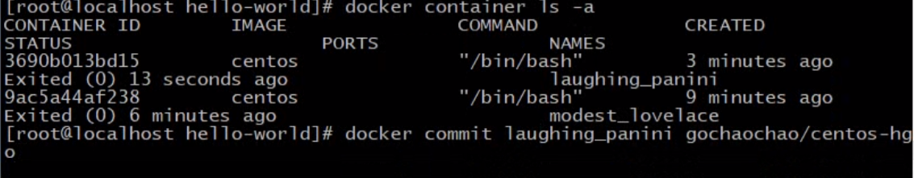
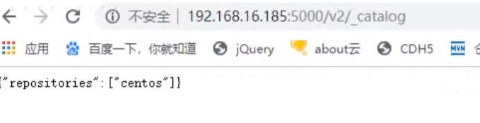

## docker 

## 创建docker image的两种方式

1. 基于image 创建container,修改container,并commit 成新的image

   `docker commit`

   在container内部操作一些东西

   


   `docker history imageID` 查看操作的记录

2. Dockerfile 创建

   `docker build -t 指定ImageName ./Dockerfile`


   ``` dockerfile
   - FROM # 开头
   	FROM scratch #从头开始至于一个最简的
   	FROM centos # 使用centos 系统,若没有则拉取
   	FROM centos:7.0 # 指定系统+版本号
   	
   - LABEL # 注释 说明信息
       LABEL version="1.0"
       LABEL description=""
       LABEL author="sss"
   
   - RUN # 执行命令, 每执行一条RUN,就会多一层
       RUN yum -y update && yum -y install lrzsz \
       	httpd # 指定多个命令,并在一行
       	
   - WORKDIR # 进入或创建目录 (有则进入,无则创建)
   	WORKDIR /root # 进入/root目录
   	WORKDIR /test # 自动创建目录
   	WORKDIR demo
   	RUN pwd	      # /test/demo
   	
   - ADD 
   - COPY # 将本地文件添加到镜像里.
   	# 区别: ADD 可以解压缩文件.  COPY 只是COPY文件
   	ADD hello /
   	ADD xx.tar.gz / # 添加并解压到根目录
   	
   	WORKDIR /root/test 
   	COPY hello . # /root/test/hello
   	
   - ENV # 设置常量
   	ENV MYSQL_VERSION 5.6
   	RUNapt-get -y install mysql-server="${MYSQL_VERSION}"
   	
   
   - CMD  # 执行命令
   - ENTRYPOINT # 执行命令
   
	Shell 和 Exec 两种编写格式
	# Shell 格式写法
	RUN yum -y install lrzsz
	CMD echo "echo docker" 
	ENTRYPOINT echo "echo docker" 
	
	# Exec 格式写法 参数都放在 [] 内.
	RUN ["yum","-y","install","lrzsz"]
	---
	ENV name Docker
	ENTRYPOINT ["/bin/bash/","-c","echo hello $name"] # 指定解释器
	
	
	# ENTRYPOINT 和 CMD 区别
	- 若docker 指定里其他命令, CMD可能会被忽略.
		ENTRYPOINT echo "hello"
		CMD echo "hello"
		CMD命令可能会被忽略
		
	- 若定义多个CMD , 只会执行最后一个CMD.
	
	# ENTRYPOINT ["/usr/bin/stress"]
	# CMD []  # 意思是等待接收参数
- EXPOSE # 暴露的端口
	EXPOSE 5000
   
   ```


### image基本命令

`docker image ls`

`docker  rmi imageID`


### 分享docker image . # hub.docker.com 

`命名规则  docker hub用户名/imageName:版本`

1. `docker login`  # docker 官网注册账户
2. `docker image push 账号名/imageName`  # 前缀必须是账号名
3. `docker pull 账号名/imageName`  # 从docker hub 拉取镜像到本地

### 分享 Dockerfile

分享 docker image 不如直接分享Dockerfile,更加安全.


## container 概念和使用

container 可以理解为运行时的实例

`docker container ls`

`docker ps`

`docker ps -aq`  只显示container id  -q

`docker ps -f  "status=exited"`

`docker rm containerID`

`docker rm $(docker ps -f status=exited -q)`


## 搭建私有的docker registry

官方链接:https://hub.docker.com/_/registry

1. 创建镜像仓库

   `$ docker run -d -p 5000:5000 --restart always --name registry registry:2`

2. 编译镜像

   `docker tag ubuntu localhost:5000/ubuntu` | `docker build -t 镜像名字就是registry的ip加端口/镜像名`

3. ` docker push localhost:5000/ubuntu` #  push 指定镜像仓库的名字

4. `docker pull  localhost:5000/ubuntu` # pull 指定镜像仓库的名字/镜像


在自己的机器修改 /etc/docker/deamon.json


查看




## 对容器资源限制

- mem 限制

  `docker run --memory=200M  imageName --verbose`

- 对CPU的限制

  `docker run --cpu-shares=4 --name=test1 imageName`
