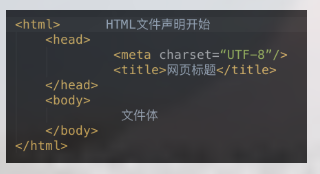
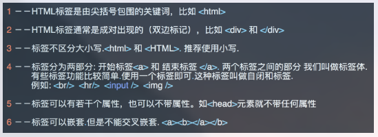

# html基础

## html是什么
- 超文本标记语言(Hypertext Markup Language，HTML),通过标签语言来标记要显示的网页中的各个部分
- 浏览器按顺序渲染网页文件,然后根据标记符解释和显示内容.但需要注意的是,对于不同的浏览器,对同一标签可能会有不完全相同的解释(兼容性)
- 静态网页文件扩展名 `.html` 或者 `.htm`

## 结构



- <!DOCTYPE html> 告诉浏览器使用什么样的html或者xhtml来解析html文档
- <html></html>是文档的开始标记和结束标记。此元素告诉浏览器其自身是一个 HTML 文档，在它们之间是文档的头部<head>和主体<body>。 
-  <head></head>元素出现在文档的开头部分。<head>与</head>之间的内容不会在浏览器的文档窗口显示，但是其间的元素有特殊重要的意义。
- <title></title>定义网页标题，在浏览器标题栏显示。
- <body></body>之间的文本是可见的网页主体内容

## 标签格式介绍



标签的语法：

<标签名 属性1=“属性值1” 属性2=“属性值2”……>内容部分</标签名>
<标签名 属性1=“属性值1” 属性2=“属性值2”…… />


## 常用的标签
###  `<!DOCTYPE>`标签
	<!DOCTYPE> 声明位于文档中的最前面的位置，处于 <html> 标签之前。此标签可告知浏览器文档使用哪种 HTML 或 XHTML 规范。


作用：声明文档的解析类型(document.compatMode)，避免浏览器的怪异模式。

document.compatMode：

1. BackCompat：怪异模式，浏览器使用自己的怪异模式解析渲染页面。
2. CSS1Compat：标准模式，浏览器使用W3C的标准解析渲染页面。
这个属性会被浏览器识别并使用，但是如果你的页面没有DOCTYPE的声明，那么compatMode默认就是BackCompat

### `<head>`内常用标签
#### `<meta>`标签
meta介绍
​	<meta>元素可提供有关页面的元信息（meta-information），针对搜索引擎和更新频度的描述和关键词。
​	<meta>标签位于文档的头部，不包含任何内容。
​	<meta>提供的信息是用户不可见的
meta 标签的组成: meta 标签共有两个属性,它们分别是
​	1. name属性:主要用于描述网页,与之对应的属性值为content, content中的内容主要是便于搜索引擎机器人查找信息和分类信息用的
``` html
<meta name="keywords" content="meta总结,html meta,meta属性,meta跳转">
 
<meta name="description" content="老男孩培训机构是由一个很老的男孩创建的">
```
	2. http-equiv属性: 相当于http的文件头作用,它可以向浏览器传回一些有用的信息,以帮助正确的显示网页内容,与之对应的属性值为content, content 中的内容其实就是各个参数的变量值
``` html
<meta http-equiv="Refresh" content="2;URL=https://www.oldboy.com"> //(注意后面的引号，分别在秒数的前面和网址的后面)
 
<meta http-equiv="content-Type" charset=UTF8">
 
<meta http-equiv = "X-UA-Compatible" content = "IE=EmulateIE7" /> 
```
#### 非`<meta>`标签
``` html
    <title>oldboy</title>
    <link rel="icon" href="http://www.jd.com/favicon.ico">
    <link rel="stylesheet" href="css.css">
    <script src="hello.js"></script>
```

### <body>内常用标签
1. 基本标签(块级标签和内联标签)

``` html
<hn>: n的取值范围是1~6; 从大到小. 用来表示标题.

<p>: 段落标签. 包裹的内容被换行.并且也上下内容之间有一行空白.

<b> <strong>: 加粗标签.

<strike>: 为文字加上一条中线.

<em>: 文字变成斜体.

<sup>和<sub>: 上角标 和 下角表.

<br>:换行.

<hr>:水平线
```

2. `<div>和<span>`


``` html
<div></div> ： 
	<div>只是一个块级元素，并无实际的意义。主要通过CSS样式为其赋予不同的表现. 
<span></span>： 
    <span>表示了内联行(行内元素),并无实际的意义,主要通过CSS样式为其赋予不同的表现.

块级元素与行内元素的区别
	所谓块元素，是以另起一行开始渲染的元素，行内元素则不需另起一行。如果单独在网页中插入这两个元素，不会对页面产生任何的影响。
        
这两个元素是专门为定义CSS样式而生的。
```


3. 图形标签:``

``` html
src : 要显示图片的路径
alt : 图片没有加载成功时的提示
title: 鼠标悬浮时的提示信息
width: 图片的宽度
height: 图片的高 (宽高两个属性只用一个会自动等比缩放)
```

4. 超链接标签 (锚标签): <a></a>
``` html
<a href="" target="_blank" >click</a>
href 属性指定目标网页地址.该地址可以有几种类型:
	绝对url - 指向另一个站点 (比如 href="http://www.jd.com")
	相对url - 指向当前站点中确切的路径(href="index.htm"）
	锚         - 指向页面中的锚 (href="#top")   其实就是指向对应标签的 id 值
```

5. 列表标签 
``` html
<ul></ul>: 无序列表 [type属性：disc(实心圆点)(默认)、circle(空心圆圈)、square(实心方块)]
<ul type="circle">
    <li>1</li>
    <li>2</li>
</ul>

<ol></ol>: 有序列表
<ol>
    <li>1</li>
    <li>2</li>
</ol>

<dl>  定义列表
         <dt> 列表标题
         <dd> 列表项
<dl>
    <dt>Title</dt>      
    <dd>item</dd>   
    <dd>item</dd>
    <dd>item</dd>
</dl>

```

6. 表格table
更多http://www.w3school.com.cn/html/html_tables.asp
``` html
	表格由<table></table> 标签来定义
<tr>: table row
 
<th>: table head cell   表格的表头使用 <th> 标签进行定义
 
<td>: table data cell

属性:
 
    border: 表格边框.
 
    cellpadding: 内边距
 
    cellspacing: 外边距.
 
    width: 像素 百分比.（最好通过css来设置长宽）
 
    rowspan:  单元格竖跨多少行
 
    colspan:  单元格横跨多少列（即合并单元格）
```

7. 表单标签 <form></form>
``` html
功能: 
	表单用于向服务器传输数据,从而实现用户与web服务器的交互
表单能够包含input 系列的标签,比如文本字段,复选框,单选框,提交按钮等等...
表单还可以包含 textarea , select, fieldset 和 label标签

表单常用属性
	action: 表单提交到哪. 一般指向服务器端一个程序,程序接收到表单提交过来的数据(即表单元素值)做相应的处理
	method: 表单的提交方式 POST/GET等等  默认是GET
	
何时用get?地址栏可见
	?name="xxx" 传值
何时用post? 地址栏不可见
	包含敏感信息或者数据量比较大的时候
```

#### 表单元素
	用来收集用户的输入信息
1. `<input>` 系列的标签
```


