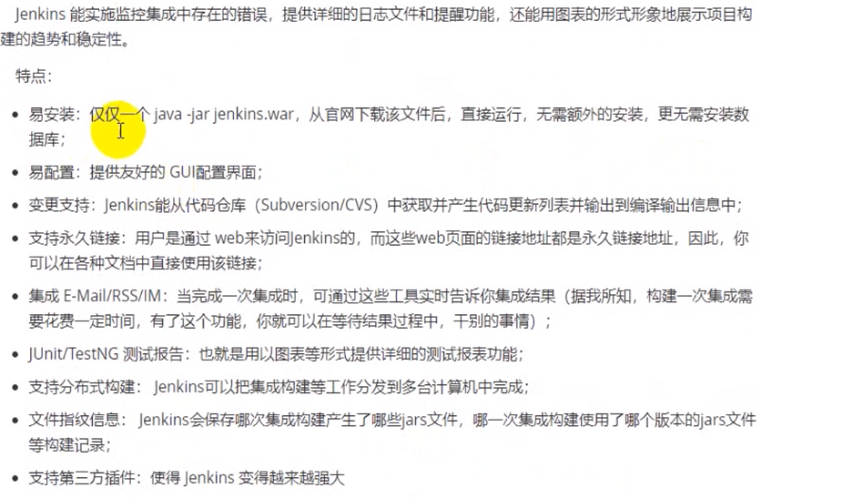

## docker 安装

下载镜像

`docker pull jenkins/jenkins:lts`

目录准备

`mkdir -p /mydata/jenkins_home`

启动docker

`docker run -di --name=jenkins -p 8080:8080 -v /mydata/jenkins_home:/var/jenkins_home jenkins/jenkins:lts`


2696671285@qq.com

Oracle123


## admin密码错误解决办法

Jenkins 的所有信息都是存储在 xml 文件中，目录为：，其中配置文件信息保存在：HOME/.jenkins/config.xml，用户信息保存在：$HOME/.jenkins/users/admin_1669049878327248561/config.xml。

### 去掉安全认证（推荐）

```c
# 终极方案，直接去掉安全认证
# 编辑 $HOME/.jenkins/config.xml，将 useSecurity 选项内容 true 改为 false
$ cat $HOME/.jenkins/config2.xml | grep -n useSecurity
12:<useSecurity>true</useSecurity>
$ sed -i "s/.*useSecurity.*/\<useSecurity\>false\<\/useSecurity\>/g" $HOME/.jenkins/config.xml

# 重启 jenkins，重新设置安全认证或者修改用户密码即可
1234567
```

### 重置 admin 用户密码

```shell
# 编辑 admin 用户的 config.xml 文件，替换 passwordHash 行为如下，密码为：123456
$ vi $HOME/.jenkins/users/admin_1669049878327248561/config.xml
<passwordHash>#jbcrypt:$2a$10$MiIVR0rr/UhQBqT.bBq0QehTiQVqgNpUGyWW2nJObaVAM/2xSQdSq</passwordHash>

# 重启 jenkins，重新设置安全认证或者修改用户密码即可
```

