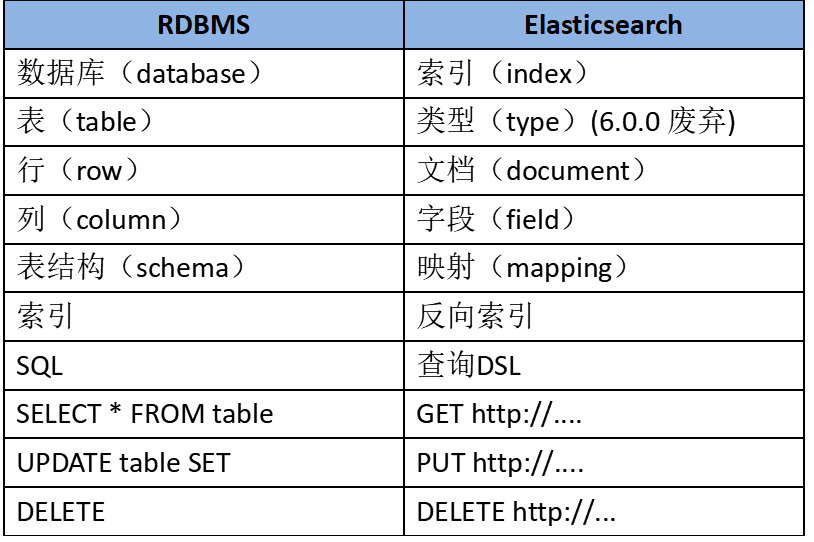
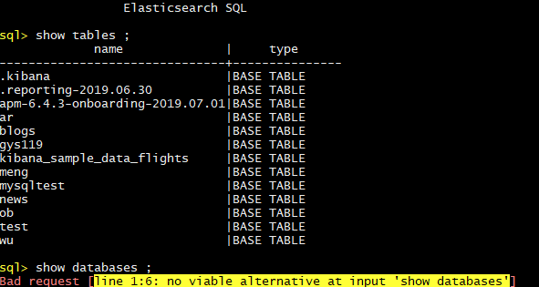

## Elasticsearch 

## **1.  Elasticsearch 简介**

  Elasticsearch 是一个基于Lucene实现索引的查询功能的分布式搜索和分析引擎.

  Lucene 可以说是当下最先进、高性能、全功能的搜索引擎库—无论是开源还是私有。
  但是 Lucene 仅仅只是一个库。为了充分发挥其功能，你需要使用 Java 并将 Lucene 直接集成到应用程序中。 更糟糕的是，您可能需要获得信息检索学位才能了解其工作原理。Lucene 非常 复杂。
​	
  Elasticsearch 也是使用 Java 编写的，它的内部使用 Lucene 做索引与搜索，但是它的目的是使全文检索变得简单， 通过隐藏 Lucene 的复杂性，取而代之的提供一套简单一致的 RESTful API。
​	


#### 特点
	速度快、易扩展、弹性、灵活、操作简单、多语言客户端、X-Pack、hadoop/spark强强联手、开箱即用。
	
	分布式：横向扩展非常灵活
	全文检索：基于lucene的强大的全文检索能力；
	近实时搜索和分析：数据进入ES，可达到近实时搜索，还可进行聚合分析
	高可用：容错机制，自动发现新的或失败的节点，重组和重新平衡数据
	模式自由：ES的动态mapping机制可以自动检测数据的结构和类型，创建索引并使数据可搜索。
	RESTful API：JSON + HTTP


#### ES的应用场景
	站内搜索
	NoSQL 数据库
	日志分析
	数据分析


#### 版本
	0.4 2010年2月第一次发布
	1.0 2014年1月
	2.0 2015年10月
	5.0 2016年10月
	6.0 2017年10月
	7.0 2019年4月


## **2. Elasticsearch安装**
elastic 的官网 elastic.co/downloads/elasticsearch


部署:

- 单节点 
  node
- 高可用 & 水平扩展 
  Master Nodes 
  Coordinate Nodes
  Data Nodes
- 支持不同节点的类型
  Master Nodes
  Coordinate Nodes
  Hot Nodes
  Warm Nodes
  Ml Nodes


## **3. Elasticsearch 相关概念**

> 在Elasticsearch中有几个基本的概念,如节点.索引.文档等等


### **Node 和 Cluster**

> 本质上是一个分布式数据库,允许多台服务器协同工作,没台服务器可以运行多个Elasticsearch实例
>单个 Elasticsearch 实例被成为一个节点(node),一组节点构成一个集群(cluster)


### **Index **

>Elasticsearch 会索引所有字段,经过处理会写入一个反向索引 (inverted index).查找数据的时候,直接查找该索引
>所以,Elasticsearch 数据管理的顶层单位就叫做 Index（索引），其实就相当于 MySQL、MongoDB 等里面的数据库的概念。另外值得注意的是，每个 Index （即数据库）的名字必须是小写。


### **Document**
> index里面单挑的记录成为Document(文档),许多条Document构成了一个index.
> Document 使用 JSON 格式表示，下面是一个例子。
> 同一个 Index 里面的 Document，不要求有相同的结构（scheme），但是最好保持相同，这样有利于提高搜索效率
>

### **Type**

>Document 可以分组，比如 weather 这个 Index 里面，可以按城市分组（北京和上海），也可以按气候分组（晴天和雨天）。这种分组就叫做 Type，它是虚拟的逻辑分组，用来过滤 Document，类似 MySQL 中的数据表，MongoDB 中的 Collection。
​	
>不同的 Type 应该有相似的结构（Schema），举例来说，id 字段不能在这个组是字符串，在另一个组是数值。这是与关系型数据库的表的一个区别。性质完全不同的数据（比如 products 和 logs）应该存成两个 Index，而不是一个 Index 里面的两个 Type（虽然可以做到）
>
>根据规划，Elastic 6.x 版只允许每个 Index 包含一个 Type，7.x 版将会彻底移除 Type


### **Fields**

>即字段，每个 Document 都类似一个 JSON 结构，它包含了许多字段，每个字段都有其对应的值，多个字段组成了一个 Document，其实就可以类比 MySQL 数据表中的字段。


### **Shard 分片**
> 在创建一个索引时可以指定分成多少个分片来存储。每个分片本身也是一个功能完善且独立的“索引”，可以被放置在集群的任意节点上。分片的好处： 允许我们水平切分/扩展容量 可在多个分片上进行分布式的、并行的操作，提高系统的性能和吞吐量。

**注意：分片数创建索引时指定，创建后不可改了。备份数可以随时改。** **Replication 备份:** 一个分片可以有多个备份（副本）。备份的好处： 高可用。**一个主分片挂了，副本分片就顶上去** 扩展搜索的并发能力、吞吐量。搜索可以在所有的副本上并行运行。-**高并发下副本也可搜索**


### 对比图
在 Elasticsearch 中，文档归属于一种类型（Type），而这些类型存在于索引（Index）中.

```python
Relational DB -> Databases -> Tables -> Rows -> Columns
Elasticsearch -> Indices   -> Types  -> Documents -> Fields
```




## **4. 交互**
    所有其他语言可以使用 RESTful API 通过端口 9200 和 Elasticsearch 进行通信，


### 使用 curl 命令

`curl -X<VERB> '<PROTOCOL>://<HOST>:<PORT>/<PATH>?<QUERY_STRING>' -d '<BODY>'`

<table>
	<tr>
		<td>VERB</td>
		<td>适当的 HTTP 方法 或 谓词 : GET、 POST、 PUT、 HEAD 或者 DELETE。</td>
	</tr>
    <tr>
		<td>PROTOCOL</td>
		<td>http 或者 https（如果你在 Elasticsearch 前面有一个 https 代理）。</td>
	</tr>
	<tr>
		<td>HOST</td>
		<td> Elasticsearch 集群中任意节点的主机名，或者用 localhost 代表本地机器上的节点。</td>
	</tr>
	<tr>
		<td>PORT</td>
		<td>运行 Elasticsearch HTTP 服务的端口号，默认是 9200 。</td>
	</tr>
	<tr>
		<td>PATH</td>
		<td> API 的终端路径（例如 _count 将返回集群中文档数量）。</td>
	</tr>
	<tr>
		<td>QUERY_STRING</td>
		<td>任意可选的查询字符串参数 (例如 ?pretty 将格式化地输出 JSON 返回值，使其更容易阅读)。</td>
	</tr>
	<tr>
		<td>BODY</td>
		<td>  一个 JSON 格式的请求体 (如果请求需要的话。</td>
	</tr>
</table>


分页
和 SQL 使用 LIMIT 关键字返回单个 page 结果的方法相同，Elasticsearch 接受 from 和 size 参数：
​    size 显示应该返回的结果数量，默认是 10
​    from 显示应该跳过的初始结果数量，默认是 0

GET /_search?size=5
GET /_search?size=5&from=5
GET /_search?size=5&from=10

/_search
在所有的索引中搜索所有的类型

/gb/_search
在 gb 索引中搜索所有的类型

/gb,us/_search
在 gb 和 us 索引中搜索所有的文档

/g*,u*/_search
在任何以 g 或者 u 开头的索引中搜索所有的类型

/gb/user/_search
在 gb 索引中搜索 user 类型

/gb,us/user,tweet/_search
在 gb 和 us 索引中搜索 user 和 tweet 类型

/_all/user,tweet/_search
在所有的索引中搜索 user 和 tweet 类型


cat命令
通过使用_cat可以查看支持的命令：

``` shell

$ curl localhost:9200/_cat

/_cat/allocation
/_cat/shards
/_cat/shards/{index}
/_cat/master
/_cat/nodes
/_cat/indices
/_cat/indices/{index}
/_cat/segments
/_cat/segments/{index}
/_cat/count
/_cat/count/{index}
/_cat/recovery
/_cat/recovery/{index}
/_cat/health
/_cat/pending_tasks
/_cat/aliases
/_cat/aliases/{alias}
/_cat/thread_pool
/_cat/plugins
/_cat/fielddata
/_cat/fielddata/{fields}
/_cat/nodeattrs
/_cat/repositories
/_cat/snapshots/{repository}
```


```shell
$ curl -XGET 'http://localhost:9200/twitter/_search?q=user:kimchy'
```


请求体搜索

``` shell
$ curl -XGET 'http://localhost:9200/twitter/tweet/_search' -d '{
    "query" : {
        "term" : { "user" : "kimchy" }
    }
}'
```


### 使用查询表达式(Query DSL)      
(Domain Specific Language)

**匹配所有文档**

```
GET /_search
{
    "query": {
        "match_all": {}
    }
}
```

**查询语句的结构**

``` shell
{
    QUERY_NAME: {
        ARGUMENT: VALUE,
        ARGUMENT: VALUE,...
    }
}
```

**如果是针对某个字段**

``` shell
{
    QUERY_NAME: {
        FIELD_NAME: {
            ARGUMENT: VALUE,
            ARGUMENT: VALUE,...
        }
    }
}
```


分页

```shell
GET /_search
{
  "from": 30,
  "size": 10
}
```


查询所有名为 Smith 的搜索
```shell
GET /megacorp/employee/_search
{
    "query" : {
        "match" : {
            "last_name" : "Smith"
        }
    }
}
```


**更复杂的搜索**

同样搜索姓氏为 Smith 的员工，但这次我们只需要年龄大于 30 的
```shell
GET /megacorp/employee/_search
{
    "query" : {
        "bool": {
            "must": {
                "match" : {
                    "last_name" : "smith" (1)
                }
            },
            "filter": {
                "range" : {
                    "age" : { "gt" : 30 } (2)
                }
            }
        }
    }
}
```


**全文搜索**

搜索下所有喜欢攀岩（rock climbing）的员工
```shell
GET /megacorp/employee/_search
{
    "query" : {
        "match" : {
            "about" : "rock climbing"
        }
    }
}
```


**短语搜索**
我们想执行这样一个查询，仅匹配同时包含 rock'' 和 climbing'' ，并且 二者以短语 ``rock climbing'' 的形式紧挨着的雇员记录。
为此对 match 查询稍作调整，使用一个叫做 match_phrase 的查询：

```shell
GET /megacorp/employee/_search
{
    "query" : {
        "match_phrase" : {
            "about" : "rock climbing"
        }
    }
}
```


**高亮搜索**

```shell
GET /megacorp/employee/_search
{
    "query" : {
        "match_phrase" : {
            "about" : "rock climbing"
        }
    },
    "highlight": {
        "fields" : {
            "about" : {}
        }
    }
}
```

等等....


### 使用ES SQL

Elasticsearch SQL支持三种client： REST Interface， command-line，JDBC

**REST Interface**

``` shell
GET /_xpack/sql
{
  "query":"select name from ob limit 20"
}

GET /_xpack/sql?format=txt
{
  "query":"select name from ob limit 20"
}
```
可以用translate api把SQL语句翻译成ES DSL语句
``` shell
GET /_xpack/sql/translate
{
  "query":"select name from ob limit 20"
}
```

**command-line**

`./bin/elasticsearch-sql-cli host:port`



``` sql
*查看当前用户所有的索引：“SHOW TABLES;”
*查看某个索引结构：“DESCRIBE table;” 或者 “DESC table;”
*查看所有函数：show functions
*常用的聚合函数
SELECT MIN(value_1) min, MAX(value_1) max, AVG(value_1) avg,SUM(value_1) sum,COUNT(*) count,COUNT(DISTINCT value_1) dictinct_count FROM "xxx";

*SELECT语句的语法排序如下：
    SELECT select_expr [, ...]
    [ FROM table_name ]  
    [ WHERE condition ] 
    [ GROUP BY grouping_element [, ...] ]
    [ HAVING condition]
    [ ORDER BY expression [ ASC | DESC ] [, ...] ]
    [ LIMIT [ count ] ]

*比较操作
	Equality (=) 
	Inequality (<> or != or <=>) 
	Comparison (<, <=, >, >=) 
	BETWEEN
	IS NULL/IS NOT NULL
*逻辑操作
	AND
	OR
	NOT
等等...

参考文档:
6.4.0 Elasticsearch SQL使用文档：
https://www.elastic.co/guide/en/elasticsearch/reference/current/xpack-sql.html
```


**JDBC**

>该组件为X-Pack中的收费组件，感兴趣的同学可以参考官方文档：https://www.elastic.co/guide/en/elasticsearch/reference/current/sql-jdbc.html


相关性得分
Elasticsearch 默认按照相关性得分排序，即每个文档跟查询的匹配程度。


## Python对接 Elasticsearch


### **1. 安装**

Python 中对接 Elasticsearch 使用的就是一个同名的库 
​	`pip3 install elasticsearch`

### **2. 使用**

``` python
from elasticsearch import Elasticsearch

es = Elasticsearch(['localhost:9200'])


In [38]: es.ping()
Out[38]: True
    
- 获取集群是否启动
In [40]: es.info()
Out[40]: 
{'name': 'nUYIDP-',
 'cluster_name': 'elasticsearch',
 'cluster_uuid': 'ywU132BdQgK8MN562Mvg8A',
 'version': {'number': '6.4.3',
  'build_flavor': 'default',
  'build_type': 'tar',
  'build_hash': 'fe40335',
  'build_date': '2018-10-30T23:17:19.084789Z',
  'build_snapshot': False,
  'lucene_version': '7.4.0',
  'minimum_wire_compatibility_version': '5.6.0',
  'minimum_index_compatibility_version': '5.0.0'},
 'tagline': 'You Know, for Search'}


- 获取集群的健康状态信息
es.cluster.health()

- 获取集群的健康状态信息
es.cluster.health()

- 获取当前连接的集群节点信息
es.cluster.client.info()

- 获取集群目前所有的索引
es.cat.indices()

- 获取集群的更多信息
es.cluster.stats()
```


#### **----单一操作**

``` python

# 创建index
es.indices.create(index="news")

# 插入
1. create 必须指定idnex、type、id和查询体body；缺一不可，否则报错
2. index：相比于create，index的用法就相对灵活很多；id并非是一个必选项，如果指定，则该文档的id就是指定值，若不指定，则系统会自动生成一个全局唯一的id赋给该文档

body = {"name": 'xxx', 'age': 23}
es.index(index='user', doc_type='user', body, id=None)

# 删除 
#delete：删除指定index、type、id的文档
es.delete(index='windex', doc_type='wtype',id='wid')

# 查找 
#get：获取指定index、type、id所对应的文档
es.get(index='windex', doc_type='wtype', id=wid)

#更新
#update：跟新指定index、type、id所对应的文档 
es.update(index='windex', doc_type='wtype', id=wid, body={待更新字段})

#也可以使用也可以把update换成index
```


#### **----批量操作**

``` python

# 条件查询
search：查询满足条件的所有文档，没有id属性，且index，type和body均可为None。 
　　body的语法格式必须符合DSL（Domain Specific Language ）格式

    
# 所有数据
es.search(index="my_index",doc_type="test_type")
# 或者
body = {
    "query":{
        "match_all":{}
    }
}
es.search(index="my_index",doc_type="test_type",body=body)


# term
body = {
    "query":{
        "term":{
            "name":"python"
        }
    }
}
# 查询name="python"的所有数据
es.search(index="my_index",doc_type="test_type",body=body)


#terms
body = {
    "query":{
        "terms":{
            "name":[
                "python","android"
            ]
        }
    }
}
# 搜索出name="python"或name="android"的所有数据
es.search(index="my_index",doc_type="test_type",body=body)


# match与multi_match

# match:匹配name包含python关键字的数据
body = {
    "query":{
        "match":{
            "name":"python"
        }
    }
}
# 查询name包含python关键字的数据
es.search(index="my_index",doc_type="test_type",body=body)


# multi_match:在name和addr里匹配包含深圳关键字的数据
body = {
    "query":{
        "multi_match":{
            "query":"深圳",
            "fields":["name","addr"]
        }
    }
}
# 查询name和addr包含"深圳"关键字的数据
es.search(index="my_index",doc_type="test_type",body=body)

 
    
#ids
body = {
    "query":{
        "ids":{
            "type":"test_type",
            "values":[
                "1","2"
            ]
        }
    }
}
# 搜索出id为1或2的所有数据
es.search(index="my_index",doc_type="test_type",body=body)


#复合查询bool
bool有3类查询关系，must(都满足),should(其中一个满足),must_not(都不满足)
body = {
    "query":{
        "bool":{
            "must":[
                {
                    "term":{
                        "name":"python"
                    }
                },
                {
                    "term":{
                        "age":18
                    }
                }
            ]
        }
    }
}
# 获取name="python"并且age=18的所有数据
es.search(index="my_index",doc_type="test_type",body=body)


# 切片式查询
body = {
    "query":{
        "match_all":{}
    },
    "from":2,   # 从第二条数据开始
    "size":4    # 获取4条数据
}
# 从第2条数据开始，获取4条数据
es.search(index="my_index",doc_type="test_type",body=body)


# 范围查询
body = {
    "query":{
        "range":{
            "age":{
                "gte":18,       # >=18
                "lte":30        # <=30
            }
        }
    }
}
# 查询18<=age<=30的所有数据
es.search(index="my_index",doc_type="test_type",body=body)


# 前缀查询
body = {
    "query":{
        "prefix":{
            "name":"p"
        }
    }
}
# 查询前缀为"p"的所有数据
es.search(index="my_index",doc_type="test_type",body=body)


# 通配符查询
body = {
    "query":{
        "wildcard":{
            "name":"*id"
        }
    }
}
# 查询name以id为后缀的所有数据
es.search(index="my_index",doc_type="test_type",body=body)


# 排序
body = {
    "query":{
        "match_all":{}
    }
    "sort":{
        "age":{                 # 根据age字段升序排序
            "order":"asc"       # asc升序，desc降序
        }
    }
}


# filter_path
响应过滤

# 只需要获取_id数据,多个条件用逗号隔开
es.search(index="my_index",doc_type="test_type",filter_path=["hits.hits._id"])

# 获取所有数据
es.search(index="my_index",doc_type="test_type",filter_path=["hits.hits._*"])


# count
执行查询并获取该查询的匹配数
# 获取数据量
es.count(index="my_index",doc_type="test_type")


# 度量类聚合
获取最小值
body = {
    "query":{
        "match_all":{}
    },
    "aggs":{                        # 聚合查询
        "min_age":{                 # 最小值的key
            "min":{                 # 最小
                "field":"age"       # 查询"age"的最小值
            }
        }
    }
}
# 搜索所有数据，并获取age最小的值
es.search(index="my_index",doc_type="test_type",body=body)


# 获取最大值
body = {
    "query":{
        "match_all":{}
    },
    "aggs":{                        # 聚合查询
        "max_age":{                 # 最大值的key
            "max":{                 # 最大
                "field":"age"       # 查询"age"的最大值
            }
        }
    }
}
# 搜索所有数据，并获取age最大的值
es.search(index="my_index",doc_type="test_type",body=body)


# 获取和
body = {
    "query":{
        "match_all":{}
    },
    "aggs":{                        # 聚合查询
        "sum_age":{                 # 和的key
            "sum":{                 # 和
                "field":"age"       # 获取所有age的和
            }
        }
    }
}
# 搜索所有数据，并获取所有age的和
es.search(index="my_index",doc_type="test_type",body=body)


# 获取平均值
body = {
    "query":{
        "match_all":{}
    },
    "aggs":{                        # 聚合查询
        "avg_age":{                 # 平均值的key
            "sum":{                 # 平均值
                "field":"age"       # 获取所有age的平均值
            }
        }
    }
}
# 搜索所有数据，获取所有age的平均值
es.search(index="my_index",doc_type="test_type",body=body)


# 条件删除
delete_by_query：删除满足条件的所有数据，查询条件必须符合DLS格式
删除数据
delete_by_all = {"query":{"match_all":{}}}
es.delete_by_query(index='windex', body=delete_by_all)

删除index
es.indices.delete(index='windex')


# 条件更新
update_by_query：更新满足条件的所有数据，写法同上删除和查询

```


```python
bulk(``*``*``kwargs)
clear_scroll(``*``*``kwargs)
count(``*``*``kwargs)
create(``*``*``kwargs)
delete(``*``*``kwargs)
delete_by_query(``*``*``kwargs)
delete_script(``*``*``kwargs)
exists(``*``*``kwargs)
exists_source(``*``*``kwargs)
explain(``*``*``kwargs)
field_caps(``*``*``kwargs)
get(``*``*``kwargs)
get_script(``*``*``kwargs)
get_source(``*``*``kwargs)
index(``*``*``kwargs)
info(``*``*``kwargs)
mget(``*``*``kwargs)
msearch(``*``*``kwargs)
msearch_template(``*``*``kwargs)
mtermvectors(``*``*``kwargs)
ping(``*``*``kwargs)
put_script(``*``*``kwargs)
reindex(``*``*``kwargs)
reindex_rethrottle(``*``*``kwargs)
render_search_template(``*``*``kwargs)
scroll(``*``*``kwargs)
search(``*``*``kwargs)
search_shards(``*``*``kwargs)
search_template(``*``*``kwargs)
termvectors(``*``*``kwargs)
update(``*``*``kwargs)
update_by_query(``*``*``kwargs)
```


## 参考文档API


https://elasticsearch-py.readthedocs.io/en/master/api.html
​    
https://www.elastic.co/guide/en/elasticsearch/reference/6.4/search-request-query.html
​    
https://endymecy.gitbooks.io/elasticsearch-guide-chinese/content/getting-started/basic-concepts.html


